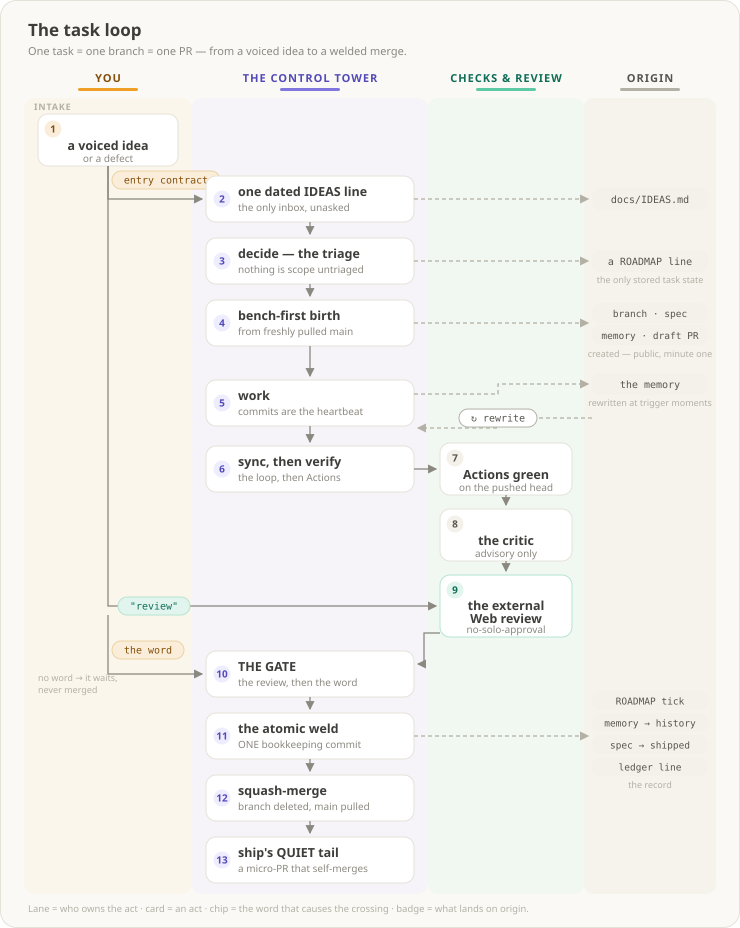
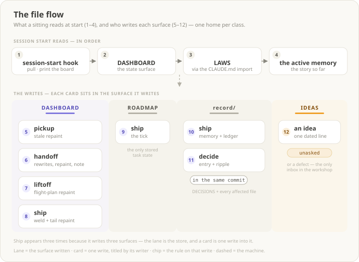
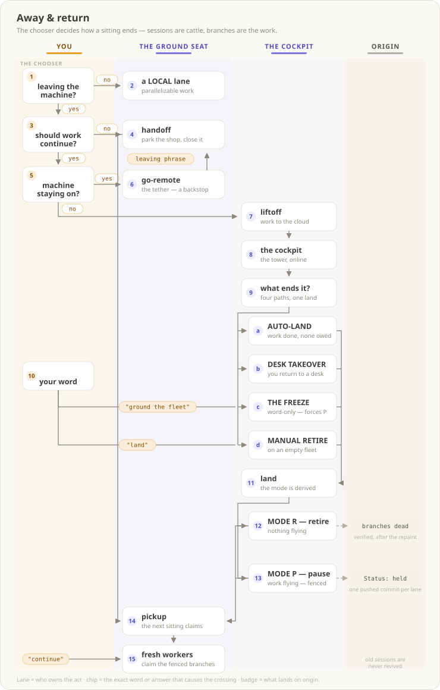
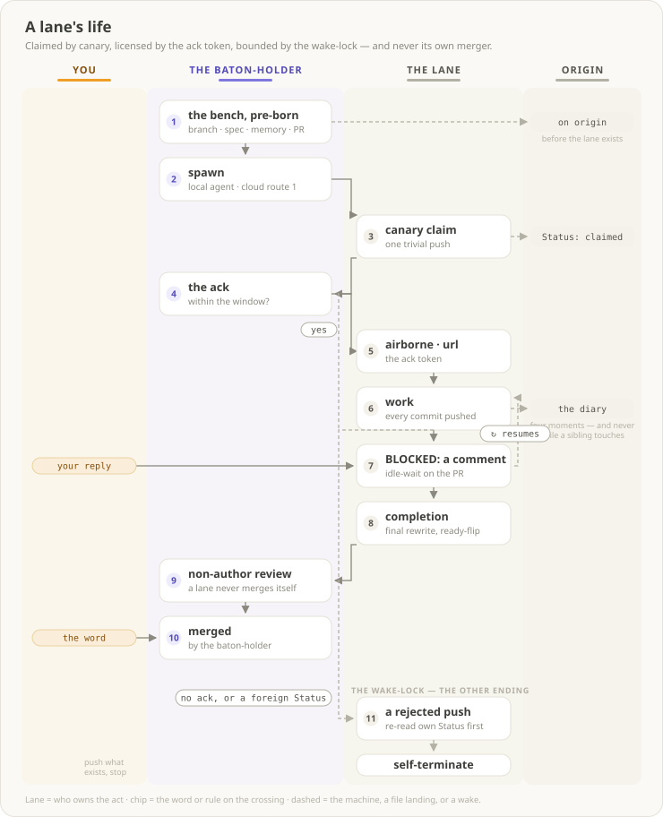
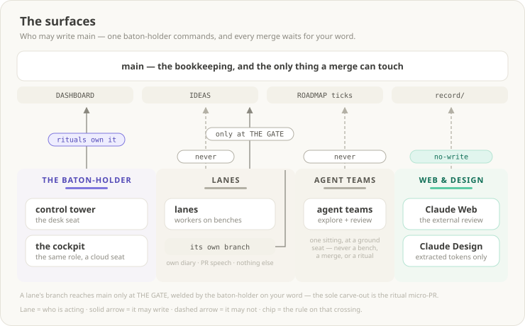
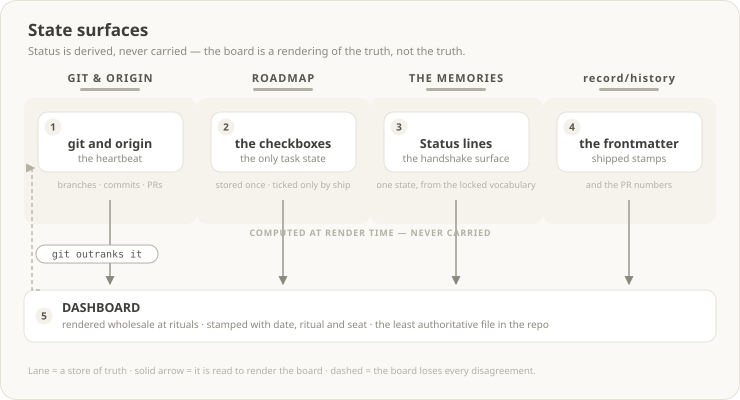
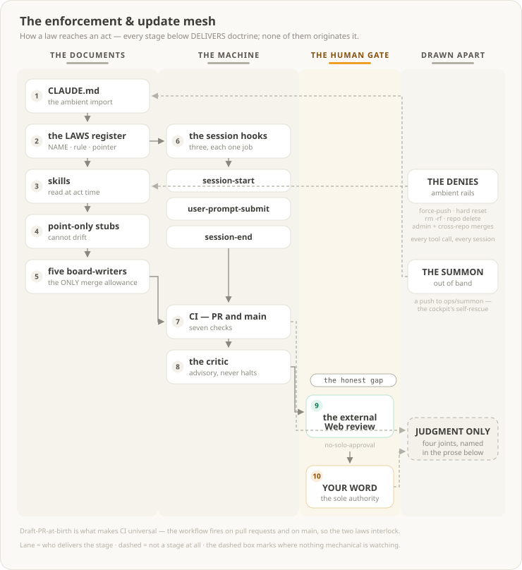
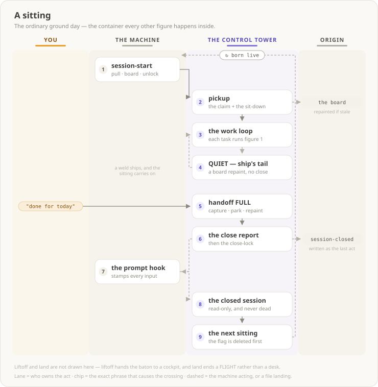

# Atlas — the system spine

Stamp: 2026-08-03 · re-authored as designed figures ·
work PC (born 2026-07-27 by the atlas bench · home PC).
The workshop depicted as eight designed figures on one page. THIS
PAGE RENDERS, IT ORIGINATES NOTHING — like [the board](DASHBOARD.md),
it is among the least authoritative files in the repo: every figure
is accompanied by the Boxes line that links the prose owning its
doctrine, and on any disagreement THE PROSE GOVERNS. A bench that
changes what a figure depicts re-draws that figure in the same PR
([HOME §Where information goes](HOME.md#where-information-goes)).

THE FIGURE LAW, and every re-render obeys it
([D-073](record/DECISIONS.md#d-073--atlas-becomes-designed-figures),
superseding [D-072](record/DECISIONS.md#d-072--the-atlas-no-scroll-law)'s
mermaid mechanics while keeping its principle — no horizontal
scroll, and a label is a NAME, never a sentence). Figures are
hand-authored static SVG under [docs/atlas/](atlas), embedded by
image link:

- **The canvas.** A fixed `viewBox` 740 wide; height grows with
  content and is kept tight to it. Self-painted panel — `#FAF9F5`
  fill, `#E5E2D9` stroke, `rx` 16 — with a 17px/600 `#3D3D3A`
  title, an 11px `#8A887F` subtitle, and a 9.5px `#B3B0A5` footer
  key restating the devices.
- **Lanes encode the chain's dominant dimension** — actors by
  default, surfaces or stores when the chain is about data. Pale
  washes at 0.5–0.6 opacity (you `#FCF4E4` · tower or cockpit
  `#F2F1FB` · web `#E9F7F1` · machine `#F3F1E9` · origin, and any
  store or surface lane, `#F1EFE6`), an 11px/600 header in the
  actor's dark tone, and a 60×3 rail underline in the actor's mid
  tone.
- **Actor tones**, fixed: you amber (`#EF9F27` mid · `#854F0B`
  dark · `#FAEEDA` tint · `#EAD3A2` edge) · tower purple
  (`#7F77DD` · `#534AB7` · `#EEEDFE`) · web teal (`#5DCAA5` ·
  `#0F6E56` · `#E1F5EE` · `#B5E4D2`) · machine gray (`#B3B0A5` ·
  `#57554E` · `#F3F1E9`).
- **Cards are acts** — white, `#E5E2D9` stroke, `rx` 10, a
  12.5px/600 title and one 10px subline. A CARD LABEL IS A NAME,
  NEVER A SENTENCE. A card carries a numbered circle in the
  owner's tint WHEN THE FIGURE READS AS A SEQUENCE; a figure that
  enumerates rather than sequences, and a card that is a child or
  a terminal of a numbered one, carry none.
- **Chips ride ON the crossing they cause** — a pill at `rx` 9,
  monospace 10px, white or owner-tinted with the owner's edge
  stroke. A chip carries EITHER the exact founder word, ALWAYS IN
  QUOTES, or the rule or answer that governs the crossing,
  unquoted. The quotation marks are the tell: quoted means it is
  something you say.
- **Captions are 9–9.5px `#B3B0A5`**, set outside any box, for
  what a badge or a lane needs said and a label must not carry.
- **Badges are files and outputs** — `#F3F1E9`, `rx` 8, monospace
  9.5–10.5px, in the origin lane, with a small "created" or "the
  record" caption where it earns one.
- **Edges**: solid `#8A887F` at 1.3 is an act's flow; dashed
  `#B3B0A5` is the machine, a file landing, or a return; one
  chevron marker; a loop is a drawn return track carrying the ↻
  pill.
- **Type is generic only** — `sans-serif` and `monospace`, no
  webfonts, no external references of any kind.
- **Coordinates are audited before commit**: no text outside its
  box, no unintended overlaps, nothing past x=740.

THE BOXES LINE UNDER EACH FIGURE IS LOAD-BEARING, not decoration:
links cannot live inside an embedded SVG, so the line beneath is
the only path from a drawn box to the prose that owns it.

## 1 · The task loop

One task = one branch = one PR — born public, gated only by the
founder's word, welded atomically. Upstream of the bench sits THE
INTAKE BAND — how a voiced thought reaches a branch: nothing is
scope until triaged into the [ROADMAP](ROADMAP.md) via
[decide](skills/decide.md).

THE GATE's review is an INDEPENDENT one — no diff merges on its
author's own approval, which is why the figure draws the review
and the word as two separate acts, in two different lanes.

Boxes: [the only inbox and its entry contract — IDEAS](IDEAS.md)
· [the triage — decide](skills/decide.md)
· [the ROADMAP and how to read it — HOME §Roadmap manual](HOME.md#roadmap-manual)
· [bench-first birth — LAWS §Workflow](LAWS.md#workflow-non-negotiable)
· [the heartbeat — LAWS §Task anatomy](LAWS.md#task-anatomy)
· [the verification loop — ship §1](skills/ship.md#1--preflight)
  (the commands' one home) ·
  [the law requiring it — LAWS §Workflow](LAWS.md#workflow-non-negotiable)
· [the critic — ship §6](skills/ship.md#6--the-gate)
· [THE GATE and no-solo-approval — LAWS §Workflow](LAWS.md#workflow-non-negotiable)
· [the atomic weld — ship §7](skills/ship.md#7--on-approval--the-atomic-weld)
· [the tail — ship §8](skills/ship.md#8--tail)
· [micro-PRs — HOME](HOME.md#micro-prs).

## 2 · The file flow

What a sitting reads at start, and which writer owns each surface
— one home per class, never a second copy. THE LANE IS THE STORE
here rather than the actor, because that is what this chain is
about; a card is one write INTO the lane it sits in, titled by the
ritual that performs it. Ship appears three times for exactly that
reason.

Boxes: [the hook and the day — HOME](HOME.md#a-day-in-the-workshop)
· [the board's writers — HOME §The board](HOME.md#the-board)
· [the repaint spec — handoff §4](skills/handoff.md#4--repaint-dashboard-the-board-spec--single-source)
· [ticks by ship only — HOME §Where information goes](HOME.md#where-information-goes)
· [the weld — ship §7](skills/ship.md#7--on-approval--the-atomic-weld)
· [decide](skills/decide.md)
· [the IDEAS clause — LAWS §Workflow](LAWS.md#workflow-non-negotiable).

## 3 · Away & return

The chooser decides how a sitting ends; land and pickup close the
circle — sessions are cattle, branches are the work. A flight can
be ended by the cockpit itself, by a desk taking over, or by the
founder's word
([D-061](record/DECISIONS.md#d-061--the-landing-doctrine-recut-to-three-scenarios)).

TWO OF THE FOUR ENDINGS ARE YOURS TO SPEAK and two are derived,
which is why only two carry chips: AUTO-LAND fires on a condition
the cockpit tests, DESK TAKEOVER fires because you sat down
somewhere else, while THE FREEZE and MANUAL RETIRE wait on a word.

Boxes: [the chooser — HOME §Delegation](HOME.md#delegation--the-away-mode-chooser)
· [handoff](skills/handoff.md) · [go-remote](skills/go-remote.md)
· [liftoff](skills/liftoff.md)
· [the cockpit's standing job — COCKPIT-CHARTER](COCKPIT-CHARTER.md)
· [the trigger table — land](skills/land.md#the-trigger-table--what-starts-a-landing)
· [AUTO-LAND](skills/land.md#scenario-1--auto-land-the-cockpit-fires-it)
· [DESK TAKEOVER](skills/land.md#scenario-2--desk-takeover-the-desk-fires-it)
· [THE FREEZE](skills/land.md#scenario-3--the-founders-freeze-word-only)
· [the mode routing — land §0](skills/land.md#0--derive-the-fleet-route-the-mode)
· [MODE R](skills/land.md#mode-r--retire-the-flights-natural-end)
· [MODE P and the fence](skills/land.md#mode-p--pause-and-transfer-the-founder-is-going-local)
· [the fleet resume — pickup §6](skills/pickup.md#6--fleet-resume-on-the-founders-answer)
· [the baton — HOME](HOME.md#the-baton)
· [every BATON rendering — handoff §4's case table](skills/handoff.md#4--repaint-dashboard-the-board-spec--single-source).

## 4 · A lane's life

A worker on a pre-birthed bench: claimed by canary, licensed by
the ack token, bounded by the wake-lock, merged only by the
baton-holder on the founder's word. Read the lanes and the shape
states the boundary on its own — the BATON-HOLDER lane opens the
bench and closes the merge, and everything between belongs to THE
LANE, which never once crosses into main.

Boxes: [the lane law — parallel-lanes](skills/parallel-lanes.md#the-lane-law-seat-blind--identical-local-or-cloud)
· [bench-first birth](skills/parallel-lanes.md#bench-first-birth-baton-holder-procedure)
· [route 1, the recipe of record](skills/parallel-lanes.md#cloud-spawn--route-ladder)
· [the canary handshake and the ack token](skills/parallel-lanes.md#canary-handshake-both-sides)
· [the four diary moments](skills/parallel-lanes.md#the-four-memory-moments-the-lanes-diary-rule)
· [the wake-lock](skills/parallel-lanes.md#wake-lock--parking)
· [the mail slot](skills/parallel-lanes.md#answering-a-lane-the-mail-slot)
· [no-solo-approval — LAWS §Workflow](LAWS.md#workflow-non-negotiable).

## 5 · The surfaces

Who may write what: one baton-holder commands, lanes speak through
their PRs, teams explore and review, Web and Design never write.
Every merge into main waits for the founder's word and is performed
by the baton-holder as the atomic weld — the sole carve-out being
the ritual micro-PR, which merges itself.

Boxes: [the baton law — LAWS §Parallel lanes & cloud](LAWS.md#parallel-lanes--cloud)
· [the cockpit — HOME §The baton](HOME.md#the-baton)
· [lane rule 7, never writes main](skills/parallel-lanes.md#the-lane-law-seat-blind--identical-local-or-cloud)
· [the team boundary — HOME §Agent teams](HOME.md#agent-teams)
· [Web's mandatory job and no-solo-approval — LAWS §Workflow](LAWS.md#workflow-non-negotiable)
· [the Design no-write clause — LAWS §Knowledge & tracking](LAWS.md#knowledge--tracking).

## 6 · State surfaces

Status is derived, never carried — every count is computed at
render time, and git outranks every note. The four lanes are the
STORES this time, and the single card beneath them is the only
thing in the workshop that is rendered rather than stored.

Boxes: [the derivation law and the ladder — LAWS §Knowledge & tracking](LAWS.md#knowledge--tracking)
· [ticks by ship only — LAWS §Knowledge & tracking](LAWS.md#knowledge--tracking)
· [the Status vocabulary — TEMPLATE](memory/TEMPLATE.md#status-vocabulary)
· [the board's repaint model — HOME §The board](HOME.md#the-board)
· [how to read it — HOME §Reading the board](HOME.md#reading-the-board)
· [the board spec, and every BATON rendering — handoff §4's case table](skills/handoff.md#4--repaint-dashboard-the-board-spec--single-source).

## 7 · The enforcement & update mesh

How a law reaches an act. Every stage is a DELIVERY stage — none
of them originates doctrine, and the prose each box links is where
the rule actually lives.

DRAFT-PR-AT-BIRTH IS WHAT MAKES CI UNIVERSAL: the workflow fires
on pull requests and on main, so a branch would be uncovered
until its PR existed — and the
[bench-first law](LAWS.md#workflow-non-negotiable) gives every
task a draft PR in its first minute. The two laws interlock;
neither covers the floor alone.

THE THREE HOOKS, each drawn as a name and each doing one job:
SESSION-START syncs main, injects the board, orders the briefing,
hands over the lane-liveness verdict, and clears the close-lock ·
USER-PROMPT-SUBMIT stamps a closed session read-only ·
SESSION-END is the crash net, committing and pushing WIP on a lane
branch. CI's seven checks are the same commands the verification
loop runs, and [ship §1](skills/ship.md#1--preflight) is their one
home.

TWO CARDS ARE NOT STAGES, and sit in a lane of their own for that
reason: THE DENIES are ambient permission rails evaluated at every
tool call in every session — force-push, hard reset, `rm -rf`,
repo delete, admin and cross-repo merges — and THE SUMMON
WORKFLOW is out-of-band, a push to the reserved `ops/summon`
branch that is a cockpit's self-rescue when its connectors are
dead, never a step in delivering a law to an act.

THE DASHED BOX IS NOT DECORATION, and its FOUR JOINTS are these:

1. **The links gate is destination-blind** — it proves an anchor
   EXISTS, never that it is the RIGHT one, and never that a
   mention became a link at all.
2. **Nothing checks the derivation law** — a bar can render the
   wrong number of segments and every gate stays green.
3. **Board freshness is only ever repaired at a ritual**, so
   between rituals the board is stale by design.
4. **THE TERMINUS ITSELF** — nothing mechanical enforces that the
   external review happened or that the word was given; the
   ritual merge allowance is unconditional once a ritual is
   running.

Each is a real miss this workshop has already paid for, or a rail
it has chosen not to build. Their inbox lines are in
[IDEAS](IDEAS.md); the guard-shaped ones would be hosted by the
HARNESS V2 bench, which does not name them today.

Boxes: [the ambient import and the session hooks — HOME §The files](HOME.md#the-files--what-each-one-is-for)
· [the close-lock the prompt hook enforces — HOME §Terms](HOME.md#terms)
· [the register itself — LAWS](LAWS.md)
· [skills and their point-only stubs — HOME §Skills](HOME.md#skills)
· [the merge allowance, its narrowness, and the micro-PR carve-out — HOME §Micro-PRs](HOME.md#micro-prs)
· [the verification loop the checks mirror — ship §1](skills/ship.md#1--preflight)
· [the critic — ship §6](skills/ship.md#6--the-gate)
· [no-solo-approval — LAWS §Workflow](LAWS.md#workflow-non-negotiable)
· [the founder's word — LAWS §The three touchpoints](LAWS.md#the-three-touchpoints)
· [the wiring inventory — SETUP](SETUP.md).

## 8 · A sitting

The ordinary ground day, end to end. Seven figures above draw
tasks, lanes, seats and surfaces; this one draws the CONTAINER
they happen inside — one sitting, opened by a hook and closed by a
ritual. The work loop in the middle is figure 1, run once per
task.

TWO ENDINGS ARE NOT DRAWN HERE because they are not ground
endings: LIFTOFF closes the sitting by handing the baton to a
cockpit, and LAND ends a FLIGHT rather than a desk. Both live in
[§3](#3--away--return), which is where the chooser belongs.

THE CLOSE-LOCK IS WHY THIS CYCLE HAS AN END AND NOT A FADE. Handoff
writes `.claude/session-closed` as its last act; from that moment
the prompt hook stamps every further input, and the session stays
CONVERSATIONAL BUT READ-ONLY — it answers by fresh derivation from
origin, names whoever now holds the baton, and refuses every write,
command act and ritual. The session-start hook deletes the flag
before anything else, so the next sitting is always born live.

Boxes: [pickup](skills/pickup.md)
· [handoff, and the board spec it renders — handoff §4](skills/handoff.md#4--repaint-dashboard-the-board-spec--single-source)
· [the close report — handoff §6](skills/handoff.md#6--close-full-only)
· [ship's QUIET tail — ship §8](skills/ship.md#8--tail)
· [the hooks — HOME §The files](HOME.md#the-files--what-each-one-is-for)
· [close-lock and closed ≠ dead — HOME §Terms](HOME.md#terms)
· [the away-mode chooser — HOME §Delegation](HOME.md#delegation--the-away-mode-chooser).
