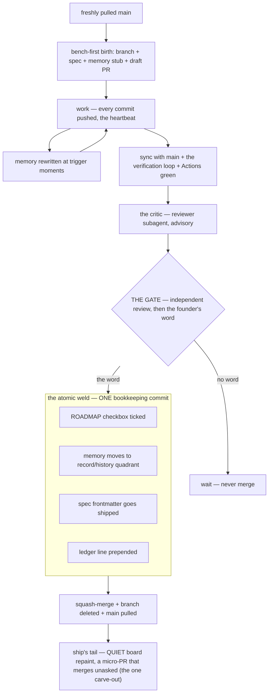
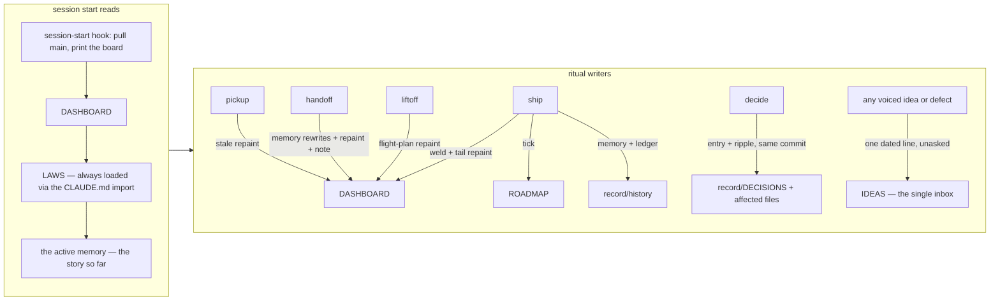
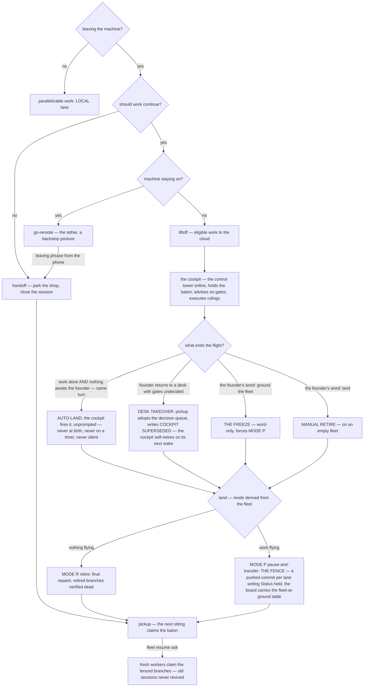
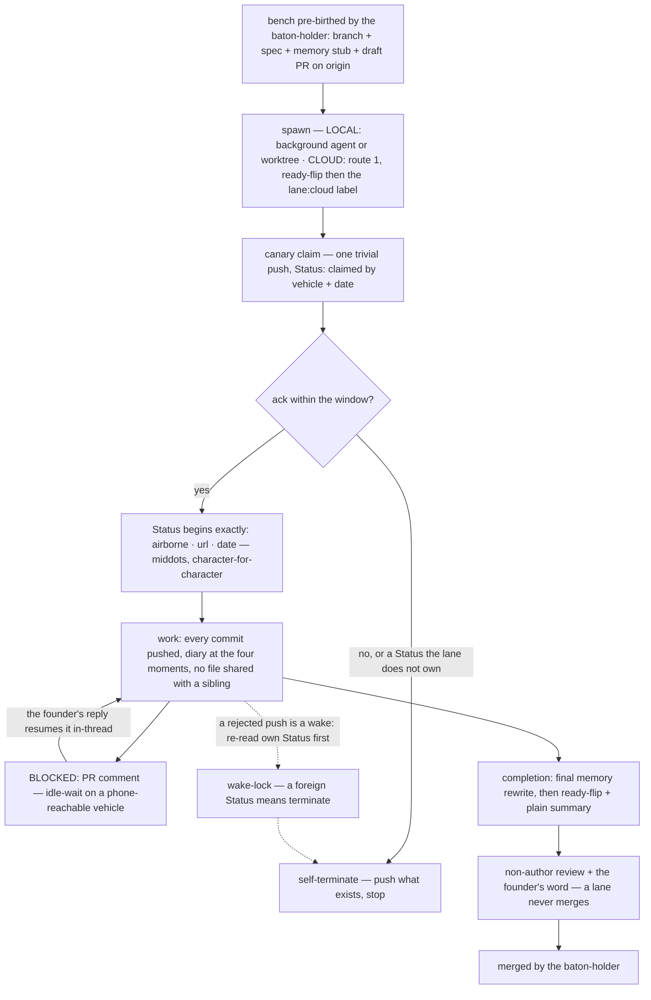
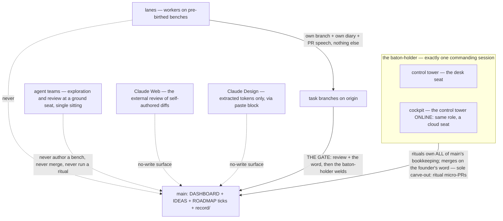
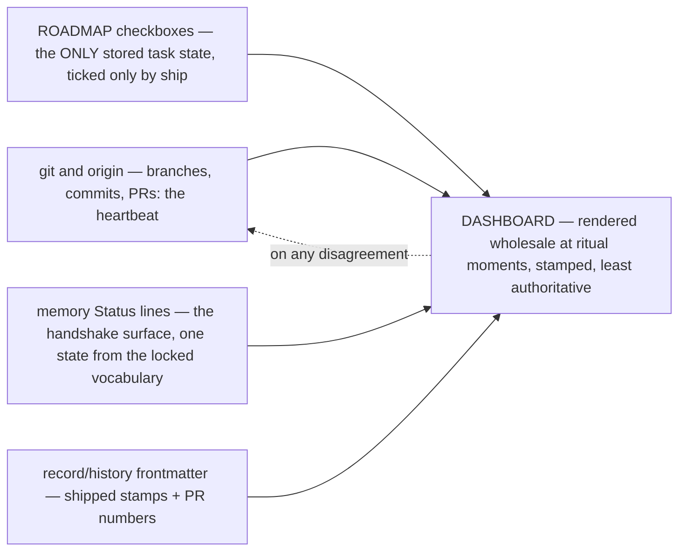
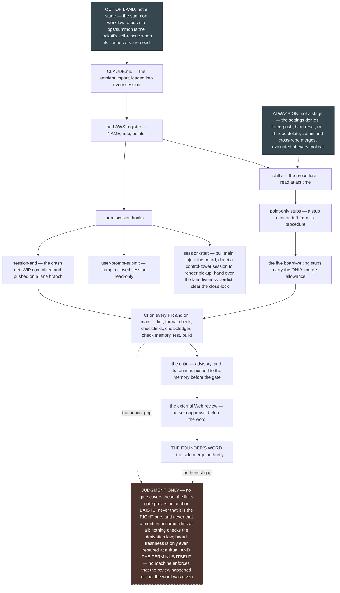

# Atlas — the system spine

Stamp: 2026-07-31 · diagram 7 added — the enforcement mesh ·
work PC (born 2026-07-27 by the atlas bench · home PC).
The workshop depicted as seven diagrams on one page. THIS PAGE
RENDERS, IT ORIGINATES NOTHING — like [the board](DASHBOARD.md),
it is among the least authoritative files in the repo: every box
links to the prose section that owns the doctrine, and on any
disagreement THE PROSE GOVERNS. A bench that changes what a
diagram depicts re-renders the diagram in the same PR
([HOME §Where information goes](HOME.md#where-information-goes)).

## 1 · The task loop

One task = one branch = one PR — born public, gated only by the
founder's word, welded atomically.

Boxes: [bench-first birth — LAWS §Workflow](LAWS.md#workflow-non-negotiable)
· [the heartbeat — LAWS §Task anatomy](LAWS.md#task-anatomy)
· [the verification loop — ship §1](skills/ship.md#1--preflight)
  (the commands' one home) ·
  [the law requiring it — LAWS §Workflow](LAWS.md#workflow-non-negotiable)
· [the critic — ship §6](skills/ship.md#6--the-gate)
· [THE GATE and no-solo-approval — LAWS §Workflow](LAWS.md#workflow-non-negotiable)
· [the atomic weld — ship §7](skills/ship.md#7--on-approval--the-atomic-weld)
· [the tail — ship §8](skills/ship.md#8--tail)
· [micro-PRs — HOME](HOME.md#micro-prs).

## 2 · The file flow

What a sitting reads at start, and which writer owns each surface
— one home per class, never a second copy.

Boxes: [the hook and the day — HOME](HOME.md#a-day-in-the-workshop)
· [the board's writers — HOME §The board](HOME.md#the-board)
· [the repaint spec — handoff §4](skills/handoff.md#4--repaint-dashboard-the-board-spec--single-source)
· [ticks by ship only — HOME §Where information goes](HOME.md#where-information-goes)
· [the weld — ship §7](skills/ship.md#7--on-approval--the-atomic-weld)
· [decide](skills/decide.md)
· [the IDEAS clause — LAWS §Workflow](LAWS.md#workflow-non-negotiable).

## 3 · Away & return

The chooser decides how a sitting ends; land and pickup close the
circle — sessions are cattle, branches are the work. A flight can
be ended by the cockpit itself, by a desk taking over, or by the
founder's word
([D-061](record/DECISIONS.md#d-061--the-landing-doctrine-recut-to-three-scenarios)).

Boxes: [the chooser — HOME §Delegation](HOME.md#delegation--the-away-mode-chooser)
· [handoff](skills/handoff.md) · [go-remote](skills/go-remote.md)
· [liftoff](skills/liftoff.md)
· [the cockpit's standing job — COCKPIT-CHARTER](COCKPIT-CHARTER.md)
· [the trigger table — land](skills/land.md#the-trigger-table--what-starts-a-landing)
· [AUTO-LAND](skills/land.md#scenario-1--auto-land-the-cockpit-fires-it)
· [DESK TAKEOVER](skills/land.md#scenario-2--desk-takeover-the-desk-fires-it)
· [THE FREEZE](skills/land.md#scenario-3--the-founders-freeze-word-only)
· [the mode routing — land §0](skills/land.md#0--derive-the-fleet-route-the-mode)
· [MODE R](skills/land.md#mode-r--retire-the-flights-natural-end)
· [MODE P and the fence](skills/land.md#mode-p--pause-and-transfer-the-founder-is-going-local)
· [the fleet resume — pickup §6](skills/pickup.md#6--fleet-resume-on-the-founders-answer)
· [the baton — HOME](HOME.md#the-baton)
· [every BATON rendering — handoff §4's case table](skills/handoff.md#4--repaint-dashboard-the-board-spec--single-source).

## 4 · A lane's life

A worker on a pre-birthed bench: claimed by canary, licensed by
the ack token, bounded by the wake-lock, merged only by the
baton-holder on the founder's word.

Boxes: [the lane law — parallel-lanes](skills/parallel-lanes.md#the-lane-law-seat-blind--identical-local-or-cloud)
· [bench-first birth](skills/parallel-lanes.md#bench-first-birth-baton-holder-procedure)
· [route 1, the recipe of record](skills/parallel-lanes.md#cloud-spawn--route-ladder)
· [the canary handshake and the ack token](skills/parallel-lanes.md#canary-handshake-both-sides)
· [the four diary moments](skills/parallel-lanes.md#the-four-memory-moments-the-lanes-diary-rule)
· [the wake-lock](skills/parallel-lanes.md#wake-lock--parking)
· [the mail slot](skills/parallel-lanes.md#answering-a-lane-the-mail-slot)
· [no-solo-approval — LAWS §Workflow](LAWS.md#workflow-non-negotiable).

## 5 · The surfaces

Who may write what: one baton-holder commands, lanes speak through
their PRs, teams explore and review, Web and Design never write.

Boxes: [the baton law — LAWS §Parallel lanes & cloud](LAWS.md#parallel-lanes--cloud)
· [the cockpit — HOME §The baton](HOME.md#the-baton)
· [lane rule 7, never writes main](skills/parallel-lanes.md#the-lane-law-seat-blind--identical-local-or-cloud)
· [the team boundary — HOME §Agent teams](HOME.md#agent-teams)
· [Web's mandatory job and no-solo-approval — LAWS §Workflow](LAWS.md#workflow-non-negotiable)
· [the Design no-write clause — LAWS §Knowledge & tracking](LAWS.md#knowledge--tracking).

## 6 · State surfaces

Status is derived, never carried — every count is computed at
render time, and git outranks every note.

Boxes: [the derivation law and the ladder — LAWS §Knowledge & tracking](LAWS.md#knowledge--tracking)
· [ticks by ship only — LAWS §Knowledge & tracking](LAWS.md#knowledge--tracking)
· [the Status vocabulary — TEMPLATE](memory/TEMPLATE.md#status-vocabulary)
· [the board's repaint model — HOME §The board](HOME.md#the-board)
· [how to read it — HOME §Reading the board](HOME.md#reading-the-board)
· [the board spec, and every BATON rendering — handoff §4's case table](skills/handoff.md#4--repaint-dashboard-the-board-spec--single-source).

## 7 · The enforcement & update mesh

How a law reaches an act. Every layer below is a DELIVERY stage —
none of them originates doctrine, and the prose each box links is
where the rule actually lives.

DRAFT-PR-AT-BIRTH IS WHAT MAKES CI UNIVERSAL: the workflow fires
on pull requests and on main, so a branch would be uncovered
until its PR existed — and the
[bench-first law](LAWS.md#workflow-non-negotiable) gives every
task a draft PR in its first minute. The two laws interlock;
neither covers the floor alone.

TWO BOXES ARE NOT STAGES, and are drawn apart from the cascade
for that reason: THE DENIES are ambient permission rails
evaluated at every tool call in every session, and THE SUMMON
WORKFLOW is out-of-band — a cockpit's self-rescue when its
connectors are dead, never a step in delivering a law to an act.

THE DASHED BOX IS NOT DECORATION. Each joint in it is a real miss
this workshop has already paid for, or a rail it has chosen not
to build — including the TERMINUS, where nothing mechanical
enforces that the external review happened or that the word was
given; the ritual allowance is unconditional once a ritual is
running. Their inbox lines are in [IDEAS](IDEAS.md); the
guard-shaped ones would be hosted by the HARNESS V2 bench, which
does not name them today.

Boxes: [the ambient import and the session hooks — HOME §The files](HOME.md#the-files--what-each-one-is-for)
· [the close-lock the prompt hook enforces — HOME §Terms](HOME.md#terms)
· [the register itself — LAWS](LAWS.md)
· [skills and their point-only stubs — HOME §Skills](HOME.md#skills)
· [the merge allowance, its narrowness, and the micro-PR carve-out — HOME §Micro-PRs](HOME.md#micro-prs)
· [the verification loop the checks mirror — ship §1](skills/ship.md#1--preflight)
· [the critic — ship §6](skills/ship.md#6--the-gate)
· [no-solo-approval — LAWS §Workflow](LAWS.md#workflow-non-negotiable)
· [the founder's word — LAWS §The three touchpoints](LAWS.md#the-three-touchpoints)
· [the wiring inventory — SETUP](SETUP.md).
