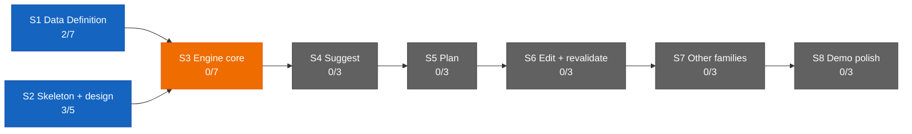

# Dashboard — progress at a glance

The stage map below renders on GitHub and in Obsidian; the Live views
section needs the Dataview community plugin (Obsidian → Settings →
Community plugins → Browse → "Dataview" → Install + Enable, once per
machine). For the fused live briefing — lanes, intent, next actions —
run /pickup in Claude Code.

## Stage map



Legend: green = done · blue = active (work permitted now) · orange =
locked (gated by an unmet dependency) · gray = pending (queued).
Counts are recomputed from [ROADMAP](ROADMAP.md) checkboxes by /ship
at every merge.

## Live views (Obsidian + Dataview)

### Open specs

```dataview
TABLE WITHOUT ID file.link AS Spec, stage AS Stage, status AS Status,
  branch AS Branch, pr AS PR, opened AS Opened
FROM "specs"
WHERE type = "spec" AND file.name != "TEMPLATE" AND status = "open"
SORT opened DESC
```

### Remaining work by stage

```dataview
TASK FROM "ROADMAP"
WHERE !completed
GROUP BY section
```

### Spec history

```dataview
TABLE WITHOUT ID file.link AS Spec, stage AS Stage, status AS Status,
  branch AS Branch, pr AS PR, opened AS Opened
FROM "specs"
WHERE type = "spec" AND file.name != "TEMPLATE"
SORT opened DESC
```

(If Dataview is absent, these three blocks show as plain code blocks
on GitHub — that's expected and fine.)

## Where the rest lives

- [SHIPLOG](SHIPLOG.md) — what shipped, when (newest first)
- [HANDOFF](HANDOFF.md) — channels + intent from the last stand-up
- run /pickup for the fused live briefing

Founder tip: in Obsidian's graph view, use Groups on paths (specs/,
data/) to color the map by knowledge area.
