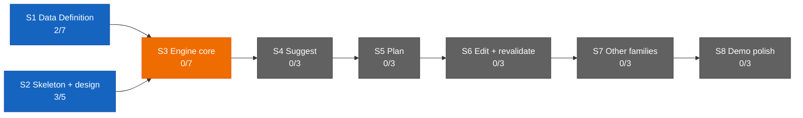

# Dashboard — the state surface

Stamp: 2026-07-11 · ship tail (QUIET handoff) · home PC
Glyphs: 🟢 done · 🟡 ongoing · 🔴 issue · ⚪ idle. Repainted only by
rituals (pickup when stale · handoff · liftoff · ship's tail) — never
hand-edited; git outranks this board.

## Needs you

1. 🟡 Run the [machine-setup](skills/machine-setup.md) Verify block
   on each PC — a full pass is unconfirmed on both seats.
2. ⚪ [DECISION-POLICY §10](DECISION-POLICY.md#10-open-questions) —
   five open engine questions; parked until
   [V1.S3](ROADMAP.md#v1s3--engine-core--two-families-deep) opens.

## You are here

V1 — The demo · 5/34 █████░░░░░░░░░░░░░░░░░░░░░░░░░░░░░
S1 · Data Definition · 2/7 ██░░░░░ → T3–T6 source vetting ⚪ held
(relaunch at ladder step P8, queued behind the ops thread)
S2 · Skeleton & design · 3/5 ███░░ → T5 Design foundations ⚪ idle
S3–S8 · queued in order · 0/22

## Stage map

Legend: green = done · blue = active (work permitted now) · orange =
locked (gated by an unmet dependency) · gray = pending (queued).
Counts recomputed from [ROADMAP](ROADMAP.md) checkboxes at every
ritual repaint.

## In flight

⚪ **[V1.S2.T5](ROADMAP.md#v1s2--skeleton--design-foundations-parallel-lane-with-s1)
— Design foundations** · no PR yet · 0/3
Exploring Roam's visual language in Claude Design. Only extracted
token values enter the repo, never markup or bundles. Each session
starts by pasting the [DESIGN-KICKOFF](DESIGN-KICKOFF.md) preamble,
then stating the lane.
⚪ option card with confidence badge · ⚪ day timeline beside map ·
⚪ token extraction ("Hand off to Claude Code")
→ memory: — (Design-surface lane; predates the memory layer)

## Threads (non-task)

🟡 Ops — knowledge architecture (Web chat) — phases 1+2
([history](history/foundation-roadmap-recut.md)), phase 3, the
engine swap ([history](history/engine-swap.md)), and phase 4, the
HOME encyclopedia ([history](history/home-encyclopedia.md)), are
shipped; later phases (5+) still to come from the chat.
⚪ Setup ladder P8 (Web chat) — the T3–T6 relaunch briefs; held
behind the ops thread.

## Shipped (latest — full record: [history/](history/README.md))

| When | What | PR |
|---|---|---|
| 2026-07-11 | [HOME v3 — the manual & encyclopedia](history/home-encyclopedia.md) | [#76](https://github.com/wsher0901/roam/pull/76) |
| 2026-07-11 | [The engine swap: architecture v2](history/engine-swap.md) | [#71](https://github.com/wsher0901/roam/pull/71) |
| 2026-07-10 | [Version ladder + lifespan split](history/foundation-roadmap-recut.md) | [#69](https://github.com/wsher0901/roam/pull/69) |
| 2026-07-10 | [Machine-setup skill](history/machine-setup-skill.md) | [#66](https://github.com/wsher0901/roam/pull/66) |
| 2026-07-10 | [Design kickoff rule-carrier](history/design-kickoff.md) | [#64](https://github.com/wsher0901/roam/pull/64) |
| 2026-07-10 | [Live ritual counts, quiet ship-tail](history/ritual-live-counts.md) | [#62](https://github.com/wsher0901/roam/pull/62) |
| 2026-07-10 | [Stage-map dashboard](history/stage-map-dashboard.md) | [#60](https://github.com/wsher0901/roam/pull/60) |
| 2026-07-09 | [The knowledge layer](history/knowledge-layer.md) | [#58](https://github.com/wsher0901/roam/pull/58) |
| 2026-07-09 | [Hygiene: line endings + retro-weave](history/hygiene-retro-weave.md) | [#57](https://github.com/wsher0901/roam/pull/57) |
| 2026-07-09 | [Ritual engine v2; the shiplog is born](history/ritual-engine-v2.md) | [#56](https://github.com/wsher0901/roam/pull/56) |
