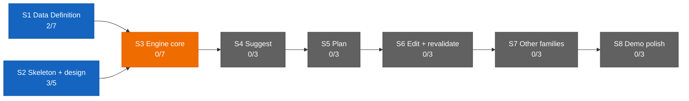

# Dashboard — the state surface

Stamp: 2026-07-16 · 22:38 · ship · home PC
V1 5/34 · S1 2/7 · S2 3/5 · sessions: 1 main · 0 parallel
(1 needs you) · needs-you 3
How to read this board →
[HOME §Reading the board](HOME.md#reading-the-board)

## Needs you

1. 🟡 Paste the current master once: WEB-INSTRUCTIONS into the
   claude.ai → Roam Project → settings box — attested done at the
   maiden preflight (07-16 17:01); clearing waits for the block-2
   flight report to process the attestation (since 07-11).
   → master: [WEB-INSTRUCTIONS](WEB-INSTRUCTIONS.md) · the box is a
   copy · [history](history/workshop/definition/web-instructions.md)
2. ⚪ Nine open engine questions sit parked in the Open register
   until S3 opens (since 07-13).
   → [ENGINE §12](ENGINE.md#12-open-register) ·
   [D-028](DECISIONS.md#d-028--2026-07--consolidation-recut--decision-policy--engine-brain-skeleton-form-project-policy-house-style-open-register-grows-69-upholds-d-021-extends-the-d-021-consolidation)
   · [V1.S3](ROADMAP.md#v1s3--engine-core--two-families-deep)
3. 🟡 Give the go on block 2 — the maiden-flight report: record the
   winning spawn recipe (ready-flip, then label) in parallel-lanes,
   fill the verify checklist, process the preflight attestations
   (item 1 clears there). While you're at it, one glance at
   claude.ai/code/routines: does the routine now show its first
   run? (since 07-16)
   → [flight story](history/workshop/mechanism/reviewer-subagent.md)
   ·
   [§Cloud spawn — "winning route: unrecorded"](skills/parallel-lanes.md#cloud-spawn--route-ladder)

## Sessions

| Session | Task | State | Last push | Your move |
|---|---|---|---|---|
| main · cockpit (home PC) | Ops — the delegation maiden flight, block 2 (the flight report) | 🟡 holding — ship tail rendered | 22:36 (the weld) | give the go on block 2 (Needs-you 3) |

↳ main micro: preflight 🟢 · leg A spawn (ladder step 2:
ready-flip + label) 🟢 · leg A payload flown, landed, welded 🟢 ·
leg B 🟢 (shipped earlier) · flight report ⚪ (block 2)

Flight context: the maiden flight is flown — both legs complete,
only the report remains. Leg A's cloud lane spawned in ~90 s once
the PR was flipped ready (drafts are filtered from the label
trigger; two draft re-labels produced nothing), then flew the whole
lane law live: canary 21:54 → ack 21:55 → BLOCKED: with @mention
21:56 → founder reply resumed it in-thread 22:10 → deliverables +
CI mirror → completion @mention 22:28 → welded 22:37 as
[#146](https://github.com/wsher0901/roam/pull/146). It even
absorbed a redelivered label webhook via the wake-lock. Checklist
still open: the provider's own run counter (founder glance) and the
dormant-baton question. Cap proxy: 3 label events today · 12
remaining; local lanes stay cap-free.

## You are here

V1 — The demo · 5/34 █████░░░░░░░░░░░░░░░░░░░░░░░░░░░░░
S1 · Data Definition · 2/7 ██░░░░░ → T3–T6 source vetting ⚪ held
(awaiting relaunch briefs)
S2 · Skeleton & design · 3/5 ███░░ → T5 Design foundations ⚪ idle
S3–S8 · queued in order · 0/22

## Stage map

No open Web or Design threads. Last paste: none (a bare trigger, at
the 07-16 18:15 handoff). The July full-pass audit thread concluded
and shipped as full-pass-fixes
([#144](https://github.com/wsher0901/roam/pull/144)); T3–T6
source-vetting relaunch stays held (see You are here).

## Shipped (latest — full record: [the ledger](history/README.md#the-ledger))

| When | What | PR |
|---|---|---|
| 07-16 22:36 | [the ship-time diff critic born: spec + `.claude/agents/reviewer.md` (read-only tools, advisory verdicts riding to THE GATE, Sonnet 5 · high) — flown end-to-end by the maiden flight's first live cloud lane, the spawn recipe proven: ready-flip, then label](history/workshop/mechanism/reviewer-subagent.md) | [#146](https://github.com/wsher0901/roam/pull/146) |
| 07-16 17:59 | [Time is derived, never recalled: the derivation law gains its time clause, ship/handoff stamps read the shell clock, the Models & effort doctrine set to the 2026-07-16 statement — flown end-to-end by a local lane, the maiden's leg B](history/workshop/definition/time-doctrine.md) | [#147](https://github.com/wsher0901/roam/pull/147) |
| 07-16 12:46 | [the July full-pass audit closed in one pass: external-item clearing, the routine saved-prompt master, the count:runs cap read, rejected-push wake + label idempotency, the reply-ack window, the maiden-flight verify list, the Models & effort doctrine, README + Web currency](history/workshop/mechanism/full-pass-fixes.md) | [#144](https://github.com/wsher0901/roam/pull/144) |
| 07-16 10:37 | [Lane liveness (D-042): live-vs-reclaimable derived from the commit heartbeat and read at the claim check and pickup's worktree sweep, fed by the session-start hook's verdict — a live lane is never adopted or pruned](history/workshop/mechanism/lane-liveness.md) | [#142](https://github.com/wsher0901/roam/pull/142) |
| 07-16 08:57 | [a CI gate (check:ledger) proving history/ files and the ledger index stay in one-to-one bijection by #PR, plus a ship §7 weld-staging line so a dropped or orphaned ledger line turns the build red instead of leaving a silent gap](history/workshop/mechanism/ledger-integrity.md) | [#140](https://github.com/wsher0901/roam/pull/140) |
| 07-15 15:35 | [the Max routine cap firmed to confirmed fact (15/day, flat across Max tiers): the SETUP and liftoff live-number hedges retired](history/workshop/definition/cap-confirm.md) | [#138](https://github.com/wsher0901/roam/pull/138) |
| 07-15 14:39 | [Delegation architecture (D-041): the away-mode chooser (local · handoff · go-remote · liftoff), the go-remote tether posture, idle-wait, label-spawned cloud lanes](history/workshop/mechanism/delegation-architecture.md) | [#136](https://github.com/wsher0901/roam/pull/136) |
| 07-15 12:58 | [LAWS tightness (Option C): command + one-line whys (D-027 upheld), procedure grain expelled to handoff §1.5, the stale decide trigger and preview conditional fixed](history/workshop/definition/laws-tightness.md) | [#134](https://github.com/wsher0901/roam/pull/134) |
| 07-15 12:08 | [Retroactivity sweep: repair three later-found gaps — HOME's surviving Cloud-ledger ghost, handoff's non-vocabulary "waiting", recall's FOUNDATION + DESIGN-KICKOFF routing omissions](history/workshop/definition/retroactivity-sweep.md) | [#132](https://github.com/wsher0901/roam/pull/132) |
| 07-15 11:18 | [HOME currency pass: bring the bible current with D-040/D-032/D-039/#128 and close six newcomer-test gaps — four rewordings, five new Terms, the recall read-path](history/workshop/definition/home-currency-pass.md) | [#130](https://github.com/wsher0901/roam/pull/130) |
