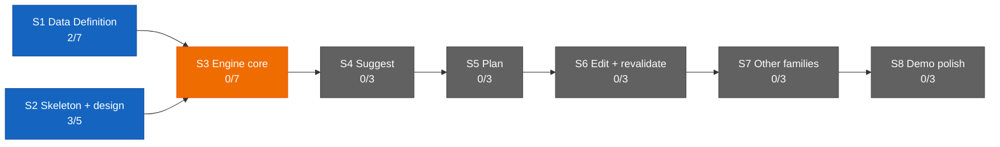

# Dashboard — the state surface

Stamp: 2026-07-17 · 15:29 · ship-tail · work PC
V1 5/34 · S1 2/7 · S2 3/5 · sessions: 1 main · 0 parallel
(0 needs you) · needs-you 2
How to read this board →
[HOME §Reading the board](HOME.md#reading-the-board)

## Needs you

1. 🟢 Closed at this ship's tail, nothing left to do: the two
   maiden-flight attestations — the provider run count confirmed at
   1 (matches the `count:runs` proxy) and the phone-buzz/doorbell
   question superseded by the staged clerk-notify line; both
   recorded in their homes, this line drops at the next repaint
   (since 07-16).
   → [parallel-lanes §Cloud spawn](skills/parallel-lanes.md#cloud-spawn--route-ladder)
   · [SETUP §Staged](SETUP.md#staged--turns-on-when-its-stage-opens)
2. ⚪ Nine open engine questions sit parked in the Open register
   until S3 opens (since 07-13).
   → [ENGINE §12](ENGINE.md#12-open-register) ·
   [D-028](DECISIONS.md#d-028--2026-07--consolidation-recut--decision-policy--engine-brain-skeleton-form-project-policy-house-style-open-register-grows-69-upholds-d-021-extends-the-d-021-consolidation)
   · [V1.S3](ROADMAP.md#v1s3--engine-core--two-families-deep)

## Sessions

| Session | Task | State | Last push | Your move |
|---|---|---|---|---|
| main · cockpit | — (between tasks — cloud-clerk just shipped) | ⚪ | 15:27 ([#156](https://github.com/wsher0901/roam/pull/156) weld) | — |

↳ main micro: — (no active task)

## You are here

V1 — The demo · 5/34 █████░░░░░░░░░░░░░░░░░░░░░░░░░░░░░
S1 · Data Definition · 2/7 ██░░░░░ → T3–T6 source vetting ⚪ held
(awaiting relaunch briefs)
S2 · Skeleton & design · 3/5 ███░░ → T5 Design foundations ⚪ idle
S3–S8 · queued in order · 0/22

## Stage map

**"Roam — full-pass audit + maiden flight"** (Web) — the clerk
maiden flew all green 07-17 and
[#156](https://github.com/wsher0901/roam/pull/156) welded: the away
surface is live, clerk PRIMARY with the GitHub app as backstop →
next: nothing owed this chat. Last paste: inline at the 07-17 00:03
handoff. T3–T6 source-vetting relaunch stays held (see You are
here).

## Shipped (latest — full record: [the ledger](history/README.md#the-ledger))

| When | What | PR |
|---|---|---|
| 07-17 15:26 | [the away surface goes live: the clerk maiden flown founder-run, C1–C6 all green (~4.5h idle survival proven, run-count attest closed at 1), the promotion clause executed — clerk PRIMARY for machine-off answering, GitHub app demoted to backstop; clerk-notify + clerk-autospawn staged beside api-ignition](history/workshop/mechanism/cloud-clerk.md) | [#156](https://github.com/wsher0901/roam/pull/156) |
| 07-17 11:09 | [the pre-GATE critic wired in (D-044): ship §6 opens by invoking the reviewer subagent — advisory verdicts riding to the founder with the summary; the critic's maiden wired run flew on its own PR (pass + the verdict-as-message clause)](history/workshop/mechanism/ship-wiring.md) | [#159](https://github.com/wsher0901/roam/pull/159) |
| 07-16 23:55 | [leave at any instant, nothing lost: the nine-row mid-state audit proves every interruption parks clean — watch-duty named at park ("watching #N for X") + pickup's re-arm mirror, the unanswered-BLOCKED Needs-you surface ("lane #N awaits your reply"), the interrupt doctrine in one home (Esc lawful anywhere but THE WELD's atomic commit)](history/workshop/mechanism/handoff-anywhere.md) | [#155](https://github.com/wsher0901/roam/pull/155) |
| 07-16 23:12 | [the delegation maiden flight closed on paper: D-043 (route ladder v2 — ready-flip-then-label the recipe of record, api-ignition + the cloud clerk staged, the Claude app the single away surface), the maiden verify checklist filled, §Answering a lane opened, squash-only + branch auto-delete enforced, the Vercel docs-only build skip live-fired both ways](history/workshop/mechanism/maiden-flight-report.md) | [#153](https://github.com/wsher0901/roam/pull/153) |
| 07-16 22:36 | [the ship-time diff critic born: spec + `.claude/agents/reviewer.md` (read-only tools, advisory verdicts riding to THE GATE, Sonnet 5 · high) — flown end-to-end by the maiden flight's first live cloud lane, the spawn recipe proven: ready-flip, then label](history/workshop/mechanism/reviewer-subagent.md) | [#146](https://github.com/wsher0901/roam/pull/146) |
| 07-16 17:59 | [Time is derived, never recalled: the derivation law gains its time clause, ship/handoff stamps read the shell clock, the Models & effort doctrine set to the 2026-07-16 statement — flown end-to-end by a local lane, the maiden's leg B](history/workshop/definition/time-doctrine.md) | [#147](https://github.com/wsher0901/roam/pull/147) |
| 07-16 12:46 | [the July full-pass audit closed in one pass: external-item clearing, the routine saved-prompt master, the count:runs cap read, rejected-push wake + label idempotency, the reply-ack window, the maiden-flight verify list, the Models & effort doctrine, README + Web currency](history/workshop/mechanism/full-pass-fixes.md) | [#144](https://github.com/wsher0901/roam/pull/144) |
| 07-16 10:37 | [Lane liveness (D-042): live-vs-reclaimable derived from the commit heartbeat and read at the claim check and pickup's worktree sweep, fed by the session-start hook's verdict — a live lane is never adopted or pruned](history/workshop/mechanism/lane-liveness.md) | [#142](https://github.com/wsher0901/roam/pull/142) |
| 07-16 08:57 | [a CI gate (check:ledger) proving history/ files and the ledger index stay in one-to-one bijection by #PR, plus a ship §7 weld-staging line so a dropped or orphaned ledger line turns the build red instead of leaving a silent gap](history/workshop/mechanism/ledger-integrity.md) | [#140](https://github.com/wsher0901/roam/pull/140) |
| 07-15 15:35 | [the Max routine cap firmed to confirmed fact (15/day, flat across Max tiers): the SETUP and liftoff live-number hedges retired](history/workshop/definition/cap-confirm.md) | [#138](https://github.com/wsher0901/roam/pull/138) |
