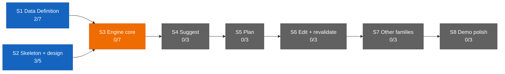

# Dashboard — the state surface

Stamp: 2026-07-16 · 10:41 · ship · work PC
V1 5/34 · S1 2/7 · S2 3/5 · sessions: 0 main · 0 parallel ·
needs-you 6
How to read this board →
[HOME §Reading the board](HOME.md#reading-the-board)

## Needs you

1. 🟡 Paste the current WEB-INSTRUCTIONS text into the claude.ai →
   Roam Project → settings box — stale twice over now: the approved
   v4 body (since 07-11) and the D-040 footer edit (the handoff paste
   goes inline).
   → master: [WEB-INSTRUCTIONS](WEB-INSTRUCTIONS.md) · the box is a
   copy · [history](history/workshop/definition/web-instructions.md)
2. 🟡 Run the machine-setup Verify block on this home PC — the work
   PC passed in full (since 07-13).
   → [machine-setup](skills/machine-setup.md) ·
   [vault lens](skills/machine-setup.md#vault-lens) (applied on both
   seats)
3. ⚪ Nine open engine questions sit parked in the Open register
   until S3 opens (since 07-13).
   → [ENGINE §12](ENGINE.md#12-open-register) ·
   [D-028](DECISIONS.md#d-028--2026-07--consolidation-recut--decision-policy--engine-brain-skeleton-form-project-policy-house-style-open-register-grows-69-upholds-d-021-extends-the-d-021-consolidation)
   · [V1.S3](ROADMAP.md#v1s3--engine-core--two-families-deep)
4. ⚪ Write the reviewer-subagent spec — a small task queued after
   the ops leg (since 07-13).
   → [SETUP §Staged](SETUP.md#staged--turns-on-when-its-stage-opens)
5. ⚪ One-time delegation UI setup (D-041): create the cloud
   lane-worker routine at claude.ai/code/routines, install the Claude
   GitHub App on the repo, allow unrestricted branch pushes, turn on
   Remote Control auto-connect + both push toggles (since 07-15).
   → [SETUP §cloud](SETUP.md#once-and-done--cloud-accounts) ·
   [machine-setup](skills/machine-setup.md) ·
   [D-041](DECISIONS.md#d-041--2026-07--delegation-architecture--the-away-mode-chooser-go-remote-tether-idle-wait-label-spawned-cloud-amends-d-032s-wake-lock-and-the-dispatch-law-upholds-the-baton-law-and-d-009)
6. ⚪ The delegation maiden flight (D-041): first real cloud lane —
   records the route ladder's winning route; needs the UI setup first
   (since 07-15).
   → [parallel-lanes §Cloud spawn](skills/parallel-lanes.md#cloud-spawn--route-ladder)

## Sessions

0 main · 0 parallel — operations idle. Shipped today: ledger-integrity
([#140](https://github.com/wsher0901/roam/pull/140)) — the
check:ledger CI gate keeping history/ and the ledger index in
bijection, plus the ship §7 weld-staging tightening; and lane-liveness
([#142](https://github.com/wsher0901/roam/pull/142), D-042) — commits
are the heartbeat: live-vs-reclaimable read at the claim check and
pickup's worktree sweep, fed by the session-start hook's per-worktree
verdict, so a live lane is never adopted or pruned. The previous
sitting shipped seven
workshop tasks: the D-040 leaving-ritual inversion
(handoff-inline-context,
[#126](https://github.com/wsher0901/roam/pull/126)); four currency
sweeps carrying it through the corpus — skills-precision-pass
([#128](https://github.com/wsher0901/roam/pull/128)),
home-currency-pass
([#130](https://github.com/wsher0901/roam/pull/130)),
retroactivity-sweep
([#132](https://github.com/wsher0901/roam/pull/132)), laws-tightness
([#134](https://github.com/wsher0901/roam/pull/134)); the capstone
delegation-architecture
([#136](https://github.com/wsher0901/roam/pull/136), D-041) — the
away-mode chooser, the go-remote tether, idle-wait, and label-spawned
cloud lanes; and cap-confirm
([#138](https://github.com/wsher0901/roam/pull/138)) firming D-041's
routine-cap budget into confirmed fact — 15/day, flat across Max
tiers. No task is running.

↳ main micro: — (no live main session)

## You are here

V1 — The demo · 5/34 █████░░░░░░░░░░░░░░░░░░░░░░░░░░░░░
S1 · Data Definition · 2/7 ██░░░░░ → T3–T6 source vetting ⚪ held
(awaiting relaunch briefs)
S2 · Skeleton & design · 3/5 ███░░ → T5 Design foundations ⚪ idle
S3–S8 · queued in order · 0/22

## Stage map

No open Web or Design threads — none surfaced this sitting.
lane-liveness shipped
([#142](https://github.com/wsher0901/roam/pull/142), D-042); T3–T6
source-vetting relaunch stays held (see You are here).

## Shipped (latest — full record: [the ledger](history/README.md#the-ledger))

| When | What | PR |
|---|---|---|
| 07-16 10:37 | [Lane liveness (D-042): live-vs-reclaimable derived from the commit heartbeat and read at the claim check and pickup's worktree sweep, fed by the session-start hook's verdict — a live lane is never adopted or pruned](history/workshop/mechanism/lane-liveness.md) | [#142](https://github.com/wsher0901/roam/pull/142) |
| 07-16 08:57 | [a CI gate (check:ledger) proving history/ files and the ledger index stay in one-to-one bijection by #PR, plus a ship §7 weld-staging line so a dropped or orphaned ledger line turns the build red instead of leaving a silent gap](history/workshop/mechanism/ledger-integrity.md) | [#140](https://github.com/wsher0901/roam/pull/140) |
| 07-15 15:35 | [the Max routine cap firmed to confirmed fact (15/day, flat across Max tiers): the SETUP and liftoff live-number hedges retired](history/workshop/definition/cap-confirm.md) | [#138](https://github.com/wsher0901/roam/pull/138) |
| 07-15 14:39 | [Delegation architecture (D-041): the away-mode chooser (local · handoff · go-remote · liftoff), the go-remote tether posture, idle-wait, label-spawned cloud lanes](history/workshop/mechanism/delegation-architecture.md) | [#136](https://github.com/wsher0901/roam/pull/136) |
| 07-15 12:58 | [LAWS tightness (Option C): command + one-line whys (D-027 upheld), procedure grain expelled to handoff §1.5, the stale decide trigger and preview conditional fixed](history/workshop/definition/laws-tightness.md) | [#134](https://github.com/wsher0901/roam/pull/134) |
| 07-15 12:08 | [Retroactivity sweep: repair three later-found gaps — HOME's surviving Cloud-ledger ghost, handoff's non-vocabulary "waiting", recall's FOUNDATION + DESIGN-KICKOFF routing omissions](history/workshop/definition/retroactivity-sweep.md) | [#132](https://github.com/wsher0901/roam/pull/132) |
| 07-15 11:18 | [HOME currency pass: bring the bible current with D-040/D-032/D-039/#128 and close six newcomer-test gaps — four rewordings, five new Terms, the recall read-path](history/workshop/definition/home-currency-pass.md) | [#130](https://github.com/wsher0901/roam/pull/130) |
| 07-15 10:24 | [Skills precision pass: codify already-decided behavior across the corpus (decide · handoff · liftoff · parallel-lanes · recall); the abort-ledger ghost fully retired](history/workshop/mechanism/skills-precision-pass.md) | [#128](https://github.com/wsher0901/roam/pull/128) |
| 07-15 09:23 | [Handoff input inversion: the leaving message carries the Web/Design paste inline; the never-skipped question is retired; a bare trigger means none](history/workshop/mechanism/handoff-inline-context.md) | [#126](https://github.com/wsher0901/roam/pull/126) |
| 07-14 11:46 | [Leg-end restyle sweep: D-029 finishes its migration — every living doc carries its links below the prose](history/workshop/definition/restyle-sweep.md) | [#121](https://github.com/wsher0901/roam/pull/121) |
