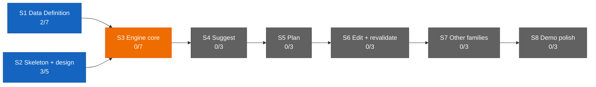

# Dashboard — the state surface

Stamp: 2026-07-15 · 10:28 · ship · work PC
V1 5/34 · S1 2/7 · S2 3/5 · sessions: 0 main · 0 parallel ·
needs-you 4
How to read this board →
[HOME §Reading the board](HOME.md#reading-the-board)

## Needs you

1. 🟡 Paste the current WEB-INSTRUCTIONS text into the claude.ai →
   Roam Project → settings box — stale twice over now: the approved
   v4 body (since 07-11) and the D-040 footer edit (the handoff paste
   goes inline).
   → master: [WEB-INSTRUCTIONS](WEB-INSTRUCTIONS.md) · the box is a
   copy · [history](history/workshop/definition/web-instructions.md)
2. 🟡 Run the machine-setup Verify block on this home PC — the work
   PC passed in full (since 07-13).
   → [machine-setup](skills/machine-setup.md) ·
   [vault lens](skills/machine-setup.md#vault-lens) (applied on both
   seats)
3. ⚪ Nine open engine questions sit parked in the Open register
   until S3 opens (since 07-13).
   → [ENGINE §12](ENGINE.md#12-open-register) ·
   [D-028](DECISIONS.md#d-028--2026-07--consolidation-recut--decision-policy--engine-brain-skeleton-form-project-policy-house-style-open-register-grows-69-upholds-d-021-extends-the-d-021-consolidation)
   · [V1.S3](ROADMAP.md#v1s3--engine-core--two-families-deep)
4. ⚪ Write the reviewer-subagent spec — a small task queued after
   the ops leg (since 07-13).
   → [SETUP §Staged](SETUP.md#staged--turns-on-when-its-stage-opens)

## Sessions

0 main · 0 parallel — operations idle. This sitting shipped two
workshop tasks in order: handoff-inline-context
([#126](https://github.com/wsher0901/roam/pull/126)) — handoff's input
inversion
([D-040](DECISIONS.md#d-040--2026-07--handoff-input-inversion--the-leaving-message-carries-the-webdesign-paste-inline-the-never-skipped-question-is-retired-a-bare-trigger-means-none-amends-the-two-touchpoints-laws-wording-upholds-d-032)) —
then skills-precision-pass
([#128](https://github.com/wsher0901/roam/pull/128)), which codified
already-decided behavior across the skill corpus and fully retired the
abort-ledger ghost. No task is running.

↳ main micro: — (no live main session)

## You are here

V1 — The demo · 5/34 █████░░░░░░░░░░░░░░░░░░░░░░░░░░░░░
S1 · Data Definition · 2/7 ██░░░░░ → T3–T6 source vetting ⚪ held
(awaiting relaunch briefs)
S2 · Skeleton & design · 3/5 ███░░ → T5 Design foundations ⚪ idle
S3–S8 · queued in order · 0/22

## Stage map

No open Web or Design threads — none surfaced this sitting.
skills-precision-pass shipped
([#128](https://github.com/wsher0901/roam/pull/128)); T3–T6
source-vetting relaunch stays held (see You are here).

## Shipped (latest — full record: [the ledger](history/README.md#the-ledger))

| When | What | PR |
|---|---|---|
| 07-15 10:24 | [Skills precision pass: codify already-decided behavior across the corpus (decide · handoff · liftoff · parallel-lanes · recall); the abort-ledger ghost fully retired](history/workshop/mechanism/skills-precision-pass.md) | [#128](https://github.com/wsher0901/roam/pull/128) |
| 07-15 09:23 | [Handoff input inversion: the leaving message carries the Web/Design paste inline; the never-skipped question is retired; a bare trigger means none](history/workshop/mechanism/handoff-inline-context.md) | [#126](https://github.com/wsher0901/roam/pull/126) |
| 07-14 14:50 | [Recall — the routing table's read mirror: founder questions answered from the files with receipts, never from memory; fires on its own judgment](history/workshop/mechanism/recall-skill.md) | [#123](https://github.com/wsher0901/roam/pull/123) |
| 07-14 11:46 | [Leg-end restyle sweep: D-029 finishes its migration — every living doc carries its links below the prose](history/workshop/definition/restyle-sweep.md) | [#121](https://github.com/wsher0901/roam/pull/121) |
| 07-14 10:55 | [Repo auto-merge enabled so the self-merge law works — the repo's first armed --auto, fired on green](history/workshop/mechanism/auto-merge-flip.md) | [#119](https://github.com/wsher0901/roam/pull/119) |
| 07-14 10:32 | [CI is the arbiter: Actions-green at every gate; the local gate mirrors all six CI steps; anchors born resolving](history/workshop/mechanism/ci-trust.md) | [#117](https://github.com/wsher0901/roam/pull/117) |
| 07-14 10:24 | [Leg close: LAWS carries the routing clause; pickup speaks the founder's shape](history/workshop/definition/laws-close.md) | [#115](https://github.com/wsher0901/roam/pull/115) |
| 07-13 23:14 | [HOME closes the leg's knowledge layer: the routing table, one day in the workshop, the board paragraph recut, a stable Sessions anchor](history/workshop/definition/home-knowledge.md) | [#113](https://github.com/wsher0901/roam/pull/113) |
| 07-13 22:58 | [State surfaces v2: the board learns the founder's names; pickup becomes the sit-down summary; welds stamp time and write the ledger](history/workshop/mechanism/state-surfaces-v2.md) | [#110](https://github.com/wsher0901/roam/pull/110) |
| 2026-07-13 | [History quadrants: four doors; TEMPLATE owns the format + Status vocabulary](history/workshop/definition/history-quadrants.md) | [#108](https://github.com/wsher0901/roam/pull/108) |
