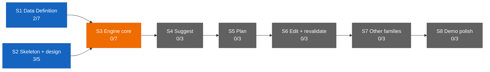

# Dashboard — the state surface

Stamp: 2026-07-23 · 16:35 · liftoff · work PC
V1 5/34 · S1 2/7 · S2 3/5 · sessions: 1 main · 1 parallel
(1 need you) · needs-you 2
How to read this board →
[HOME §Reading the board](HOME.md#reading-the-board)

## Needs you

1. 🟡 THE FLIGHT'S GATE — merge PR
   [#200](https://github.com/wsher0901/roam/pull/200)
   (env-clerk-scrub) on your word, once the cockpit has reviewed
   the lane's diff as a non-author. Lane-authored, so the cockpit's
   review plus your word carries it — no external Web review. The
   cockpit relays and merges; command it from the phone (since
   07-23).
   → [#200](https://github.com/wsher0901/roam/pull/200) ·
   [env-clerk-scrub](https://github.com/wsher0901/roam/pull/200)
2. 🟡 The home PC's seat debt, owed at that machine's next sitting:
   paste the `COCKPIT_` pair into its `.env.local` (password
   manager first) and bring `claude --version` to 2.1.195 or
   later. Optional and non-urgent while you are at the work PC
   (since 07-21).
   → [SETUP §cloud accounts](SETUP.md#once-and-done--cloud-accounts)
   · [SETUP §Per machine](SETUP.md#per-machine-procedure-machine-setup-skill)
   · [machine-setup](skills/machine-setup.md)

The nine open engine questions stay parked in
[ENGINE §12](ENGINE.md#12-open-register) until
[V1.S3](ROADMAP.md#v1s3--engine-core--two-families-deep) opens;
they are a register, not an action.

## Sessions

| Session | Task | State | Last push | Your move |
|---|---|---|---|---|
| main · cockpit | THE FLIGHT — commands the env-clerk-scrub lane, reviews it non-author, merges on your word | 🟢 birthing at this liftoff (rung + url in the close line; the cockpit adds its own row at first repaint) | 16:35 | your word to merge [#200](https://github.com/wsher0901/roam/pull/200) after its review |
| cloud · lane | [env-clerk-scrub](https://github.com/wsher0901/roam/pull/200) → [#200](https://github.com/wsher0901/roam/pull/200) | 🟢 airborne · cloud · 2026-07-23 | 16:33 (ack) | — (working; then cockpit review → your word) |

↳ THE FLIGHT PLAN (the cockpit's authoritative mandate — read this,
not the birth prompt, if they ever disagree):

- **In flight.** The env-clerk-scrub lane
  ([#200](https://github.com/wsher0901/roam/pull/200)), airborne and
  acked, is scrubbing the vestigial `CLERK_` comment from
  `.env.example` so the file carries zero `CLERK_` references. READ
  THE LANE'S [spec](https://github.com/wsher0901/roam/pull/200) FIRST: the founder's
  mandate said "remove the two `CLERK_` placeholder lines," but those
  assignment lines were already removed by
  [#197](https://github.com/wsher0901/roam/pull/197) — what remains
  is comment prose, so the payload is the comment scrub, and the end
  state matches the ask (no `CLERK_` anywhere). The cockpit reviews
  the lane's diff as an independent non-author.
- **Owed.** Nothing parked or held. One clean lane.
- **Needs the founder's word.** The merge of
  [#200](https://github.com/wsher0901/roam/pull/200) after the
  cockpit's non-author review — lane-authored, so review + word
  suffices. Plus the standing home-PC seat debt (Needs-you 2), a
  founder act, not a gate.

Cap arithmetic for this outing, stated plainly: `count:runs` reads
15 remaining but is BLIND to the 07-23 summon-drill fire (one run),
so the true budget was 14. Spent this liftoff: the label-spawn of
[#200](https://github.com/wsher0901/roam/pull/200) (one
GitHub-triggered run, visible to `count:runs`). The cockpit's
rung-1 `--cloud` birth is list-native and NOT a routine run; a fall
to rung 3 (`fire:cockpit`) would add one. So after this liftoff:
13 actual remaining (12 if the cockpit fell to rung 3), while
`count:runs` will read 14 — still blind to the summon fire.

## You are here

V1 — The demo · 5/34 █████░░░░░░░░░░░░░░░░░░░░░░░░░░░░
S1 · Data Definition · 2/7 ██░░░░░ → T3–T6 source vetting ⚪ held
(awaiting relaunch briefs)
S2 · Skeleton & design · 3/5 ███░░ → T5 Design foundations ⚪ idle
S3–S8 · queued in order · 0/22

## Stage map

## Claude Web + Design discussion

The live ops surface is the current ops chat (title unrecorded at
the shakedown-audit weld). Its most recent external review —
[#199](https://github.com/wsher0901/roam/pull/199) (the cloud-birth
probe finding, IDEAS append) — is DONE, verdict PASS on `0fe69a9`
(single file, append-only). Earlier reviews, all DONE:
[#197](https://github.com/wsher0901/roam/pull/197) (PASS on
`0fe69a9`) ·
[#193](https://github.com/wsher0901/roam/pull/193) (PASS on
`d118af5`) · [#195](https://github.com/wsher0901/roam/pull/195)
(PASS on `aa62baf`/`0af0d97`) → next: grade the cockpit maiden,
once the closeout bench opens. Under the surface doctrine
([D-046](DECISIONS.md#d-046--2026-07--flight-cockpit--the-cockpit-is-the-control-tower-online-full-authorship-cloud-command-session-the-no-solo-approval-law-liftoff-auto-fires-the-cockpit-cc-direct-surface-doctrine-clerk-retirement-staged-remote-control-demoted-to-backstop-the-cockpitcontrol-tower-rename-amends-d-041-and-d-043-upholds-the-lane-law-and-the-wake-lock)),
Web's one mandatory job is the external review of self-authored
diffs; this liftoff's payload
([#200](https://github.com/wsher0901/roam/pull/200)) is
LANE-authored, so the cockpit's non-author review plus your word
carries it without Web.
T3–T6 source-vetting relaunch stays held (see You are here).

## Shipped (latest — full record: [the ledger](history/README.md#the-ledger))

| When | What | PR |
|---|---|---|
| 07-23 12:02 | [the repo stops pointing at a vehicle that cannot fire: the clerk routine was deleted 07-22, every live instruction reaching for the clerk removed and every verified record tombstoned (C1–C6, N2/N3, A1/A4 kept), liftoff's ladder bottomed out at the D-048 phone bootstrap, `fire.mjs` cockpit-only with the drain idiom untouched, no new D-number by design, and one live defect caught just outside the mandate's file list — parallel-lanes still armed the clerk as both fallback and notification watcher](history/workshop/mechanism/clerk-retirement.md) | [#197](https://github.com/wsher0901/roam/pull/197) |
| 07-22 16:36 | [a cockpit that survives, announces, and replaces its own GitHub connector loss (D-048): redundancy inside a session ruled impossible, so resilience became a five-rung ladder OUT of the session (prevent · detect · repair · degrade · self-rescue) with a tombstone and refusal guard; `summon.yml` ships live on `workflow_dispatch` + a push to `ops/summon`, reusing `fire.mjs`; merge-on-signal REJECTED with reasons](history/workshop/mechanism/cockpit-resilience.md) | [#195](https://github.com/wsher0901/roam/pull/195) |
| 07-22 16:19 | [the lane-worker charter's canary line names the baton-holder: the D-046 vocabulary sweep's one missed straggler; flown as the first end-to-end flight of the assembled chain, the wake-lock catching a mistimed em-dash-vs-middot ack in flight](history/workshop/mechanism/lane-worker-baton.md) | [#191](https://github.com/wsher0901/roam/pull/191) |
| 07-22 15:09 | [the repo stops telling a future seat to do things that cannot work: nine corrections from the first end-to-end chain flight — one canonical anchored ack token, rung 1's impossible recipe replaced by the console-attach shape that flew, the board promoted to authoritative flight plan, a git-only vs API-only dependency map, the cloud environment corrected to `Default`, one LAWS sentence fixing "non-author" to the payload diff](history/workshop/mechanism/flight-hardening.md) | [#193](https://github.com/wsher0901/roam/pull/193) |
| 07-21 14:56 | [the cockpit's birth vehicle becomes `claude --cloud` (D-047): the automated hidden-console birth is liftoff §6's primary rung — list-native — with compose-and-hand, the routine fire, and the manual paste as fallbacks; three STOP-gates proved clone-from-GitHub and branch-create by live probe](history/workshop/mechanism/cloud-born-cockpit.md) | [#187](https://github.com/wsher0901/roam/pull/187) |
| 07-20 22:01 | [the `.claude/` harness learns the D-046 vocabulary: the pickup stub and session-start hook name the BATON-HOLDER (control tower on the ground, cockpit in flight); flown as a label-spawned cloud lane](history/workshop/mechanism/harness-vocab-rename.md) | [#180](https://github.com/wsher0901/roam/pull/180) |
| 07-20 15:40 | [the cockpit is the control tower online (D-046): full-authorship cloud command session fired by liftoff; the no-solo-approval law; the CC-direct surface doctrine; clerk retirement staged; fire.mjs generalized (clerk \| cockpit)](history/workshop/definition/flight-cockpit.md) | [#177](https://github.com/wsher0901/roam/pull/177) |
| 07-20 13:17 | [the Shakedown Flight closes on paper: A/N checklists graded evidence-or-attest; six forensics findings closed; both staged clerk lines resolved; liftoff's fire:clerk folded in on the founder's gate word](history/workshop/mechanism/shakedown-audit.md) | [#175](https://github.com/wsher0901/roam/pull/175) |
| 07-17 23:43 | [the Hands doctrine (D-045): solo · exploratory subagents · agent team · parallel lanes, the one-bench/many-benches/read-only litmus; flown fully unattended as payload A of Shakedown phase 2](history/workshop/definition/agent-teams-brain.md) | [#170](https://github.com/wsher0901/roam/pull/170) |
| 07-17 23:39 | [the memory-format CI gate: scripts/check-memory.mjs validates every task memory against TEMPLATE's locked format; flown fully unattended as payload B of Shakedown phase 2](history/workshop/mechanism/check-memory.md) | [#171](https://github.com/wsher0901/roam/pull/171) |

Note: [#198](https://github.com/wsher0901/roam/pull/198) (board
repaint) and [#199](https://github.com/wsher0901/roam/pull/199) (the
cloud-birth probe finding into IDEAS) are chore/docs micro-PRs, not
history/ stories, so they carry no ledger line — the ledger is
history-keyed. #199's finding lives in [IDEAS](IDEAS.md).
