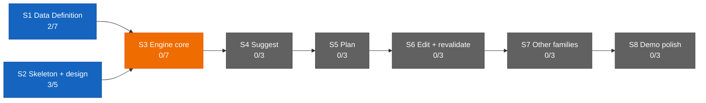

# Dashboard — the state surface

Stamp: 2026-07-13 · ship tail · home PC
Glyphs: 🟢 done · 🟡 ongoing · 🔴 issue · ⚪ idle. Repainted only by
rituals (pickup when stale · handoff · liftoff · ship's tail) — never
hand-edited; git outranks this board.

## Needs you

1. 🟡 Paste the approved v4 text into the claude.ai → Roam Project →
   settings box — its master is now
   [WEB-INSTRUCTIONS](WEB-INSTRUCTIONS.md); the box is a copy
   ([history](history/web-instructions.md)).
2. 🟡 Run the [machine-setup](skills/machine-setup.md) Verify block
   on the home PC — the work PC passed in full on 2026-07-13 (seat
   label repaired to "work PC").
   [Vault lens](skills/machine-setup.md#vault-lens): applied on both
   seats (2026-07-13).
3. ⚪ [ENGINE §12 — the Open register](ENGINE.md#12-open-register) —
   NINE open slots (was "DECISION-POLICY §10 — five questions";
   grew at
   [D-028](DECISIONS.md#d-028--2026-07--consolidation-recut--decision-policy--engine-brain-skeleton-form-project-policy-house-style-open-register-grows-69-upholds-d-021-extends-the-d-021-consolidation));
   still parked until
   [V1.S3](ROADMAP.md#v1s3--engine-core--two-families-deep) opens.
4. ⚪ reviewer-subagent spec
   ([SETUP §Staged](SETUP.md#staged--turns-on-when-its-stage-opens),
   V1.S2.T2+) — small task after the ops leg.

## You are here

V1 — The demo · 5/34 █████░░░░░░░░░░░░░░░░░░░░░░░░░░░░░
S1 · Data Definition · 2/7 ██░░░░░ → T3–T6 source vetting ⚪ held
(relaunch briefs due from ladder step P8 in the Web chat)
S2 · Skeleton & design · 3/5 ███░░ → T5 Design foundations ⚪ idle
S3–S8 · queued in order · 0/22

## Stage map

Legend: green = done · blue = active (work permitted now) · orange =
locked (gated by an unmet dependency) · gray = pending (queued).
Counts recomputed from [ROADMAP](ROADMAP.md) checkboxes at every
ritual repaint.

## In flight

⚪ **[V1.S2.T5](ROADMAP.md#v1s2--skeleton--design-foundations-parallel-lane-with-s1)
— Design foundations** · no PR yet · 0/3
Exploring Roam's visual language in Claude Design. Only extracted
token values enter the repo, never markup or bundles. Each session
starts by pasting the [DESIGN-KICKOFF](DESIGN-KICKOFF.md) preamble,
then stating the lane.
⚪ option card with confidence badge · ⚪ day timeline beside map ·
⚪ token extraction ("Hand off to Claude Code")
→ memory: — (Design-surface lane; predates the memory layer)

## Threads (non-task)

none open — founder confirmed at the 2026-07-13 work-PC handoff.
Two ops-leg briefs shipped this sitting on the home PC — Fleet
Continuity ([PR #104](https://github.com/wsher0901/roam/pull/104))
and the telemetry fold
([PR #106](https://github.com/wsher0901/roam/pull/106)) (see
Shipped). Queued Web-chat work, in order:
- the history/ brief — named "next task" by the telemetry-fold
  brief; the ops leg's next item;
- the T3–T6 relaunch briefs (ladder step P8) — tracked as the S1
  hold in You-are-here;
- the v4 WEB-INSTRUCTIONS paste — Needs-you 1.

## Shipped (latest — full record: [history/](history/README.md))

| When | What | PR |
|---|---|---|
| 2026-07-13 | [TELEMETRY folds into FACTS: Appendix C; file retired](history/telemetry-fold.md) | [#106](https://github.com/wsher0901/roam/pull/106) |
| 2026-07-13 | [Fleet continuity: handoff parks every local lane; liftoff respawns parked benches; wake-lock parks every outcome](history/fleet-continuity.md) | [#104](https://github.com/wsher0901/roam/pull/104) |
| 2026-07-13 | [Stale-branch hygiene: gone-guard on the safety net; welded-elsewhere locals auto-removed](history/stale-branch-hygiene.md) | [#101](https://github.com/wsher0901/roam/pull/101) |
| 2026-07-13 | [Setup consolidation: SETUP.md born; equipment-plan and PROJECT-POLICY retired; the writing laws adopted](history/setup-consolidation.md) | [#99](https://github.com/wsher0901/roam/pull/99) |
| 2026-07-13 | [DESIGN-KICKOFF refresh: June-2026 Claude Design capabilities](history/design-kickoff-refresh.md) | [#97](https://github.com/wsher0901/roam/pull/97) |
| 2026-07-13 | [Consolidation recut: DECISION-POLICY becomes ENGINE; PROJECT-POLICY to house style](history/engine-recut.md) | [#95](https://github.com/wsher0901/roam/pull/95) |
| 2026-07-13 | [Vault-lens seed: Obsidian config travels through git](history/vault-lens-seed.md) | [#91](https://github.com/wsher0901/roam/pull/91) |
| 2026-07-13 | [LAWS polish: glossed lane law, provenance to consolidations, ship syncs with main](history/laws-polish.md) | [#89](https://github.com/wsher0901/roam/pull/89) |
| 2026-07-13 | [ROADMAP recut: plain-language V1, completion criteria, per-family vetting outputs](history/roadmap-recut.md) | [#87](https://github.com/wsher0901/roam/pull/87) |
| 2026-07-12 | [FOUNDATION v4: principles recut, open family set, lifespan repair](history/foundation-v4.md) | [#85](https://github.com/wsher0901/roam/pull/85) |
