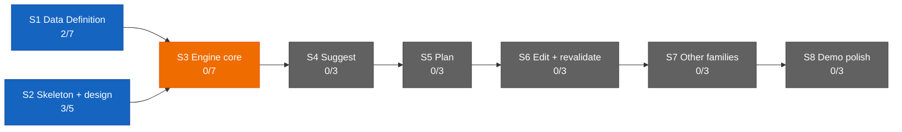

# Dashboard — the state surface

Stamp: 2026-07-22 · 10:58 · liftoff · work PC
V1 5/34 · S1 2/7 · S2 3/5 · sessions: 1 main · 0 parallel
(0 need you) · needs-you 2
How to read this board →
[HOME §Reading the board](HOME.md#reading-the-board)

## Needs you

1. 🟡 The box-is-a-copy re-saves and the post-weld manual acts,
   one standing set: re-save the cockpit routine box from the
   CHARTER MASTER AS UPDATED BY
   [D-047](DECISIONS.md#d-047--2026-07--cloud-born-cockpit--the-cockpits-birth-vehicle-becomes-claude---cloud-list-native-on-every-device-the-automated-hidden-console-birth-is-liftoffs-primary-rung-the-routine-fire-demotes-to-fallback--summon-button-engine-amends-d-046-clause-3-upholds-the-lane-law)
   (born-at clause changed 07-21) · re-save the LANE-WORKER
   routine box once this outing's `docs/SETUP.md` fix welds —
   that fix edits the lane-worker charter master and the box is
   a copy (founder-recorded at this liftoff) · add the `gh`
   install to the roam cloud environment's setup script
   (claude.ai/code settings → Environments) · the home PC's
   credential paste · the clerk routine/session re-saves from
   the updated SETUP masters · from the maiden closeout, still
   owed: archive the maiden lane's session at claude.ai/code and
   grade the maiden (since 07-20/21/22).
   → [SETUP §cloud accounts](SETUP.md#once-and-done--cloud-accounts)
   · [flight-cockpit](specs/flight-cockpit.md) ·
   [cloud-born-cockpit](specs/cloud-born-cockpit.md) ·
   [D-046](DECISIONS.md#d-046--2026-07--flight-cockpit--the-cockpit-is-the-control-tower-online-full-authorship-cloud-command-session-the-no-solo-approval-law-liftoff-auto-fires-the-cockpit-cc-direct-surface-doctrine-clerk-retirement-staged-remote-control-demoted-to-backstop-the-cockpitcontrol-tower-rename-amends-d-041-and-d-043-upholds-the-lane-law-and-the-wake-lock)
2. ⚪ Nine open engine questions sit parked in the Open register
   until S3 opens (since 07-13).
   → [ENGINE §12](ENGINE.md#12-open-register) ·
   [D-028](DECISIONS.md#d-028--2026-07--consolidation-recut--decision-policy--engine-brain-skeleton-form-project-policy-house-style-open-register-grows-69-upholds-d-021-extends-the-d-021-consolidation)
   · [V1.S3](ROADMAP.md#v1s3--engine-core--two-families-deep)

## Sessions

| Session | Task | State | Last push | Your move |
|---|---|---|---|---|
| main · control tower | liftoff — no task in flight at this seat; this outing's mandate rides to the cockpit | 🟢 | 10:58 (this repaint) | none — the cockpit reports next |

↳ main micro: the outing's mandate, all five steps owned by the
cockpit — ⚪ birth the `docs/SETUP.md` bench · ⚪ fly it
label-spawned · ⚪ non-author review · ⚪ bring the founder the
word · ⚪ land on "land"

Flight context — the first end-to-end flight of the assembled
chain
([D-046](DECISIONS.md#d-046--2026-07--flight-cockpit--the-cockpit-is-the-control-tower-online-full-authorship-cloud-command-session-the-no-solo-approval-law-liftoff-auto-fires-the-cockpit-cc-direct-surface-doctrine-clerk-retirement-staged-remote-control-demoted-to-backstop-the-cockpitcontrol-tower-rename-amends-d-041-and-d-043-upholds-the-lane-law-and-the-wake-lock)
+ [D-047](DECISIONS.md#d-047--2026-07--cloud-born-cockpit--the-cockpits-birth-vehicle-becomes-claude---cloud-list-native-on-every-device-the-automated-hidden-console-birth-is-liftoffs-primary-rung-the-routine-fire-demotes-to-fallback--summon-button-engine-amends-d-046-clause-3-upholds-the-lane-law)):
the founder stays at the desk but commands from the phone only.
The control tower flies ZERO lanes this outing — the cockpit
births the single bench itself, by the founder's mandate, so the
chain birth → label-spawn → non-author review → the founder's
word → landing runs end-to-end for the first time. Payload, one
theme: `docs/SETUP.md`'s lane-worker charter master still tells
a lane to WAIT for "the control tower's" airborne ack where the
amended lane law says BATON-HOLDER — that one phrase, nothing
else. The closeout bench stays UNFLOWN by founder order (no spec
yet; grading the maiden waits with it). Cap arithmetic at this
liftoff: 0 GitHub-triggered runs today, 15 of 15 remaining; the
cockpit's rung-1 `--cloud` birth is a plain cloud session and
burns none of the cap; the one lane the cockpit spawns costs 1,
leaving 14. Seat tripwire: origin heads = `main` only, so
`chore/cloud-probe` and `chore/harness-vocab-rename` are both
verified DEAD and the 07-21 probe-branch item clears — git
outranks the board. No active watches.

## You are here

V1 — The demo · 5/34 █████░░░░░░░░░░░░░░░░░░░░░░░░░░░░░
S1 · Data Definition · 2/7 ██░░░░░ → T3–T6 source vetting ⚪ held
(awaiting relaunch briefs)
S2 · Skeleton & design · 3/5 ███░░ → T5 Design foundations ⚪ idle
S3–S8 · queued in order · 0/22

## Stage map

The live ops surface is the current ops chat (title unrecorded at
the shakedown-audit weld) — its external review of
[#177](https://github.com/wsher0901/roam/pull/177) is DONE (the
baton-holder amendment, folded); the external Web review of
[#187](https://github.com/wsher0901/roam/pull/187) is DONE
(founder-confirmed at the gate, chat title unrecorded) → next:
grade the cockpit maiden, once the closeout bench opens. Last
paste: none — this outing's leaving message carried a mandate,
not a Web/Design paste. Under the surface doctrine
([D-046](DECISIONS.md#d-046--2026-07--flight-cockpit--the-cockpit-is-the-control-tower-online-full-authorship-cloud-command-session-the-no-solo-approval-law-liftoff-auto-fires-the-cockpit-cc-direct-surface-doctrine-clerk-retirement-staged-remote-control-demoted-to-backstop-the-cockpitcontrol-tower-rename-amends-d-041-and-d-043-upholds-the-lane-law-and-the-wake-lock)),
Web's one mandatory job is the external review of self-authored
diffs — this outing's payload is lane-authored, so a non-author
cockpit review plus the founder's word is lawful without it.
T3–T6 source-vetting relaunch stays held (see You are here).

## Shipped (latest — full record: [the ledger](history/README.md#the-ledger))

| When | What | PR |
|---|---|---|
| 07-21 14:56 | [the cockpit's birth vehicle becomes `claude --cloud` (D-047): the automated hidden-console birth is liftoff §6's primary rung — list-native, sessions join the phone's GENERAL list by gate-0c evidence — with compose-and-hand, the routine fire (kept as the summon button's engine), and the manual paste as fallbacks; every flight plan opens with the standing clone-provenance first line; three STOP-gates proved clone-from-GitHub and branch-create by live probe; the mandate run by the probe session itself on the founder's in-list word](history/workshop/mechanism/cloud-born-cockpit.md) | [#187](https://github.com/wsher0901/roam/pull/187) |
| 07-20 22:01 | [the `.claude/` harness learns the D-046 vocabulary: the pickup stub's description and the session-start hook's briefing directive name the BATON-HOLDER (control tower on the ground, cockpit in flight) — wording only, zero stragglers by grep; flown as a label-spawned cloud lane, welded from the same seat on the founder's direct word with the reviewer critic's clean verdict](history/workshop/mechanism/harness-vocab-rename.md) | [#180](https://github.com/wsher0901/roam/pull/180) |
| 07-20 15:40 | [the cockpit is the control tower online (D-046): full-authorship cloud command session fired by liftoff with the board-derived flight plan; the no-solo-approval law (external Web review for self-authored diffs — this weld its own first subject); the CC-direct surface doctrine; clerk retirement staged; Remote Control demoted to backstop; the cockpit/control-tower rename with the BATON-HOLDER as lane-command actor, folded to closure through one review amendment + three critic passes; fire.mjs generalized (clerk \| cockpit)](history/workshop/definition/flight-cockpit.md) | [#177](https://github.com/wsher0901/roam/pull/177) |
| 07-20 13:17 | [the Shakedown Flight closes on paper: A/N checklists graded evidence-or-attest — the 07-20 gate answers folded verbatim, hedges included; six forensics findings closed (the exit-127 assert repaired to an honest 1, the resurrection incident's verify-the-branch-stays-dead ripple, the cloud-proxy 403 rail confirmed); both staged clerk lines resolved verified; liftoff's fire:clerk folded in on the founder's gate word; the attestation haze recorded as lived evidence for D-046](history/workshop/mechanism/shakedown-audit.md) | [#175](https://github.com/wsher0901/roam/pull/175) |
| 07-17 23:43 | [the Hands doctrine (D-045): solo · exploratory subagents · agent team · parallel lanes, the one-bench/many-benches/read-only litmus — the founder's passage verbatim into SETUP §Models & effort, D-045 into DECISIONS, a pointer in parallel-lanes §Vehicles; flown fully unattended as payload A of Shakedown phase 2](history/workshop/definition/agent-teams-brain.md) | [#170](https://github.com/wsher0901/roam/pull/170) |
| 07-17 23:39 | [the memory-format CI gate: scripts/check-memory.mjs validates every task memory against TEMPLATE's locked format — frontmatter, six headings in order, dated Status, no surviving placeholders — wired into package.json, ci.yml, and ship §1's mirror; flown fully unattended as payload B of Shakedown phase 2, the two declared doc mentions landed at the weld](history/workshop/mechanism/check-memory.md) | [#171](https://github.com/wsher0901/roam/pull/171) |
| 07-17 16:41 | [the ignore step fails toward build, never toward error: `\|\| exit 1` hardens the docs-only skip against Vercel's shallow-clone horizon (exit 128 turned four productions ERROR tonight; #153's "failure direction is always build" held for exit 1, not 128 — a shared miss, corrected); documented side-effect: a beyond-horizon docs-only push builds once and self-heals](history/workshop/mechanism/vercel-ignore-fix.md) | [#167](https://github.com/wsher0901/roam/pull/167) |
| 07-17 16:22 | [liftoff ignites the clerk by API: fire-clerk.mjs + fire:clerk against the doc-verified routine-fire endpoint (per-routine token, dated experimental beta header, no idempotency — no auto-retry), the second routine's recipe + the machine-local secret path, manual paste retained as fallback; API fires count against the daily cap yet stay invisible to count:runs — liftoff budgets both (A1–A5 graded at the flight audit)](history/workshop/mechanism/clerk-autospawn.md) | [#164](https://github.com/wsher0901/roam/pull/164) |
| 07-17 16:16 | [the clerk gains the standing watch (charter v2, duty 6): lane events reach the founder's phone as turn-end announcements — BLOCKED:/completions/CI-red; the watcher line opens in the mail slot (N1–N6 graded at the flight audit); the doorbell-mirror idea superseded; the reviewer agent-type failure graduated to defect](history/workshop/mechanism/clerk-notify.md) | [#163](https://github.com/wsher0901/roam/pull/163) |
| 07-17 15:26 | [the away surface goes live: the clerk maiden flown founder-run, C1–C6 all green (~4.5h idle survival proven, run-count attest closed at 1), the promotion clause executed — clerk PRIMARY for machine-off answering, GitHub app demoted to backstop; clerk-notify + clerk-autospawn staged beside api-ignition](history/workshop/mechanism/cloud-clerk.md) | [#156](https://github.com/wsher0901/roam/pull/156) |
