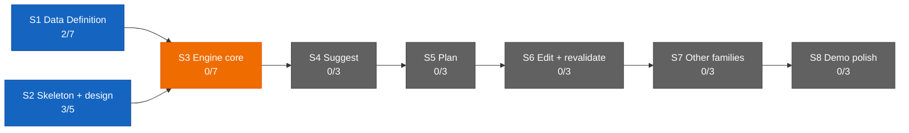

# Dashboard — the state surface

Stamp: 2026-07-13 · handoff · home PC
Glyphs: 🟢 done · 🟡 ongoing · 🔴 issue · ⚪ idle. Repainted only by
rituals (pickup when stale · handoff · liftoff · ship's tail) — never
hand-edited; git outranks this board.

## Needs you

1. 🟡 Paste the approved v4 text into the claude.ai → Roam Project →
   settings box — its master is now
   [WEB-INSTRUCTIONS](WEB-INSTRUCTIONS.md); the box is a copy
   ([history](history/web-instructions.md)).
2. 🟡 Run the [machine-setup](skills/machine-setup.md) Verify block
   on each PC — a full pass is unconfirmed on both seats.
   [Vault lens](skills/machine-setup.md#vault-lens): applied on the
   home PC (2026-07-13); on the work PC say "apply the vault lens".
3. ⚪ [DECISION-POLICY §10](DECISION-POLICY.md#10-open-questions) —
   five open engine questions; parked until
   [V1.S3](ROADMAP.md#v1s3--engine-core--two-families-deep) opens.

## You are here

V1 — The demo · 5/34 █████░░░░░░░░░░░░░░░░░░░░░░░░░░░░░
S1 · Data Definition · 2/7 ██░░░░░ → T3–T6 source vetting ⚪ held
(relaunch briefs due from ladder step P8 in the Web chat)
S2 · Skeleton & design · 3/5 ███░░ → T5 Design foundations ⚪ idle
S3–S8 · queued in order · 0/22

## Stage map

Legend: green = done · blue = active (work permitted now) · orange =
locked (gated by an unmet dependency) · gray = pending (queued).
Counts recomputed from [ROADMAP](ROADMAP.md) checkboxes at every
ritual repaint.

## In flight

⚪ **[V1.S2.T5](ROADMAP.md#v1s2--skeleton--design-foundations-parallel-lane-with-s1)
— Design foundations** · no PR yet · 0/3
Exploring Roam's visual language in Claude Design. Only extracted
token values enter the repo, never markup or bundles. Each session
starts by pasting the [DESIGN-KICKOFF](DESIGN-KICKOFF.md) preamble,
then stating the lane.
⚪ option card with confidence badge · ⚪ day timeline beside map ·
⚪ token extraction ("Hand off to Claude Code")
→ memory: — (Design-surface lane; predates the memory layer)

## Threads (non-task)

none open — founder reported none at the 2026-07-13 handoff. The
four workshop briefs cut earlier in the Web chat all shipped today
(see Shipped). The T3–T6 relaunch briefs (ladder step P8) remain
the queued Web-chat work — tracked as the S1 hold in You-are-here.

## Shipped (latest — full record: [history/](history/README.md))

| When | What | PR |
|---|---|---|
| 2026-07-13 | [Vault-lens seed: Obsidian config travels through git](history/vault-lens-seed.md) | [#91](https://github.com/wsher0901/roam/pull/91) |
| 2026-07-13 | [LAWS polish: glossed lane law, provenance to consolidations, ship syncs with main](history/laws-polish.md) | [#89](https://github.com/wsher0901/roam/pull/89) |
| 2026-07-13 | [ROADMAP recut: plain-language V1, completion criteria, per-family vetting outputs](history/roadmap-recut.md) | [#87](https://github.com/wsher0901/roam/pull/87) |
| 2026-07-12 | [FOUNDATION v4: principles recut, open family set, lifespan repair](history/foundation-v4.md) | [#85](https://github.com/wsher0901/roam/pull/85) |
| 2026-07-11 | [Vault lens + clean-tree verdict](history/vault-lens.md) | [#82](https://github.com/wsher0901/roam/pull/82) |
| 2026-07-11 | [Web instructions: the rule-carrier](history/web-instructions.md) | [#80](https://github.com/wsher0901/roam/pull/80) |
| 2026-07-11 | [Phase 5 — the sweep: hardening + hygiene](history/phase5-sweep.md) | [#78](https://github.com/wsher0901/roam/pull/78) |
| 2026-07-11 | [HOME v3 — the manual & encyclopedia](history/home-encyclopedia.md) | [#76](https://github.com/wsher0901/roam/pull/76) |
| 2026-07-11 | [The engine swap: architecture v2](history/engine-swap.md) | [#71](https://github.com/wsher0901/roam/pull/71) |
| 2026-07-10 | [Version ladder + lifespan split](history/foundation-roadmap-recut.md) | [#69](https://github.com/wsher0901/roam/pull/69) |
