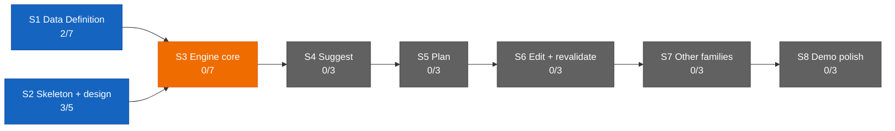

# Dashboard — the state surface

Stamp: 2026-07-13 · 23:00 · ship tail · home PC
V1 5/34 · S1 2/7 · S2 3/5 · sessions: 1 main · 0 parallel
(0 needs you) · needs-you 4
How to read this board →
[HOME §Reading the board](HOME.md#reading-the-board)

## Needs you

1. 🟡 Paste the approved v4 text into the claude.ai → Roam Project →
   settings box (since 07-11).
   → master: [WEB-INSTRUCTIONS](WEB-INSTRUCTIONS.md) · the box is a
   copy · [history](history/workshop/definition/web-instructions.md)
2. 🟡 Run the machine-setup Verify block on this home PC — the work
   PC passed in full (since 07-13).
   → [machine-setup](skills/machine-setup.md) ·
   [vault lens](skills/machine-setup.md#vault-lens) (applied on both
   seats)
3. ⚪ Nine open engine questions sit parked in the Open register
   until S3 opens (since 07-13).
   → [ENGINE §12](ENGINE.md#12-open-register) ·
   [D-028](DECISIONS.md#d-028--2026-07--consolidation-recut--decision-policy--engine-brain-skeleton-form-project-policy-house-style-open-register-grows-69-upholds-d-021-extends-the-d-021-consolidation)
   · [V1.S3](ROADMAP.md#v1s3--engine-core--two-families-deep)
4. ⚪ Write the reviewer-subagent spec — a small task queued after
   the ops leg (since 07-13).
   → [SETUP §Staged](SETUP.md#staged--turns-on-when-its-stage-opens)

## Sessions

1 main · 0 parallel (0 needs you · 0 await merge · 0 flying)

| Session | Task | State | Last push | Your move |
|---|---|---|---|---|
| main · cockpit | ops leg — [state-surfaces-v2](history/workshop/mechanism/state-surfaces-v2.md) welded; next: the HOME block brief | ⚪ idle | just now | — |

↳ main micro: — (between briefs; no active spec)

## You are here

V1 — The demo · 5/34 █████░░░░░░░░░░░░░░░░░░░░░░░░░░░░░
S1 · Data Definition · 2/7 ██░░░░░ → T3–T6 source vetting ⚪ held
(relaunch briefs due from ladder step P8 in the Web chat)
S2 · Skeleton & design · 3/5 ███░░ → T5 Design foundations ⚪ idle
S3–S8 · queued in order · 0/22

## Stage map

## Claude Web + Design discussion

- **"Ops — Architecture audit & setup"** (Web) — the ops leg;
  HOME + LAWS remain → next: the HOME block after this weld.
- **"<setup-ladder / P8 chat's exact title>"** (Web) — T3–T6
  relaunch briefs pending → next: per its own thread.

No Design chats open yet.

## Shipped (latest — full record: [the ledger](history/README.md#the-ledger))

| When | What | PR |
|---|---|---|
| 07-13 22:58 | [State surfaces v2: the board learns the founder's names; pickup becomes the sit-down summary; welds stamp time and write the ledger](history/workshop/mechanism/state-surfaces-v2.md) | [#110](https://github.com/wsher0901/roam/pull/110) |
| 2026-07-13 | [History quadrants: four doors; TEMPLATE owns the format + Status vocabulary](history/workshop/definition/history-quadrants.md) | [#108](https://github.com/wsher0901/roam/pull/108) |
| 2026-07-13 | [TELEMETRY folds into FACTS: Appendix C; file retired](history/workshop/definition/telemetry-fold.md) | [#106](https://github.com/wsher0901/roam/pull/106) |
| 2026-07-13 | [Fleet continuity: handoff parks every local lane; liftoff respawns parked benches; wake-lock parks every outcome](history/workshop/mechanism/fleet-continuity.md) | [#104](https://github.com/wsher0901/roam/pull/104) |
| 2026-07-13 | [Stale-branch hygiene: gone-guard on the safety net; welded-elsewhere locals auto-removed](history/workshop/mechanism/stale-branch-hygiene.md) | [#101](https://github.com/wsher0901/roam/pull/101) |
| 2026-07-13 | [Setup consolidation: SETUP.md born; equipment-plan and PROJECT-POLICY retired; the writing laws adopted](history/workshop/definition/setup-consolidation.md) | [#99](https://github.com/wsher0901/roam/pull/99) |
| 2026-07-13 | [DESIGN-KICKOFF refresh: June-2026 Claude Design capabilities](history/workshop/definition/design-kickoff-refresh.md) | [#97](https://github.com/wsher0901/roam/pull/97) |
| 2026-07-13 | [Consolidation recut: DECISION-POLICY becomes ENGINE; PROJECT-POLICY to house style](history/product/definition/engine-recut.md) | [#95](https://github.com/wsher0901/roam/pull/95) |
| 2026-07-13 | [Vault-lens seed: Obsidian config travels through git](history/workshop/mechanism/vault-lens-seed.md) | [#91](https://github.com/wsher0901/roam/pull/91) |
| 2026-07-13 | [LAWS polish: glossed lane law, provenance to consolidations, ship syncs with main](history/workshop/definition/laws-polish.md) | [#89](https://github.com/wsher0901/roam/pull/89) |
