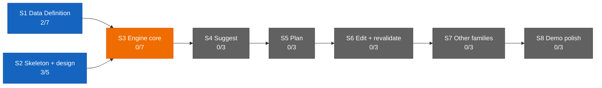

# Dashboard — the state surface

Stamp: 2026-07-23 · 12:08 · ship (quiet handoff) · work PC
V1 5/34 · S1 2/7 · S2 3/5 · sessions: 1 main · 0 parallel
(0 need you) · needs-you 1
How to read this board →
[HOME §Reading the board](HOME.md#reading-the-board)

## Needs you

1. 🟡 The home PC's seat debt, owed at that machine's next sitting:
   paste the `COCKPIT_` pair into its `.env.local` (password
   manager first) and bring `claude --version` to 2.1.195 or
   later. Optional and non-urgent while you are at the work PC
   (since 07-21).
   → [SETUP §cloud accounts](SETUP.md#once-and-done--cloud-accounts)
   · [SETUP §Per machine](SETUP.md#per-machine-procedure-machine-setup-skill)
   · [machine-setup](skills/machine-setup.md)

Cleared at this repaint on the founder's word — outside-repo acts
rituals cannot derive
([handoff §4](skills/handoff.md#4--repaint-dashboard-the-board-spec--single-source)):
the two repository secrets that gated self-rescue, the COCKPIT and
LANE-WORKER routine-box re-saves, the `Default` environment's
setup-script prune, and the maiden closeout's archive-and-grade.
The clerk routine/session re-saves are gone for a different reason
— there is no box left to re-save
([#197](https://github.com/wsher0901/roam/pull/197)). The nine
open engine questions stay parked in
[ENGINE §12](ENGINE.md#12-open-register) until
[V1.S3](ROADMAP.md#v1s3--engine-core--two-families-deep) opens;
they are a register, not an action.

## Sessions

| Session | Task | State | Last push | Your move |
|---|---|---|---|---|
| main · control tower | [clerk-retirement](history/workshop/mechanism/clerk-retirement.md) welded — no task in flight at this seat · 5/34 | 🟢 | 12:08 (this repaint) | — |

↳ main micro: the clerk-retirement bench, born and shipped at this
seat — 🟢 bench birth (spec · memory · draft PR at birth) · 🟢
liftoff's ladder bottomed out at the
[D-048](DECISIONS.md#d-048--2026-07--cockpit-resilience--the-five-rung-connector-ladder-the-summon-workflow-live-on-workflow_dispatch-and-a-push-to-opssummon-explicit-supersession-with-tombstone-and-refusal-guard-and-the-phone-bootstrap-merge-on-signal-and-a-cloud-environment-token-both-rejected-upholds-no-solo-approval-and-d-047)
phone bootstrap · 🟢 `fire.mjs` cockpit-only, drain idiom intact ·
🟢 SETUP tombstoned, never deleted · 🟢 both fire probes RUN
foreground · 🟢 D-046 anchors verified byte-identical by slug-set
diff · 🟢 the out-of-mandate `parallel-lanes` catch, flagged and
APPROVED · 🟢 ship §6 critic (3 findings, all resolved) · 🟢
external Web review (PASS on `0fe69a9`) · 🟢 the founder's word ·
🟢 weld + squash-merge
([#197](https://github.com/wsher0901/roam/pull/197), e0c1ac1) · 🟢
this board tail

The clerk is RETIRED and the repo now says so. The founder deleted
the routine on 07-22, ahead of the maiden-closeout trigger
[D-046](DECISIONS.md#d-046--2026-07--flight-cockpit--the-cockpit-is-the-control-tower-online-full-authorship-cloud-command-session-the-no-solo-approval-law-liftoff-auto-fires-the-cockpit-cc-direct-surface-doctrine-clerk-retirement-staged-remote-control-demoted-to-backstop-the-cockpitcontrol-tower-rename-amends-d-041-and-d-043-upholds-the-lane-law-and-the-wake-lock)
had staged it to, which inverted the risk the staging protected
against: the paper was meant to die before the vehicle, and instead
the vehicle died first — leaving a fallback rung and a promised
notification channel that could not fire, in exactly the places a
seat reaches under failure.
[#197](https://github.com/wsher0901/roam/pull/197) removed every
live instruction reaching for the clerk and kept every verified
record ([the story](history/workshop/mechanism/clerk-retirement.md)),
on one distinction: an instruction tells a future seat to DO
something, so a false one is a trap; a record says what WAS proved,
so deleting it destroys evidence. C1–C6, N2/N3 and A1/A4 stay on
the record, tombstoned. No new D-number by design — D-046 decided
the retirement and
[D-048](DECISIONS.md#d-048--2026-07--cockpit-resilience--the-five-rung-connector-ladder-the-summon-workflow-live-on-workflow_dispatch-and-a-push-to-opssummon-explicit-supersession-with-tombstone-and-refusal-guard-and-the-phone-bootstrap-merge-on-signal-and-a-cloud-environment-token-both-rejected-upholds-no-solo-approval-and-d-047)
superseded its last function, so the bench executed a standing
decision and wrote the reasoning into
[its spec](specs/clerk-retirement.md).

The durable lesson, worth more than the cleanup: the bench found a
live defect JUST OUTSIDE its mandate's file list —
[parallel-lanes](skills/parallel-lanes.md) still armed the clerk as
both the away-surface fallback and the notification watcher — and
it would have passed the mandate's own grep, which said "fire"
where that file says "arm". Ruled at the gate a GAP IN THE MANDATE,
not an overreach: a silent notification channel is a worse failure
than a loud fallback. A verification phrased around one verb does
not cover its synonyms.

No lanes flew this bench; no cap runs were spent. The `fire:cockpit`
probe was deliberately fired with FAKE credentials from a temp cwd
(the [#175](https://github.com/wsher0901/roam/pull/175) method), so
it was rejected 401 pre-spawn — zero cap burn, and the honest exit 1
rather than the Windows 127 the drain idiom exists to prevent.
Standing residual, carried forward from the #195 gate: a `push`
event runs the workflow definition FROM THE PUSHED REF, so
`summon.yml` cannot protect itself — revisit if a session is ever
observed authoring workflow files.

## You are here

V1 — The demo · 5/34 █████░░░░░░░░░░░░░░░░░░░░░░░░░░░░
S1 · Data Definition · 2/7 ██░░░░░ → T3–T6 source vetting ⚪ held
(awaiting relaunch briefs)
S2 · Skeleton & design · 3/5 ███░░ → T5 Design foundations ⚪ idle
S3–S8 · queued in order · 0/22

## Stage map

## Claude Web + Design discussion

The live ops surface is the current ops chat (title unrecorded at
the shakedown-audit weld). Its external review of
[#197](https://github.com/wsher0901/roam/pull/197) is DONE —
verdict PASS on `0fe69a9`, taken verbatim onto the record in
[the story](history/workshop/mechanism/clerk-retirement.md), with
the reviewer independently RUNNING both `fire.mjs` probes and
re-running the gates rather than taking them on trust. Earlier
reviews, all DONE:
[#177](https://github.com/wsher0901/roam/pull/177) (the
baton-holder amendment, folded) ·
[#187](https://github.com/wsher0901/roam/pull/187)
(founder-confirmed at the gate) ·
[#193](https://github.com/wsher0901/roam/pull/193) (PASS on
`d118af5`) · [#195](https://github.com/wsher0901/roam/pull/195)
(PASS on `aa62baf`, again on `0af0d97` after the gate fold) →
next: grade the cockpit maiden, once the closeout bench opens.
Last paste: none — this sitting's messages carried the
clerk-retirement mandate and the review verdict, not a Web/Design
paste. Under the surface doctrine
([D-046](DECISIONS.md#d-046--2026-07--flight-cockpit--the-cockpit-is-the-control-tower-online-full-authorship-cloud-command-session-the-no-solo-approval-law-liftoff-auto-fires-the-cockpit-cc-direct-surface-doctrine-clerk-retirement-staged-remote-control-demoted-to-backstop-the-cockpitcontrol-tower-rename-amends-d-041-and-d-043-upholds-the-lane-law-and-the-wake-lock)),
Web's one mandatory job is the external review of self-authored
diffs — #197 was tower-authored, so it needed Web and got it before
the word.
T3–T6 source-vetting relaunch stays held (see You are here).

## Shipped (latest — full record: [the ledger](history/README.md#the-ledger))

| When | What | PR |
|---|---|---|
| 07-23 12:02 | [the repo stops pointing at a vehicle that cannot fire: the clerk routine was deleted 07-22, ahead of the closeout D-046 staged its retirement to, which inverted the risk — the vehicle died before the paper, leaving a fallback rung and a promised notification channel that could not fire in exactly the places a seat reaches under failure; every live instruction reaching for the clerk removed and every verified record tombstoned (C1–C6, N2/N3, A1/A4 kept), liftoff's ladder bottomed out at the D-048 phone bootstrap, `fire.mjs` cockpit-only with the drain idiom and honest exit codes untouched and both probes RUN foreground, no new D-number by design with the reasoning written into the spec, and one live defect caught just outside the mandate's file list — parallel-lanes still armed the clerk as both fallback and notification watcher, which would have passed a grep that said "fire" where that file says "arm" — ruled a gap in the mandate, not an overreach](history/workshop/mechanism/clerk-retirement.md) | [#197](https://github.com/wsher0901/roam/pull/197) |
| 07-22 16:36 | [a cockpit that survives, announces, and replaces its own GitHub connector loss (D-048): redundancy inside a session ruled impossible — cloud sessions get a session-scoped MCP injection and no `gh` by design — so resilience became a five-rung ladder OUT of the session (prevent · detect · repair · degrade · self-rescue), with a tombstone and refusal guard so a dead cockpit can never be commanded by accident; `summon.yml` ships live on `workflow_dispatch` + a push to `ops/summon`, reusing `fire.mjs` as-is, because a push is git and survives when the API does not; merge-on-signal REJECTED with reasons and the pushed-ref residual accepted at the gate fold](history/workshop/mechanism/cockpit-resilience.md) | [#195](https://github.com/wsher0901/roam/pull/195) |
| 07-22 16:19 | [the lane-worker charter's canary line names the baton-holder: the D-046 vocabulary sweep's one missed straggler — SETUP's fenced "You are a Roam cloud lane" box now waits for the baton-holder's airborne ack per §Canary, the six other ground-meaning mentions left intact; flown as the first end-to-end flight of the assembled chain, the wake-lock catching a mistimed em-dash-vs-middot ack in flight](history/workshop/mechanism/lane-worker-baton.md) | [#191](https://github.com/wsher0901/roam/pull/191) |
| 07-22 15:09 | [the repo stops telling a future seat to do things that cannot work: nine corrections from the first end-to-end chain flight — ONE canonical anchored ack token owned by §Canary, rung 1's impossible pty-wrapper recipe replaced by the console-attach shape that flew, the board promoted to authoritative flight plan with the birth prompt demoted to a pointer, a git-only vs API-only dependency map with a four-step recovery rung, the cloud environment corrected to `Default` with no `gh`, one LAWS sentence fixing "non-author" to the payload diff, and IDEAS triaged](history/workshop/mechanism/flight-hardening.md) | [#193](https://github.com/wsher0901/roam/pull/193) |
| 07-21 14:56 | [the cockpit's birth vehicle becomes `claude --cloud` (D-047): the automated hidden-console birth is liftoff §6's primary rung — list-native, sessions join the phone's GENERAL list by gate-0c evidence — with compose-and-hand, the routine fire (kept as the summon button's engine), and the manual paste as fallbacks; three STOP-gates proved clone-from-GitHub and branch-create by live probe](history/workshop/mechanism/cloud-born-cockpit.md) | [#187](https://github.com/wsher0901/roam/pull/187) |
| 07-20 22:01 | [the `.claude/` harness learns the D-046 vocabulary: the pickup stub's description and the session-start hook's briefing directive name the BATON-HOLDER (control tower on the ground, cockpit in flight) — wording only, zero stragglers by grep; flown as a label-spawned cloud lane](history/workshop/mechanism/harness-vocab-rename.md) | [#180](https://github.com/wsher0901/roam/pull/180) |
| 07-20 15:40 | [the cockpit is the control tower online (D-046): full-authorship cloud command session fired by liftoff with the board-derived flight plan; the no-solo-approval law (external Web review for self-authored diffs — this weld its own first subject); the CC-direct surface doctrine; clerk retirement staged; Remote Control demoted to backstop; fire.mjs generalized (clerk \| cockpit)](history/workshop/definition/flight-cockpit.md) | [#177](https://github.com/wsher0901/roam/pull/177) |
| 07-20 13:17 | [the Shakedown Flight closes on paper: A/N checklists graded evidence-or-attest — six forensics findings closed (the exit-127 assert repaired to an honest 1, the resurrection incident's verify-the-branch-stays-dead ripple, the cloud-proxy 403 rail confirmed); both staged clerk lines resolved verified; liftoff's fire:clerk folded in on the founder's gate word](history/workshop/mechanism/shakedown-audit.md) | [#175](https://github.com/wsher0901/roam/pull/175) |
| 07-17 23:43 | [the Hands doctrine (D-045): solo · exploratory subagents · agent team · parallel lanes, the one-bench/many-benches/read-only litmus — the founder's passage verbatim into SETUP §Models & effort; flown fully unattended as payload A of Shakedown phase 2](history/workshop/definition/agent-teams-brain.md) | [#170](https://github.com/wsher0901/roam/pull/170) |
| 07-17 23:39 | [the memory-format CI gate: scripts/check-memory.mjs validates every task memory against TEMPLATE's locked format — frontmatter, six headings in order, dated Status, no surviving placeholders — wired into package.json, ci.yml, and ship §1's mirror; flown fully unattended as payload B of Shakedown phase 2](history/workshop/mechanism/check-memory.md) | [#171](https://github.com/wsher0901/roam/pull/171) |
