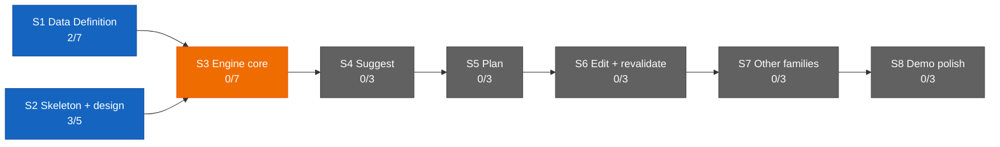

# Dashboard — the state surface

Stamp: 2026-07-20 · 17:41 · pickup · cockpit
V1 5/34 · S1 2/7 · S2 3/5 · sessions: 1 main · 1 parallel
(0 need you) · needs-you 2
How to read this board →
[HOME §Reading the board](HOME.md#reading-the-board)

## Needs you

1. 🟡 The cockpit's arming is PART-DONE: this seat's credential
   paste landed 07-20 (COCKPIT_ pair in `.env.local`, masked
   read-back verified, shapes matching the clerk pair's). Still
   owed: the home PC repeats the paste at its next sitting; the
   lane-worker routine box and the clerk routine/session paste
   owe a re-save from the updated SETUP masters (the rename
   changed their wording). The harness-rename word ARRIVED at the
   maiden's part-2 fire — that chore now flies as
   [#180](https://github.com/wsher0901/roam/pull/180), off this
   list (since 07-20).
   → [SETUP §cloud accounts](SETUP.md#once-and-done--cloud-accounts)
   · [flight-cockpit](specs/flight-cockpit.md) ·
   [D-046](DECISIONS.md#d-046--2026-07--flight-cockpit--the-cockpit-is-the-control-tower-online-full-authorship-cloud-command-session-the-no-solo-approval-law-liftoff-auto-fires-the-cockpit-cc-direct-surface-doctrine-clerk-retirement-staged-remote-control-demoted-to-backstop-the-cockpitcontrol-tower-rename-amends-d-041-and-d-043-upholds-the-lane-law-and-the-wake-lock)
2. ⚪ Nine open engine questions sit parked in the Open register
   until S3 opens (since 07-13).
   → [ENGINE §12](ENGINE.md#12-open-register) ·
   [D-028](DECISIONS.md#d-028--2026-07--consolidation-recut--decision-policy--engine-brain-skeleton-form-project-policy-house-style-open-register-grows-69-upholds-d-021-extends-the-d-021-consolidation)
   · [V1.S3](ROADMAP.md#v1s3--engine-core--two-families-deep)

## Sessions

| Session | Task | State | Last push | Your move |
|---|---|---|---|---|
| main · cockpit | the cockpit maiden, part 2 — commanding the harness outing ([flight-cockpit](specs/flight-cockpit.md) drill) | 🟡 | 17:41 (airborne ack) | — |
| cloud | [harness-vocab-rename](https://github.com/wsher0901/roam/blob/chore/harness-vocab-rename/docs/memory/harness-vocab-rename.md) · [#180](https://github.com/wsher0901/roam/pull/180) | 🟡 airborne | 17:40 (canary) | — |

↳ main micro: 🟢 claim check · 🟢 bench birth · 🟢 label-spawn ·
🟢 canary ack · 🟡 the lane flies · ⚪ non-author review · ⚪ the
founder's word

Flight context — THE COCKPIT MAIDEN, part 2
([D-046](DECISIONS.md#d-046--2026-07--flight-cockpit--the-cockpit-is-the-control-tower-online-full-authorship-cloud-command-session-the-no-solo-approval-law-liftoff-auto-fires-the-cockpit-cc-direct-surface-doctrine-clerk-retirement-staged-remote-control-demoted-to-backstop-the-cockpitcontrol-tower-rename-amends-d-041-and-d-043-upholds-the-lane-law-and-the-wake-lock)):
part 1 fired but could not push; the founder granted write access
and re-fired with the part-2 payload (first act stamped 17:34).
This flight the birth push landed FIRST TRY — the
harness-vocab-rename bench went up bench-first (spec + memory +
draft PR at birth), flew label-spawned by the recipe of record,
canary 60s after the label, airborne ack 17:41. Cap arithmetic:
proxy read 0 GitHub-triggered today; the part-2 fire (+1,
proxy-invisible) + the label-spawn (+1) → day total 2, truly 13
remaining. Named watch: the cockpit is watching
[#180](https://github.com/wsher0901/roam/pull/180) for BLOCKED: /
ready-flip (pickup re-arms it if this session dies). The clerk
stays armed as fallback (retirement staged for the maiden drill's
closeout). Landing = non-author review → the founder's word →
weld → final repaint → park → founder archives → branch verified
dead.

## You are here

V1 — The demo · 5/34 █████░░░░░░░░░░░░░░░░░░░░░░░░░░░░░
S1 · Data Definition · 2/7 ██░░░░░ → T3–T6 source vetting ⚪ held
(awaiting relaunch briefs)
S2 · Skeleton & design · 3/5 ███░░ → T5 Design foundations ⚪ idle
S3–S8 · queued in order · 0/22

## Stage map

The live ops surface is the current ops chat (title unrecorded at
the shakedown-audit weld) — its external review of
[#177](https://github.com/wsher0901/roam/pull/177) is DONE (the
baton-holder amendment, folded) → next: grade the cockpit maiden.
Last paste: none (bare trigger at the 07-20 liftoff). Under the
surface doctrine
([D-046](DECISIONS.md#d-046--2026-07--flight-cockpit--the-cockpit-is-the-control-tower-online-full-authorship-cloud-command-session-the-no-solo-approval-law-liftoff-auto-fires-the-cockpit-cc-direct-surface-doctrine-clerk-retirement-staged-remote-control-demoted-to-backstop-the-cockpitcontrol-tower-rename-amends-d-041-and-d-043-upholds-the-lane-law-and-the-wake-lock)),
Web's one mandatory job is the external review of self-authored
diffs. T3–T6 source-vetting relaunch stays held (see You are
here).

## Shipped (latest — full record: [the ledger](history/README.md#the-ledger))

| When | What | PR |
|---|---|---|
| 07-20 15:40 | [the cockpit is the control tower online (D-046): full-authorship cloud command session fired by liftoff with the board-derived flight plan; the no-solo-approval law (external Web review for self-authored diffs — this weld its own first subject); the CC-direct surface doctrine; clerk retirement staged; Remote Control demoted to backstop; the cockpit/control-tower rename with the BATON-HOLDER as lane-command actor, folded to closure through one review amendment + three critic passes; fire.mjs generalized (clerk \| cockpit)](history/workshop/definition/flight-cockpit.md) | [#177](https://github.com/wsher0901/roam/pull/177) |
| 07-20 13:17 | [the Shakedown Flight closes on paper: A/N checklists graded evidence-or-attest — the 07-20 gate answers folded verbatim, hedges included; six forensics findings closed (the exit-127 assert repaired to an honest 1, the resurrection incident's verify-the-branch-stays-dead ripple, the cloud-proxy 403 rail confirmed); both staged clerk lines resolved verified; liftoff's fire:clerk folded in on the founder's gate word; the attestation haze recorded as lived evidence for D-046](history/workshop/mechanism/shakedown-audit.md) | [#175](https://github.com/wsher0901/roam/pull/175) |
| 07-17 23:43 | [the Hands doctrine (D-045): solo · exploratory subagents · agent team · parallel lanes, the one-bench/many-benches/read-only litmus — the founder's passage verbatim into SETUP §Models & effort, D-045 into DECISIONS, a pointer in parallel-lanes §Vehicles; flown fully unattended as payload A of Shakedown phase 2](history/workshop/definition/agent-teams-brain.md) | [#170](https://github.com/wsher0901/roam/pull/170) |
| 07-17 23:39 | [the memory-format CI gate: scripts/check-memory.mjs validates every task memory against TEMPLATE's locked format — frontmatter, six headings in order, dated Status, no surviving placeholders — wired into package.json, ci.yml, and ship §1's mirror; flown fully unattended as payload B of Shakedown phase 2, the two declared doc mentions landed at the weld](history/workshop/mechanism/check-memory.md) | [#171](https://github.com/wsher0901/roam/pull/171) |
| 07-17 16:41 | [the ignore step fails toward build, never toward error: `\|\| exit 1` hardens the docs-only skip against Vercel's shallow-clone horizon (exit 128 turned four productions ERROR tonight; #153's "failure direction is always build" held for exit 1, not 128 — a shared miss, corrected); documented side-effect: a beyond-horizon docs-only push builds once and self-heals](history/workshop/mechanism/vercel-ignore-fix.md) | [#167](https://github.com/wsher0901/roam/pull/167) |
| 07-17 16:22 | [liftoff ignites the clerk by API: fire-clerk.mjs + fire:clerk against the doc-verified routine-fire endpoint (per-routine token, dated experimental beta header, no idempotency — no auto-retry), the second routine's recipe + the machine-local secret path, manual paste retained as fallback; API fires count against the daily cap yet stay invisible to count:runs — liftoff budgets both (A1–A5 graded at the flight audit)](history/workshop/mechanism/clerk-autospawn.md) | [#164](https://github.com/wsher0901/roam/pull/164) |
| 07-17 16:16 | [the clerk gains the standing watch (charter v2, duty 6): lane events reach the founder's phone as turn-end announcements — BLOCKED:/completions/CI-red; the watcher line opens in the mail slot (N1–N6 graded at the flight audit); the doorbell-mirror idea superseded; the reviewer agent-type failure graduated to defect](history/workshop/mechanism/clerk-notify.md) | [#163](https://github.com/wsher0901/roam/pull/163) |
| 07-17 15:26 | [the away surface goes live: the clerk maiden flown founder-run, C1–C6 all green (~4.5h idle survival proven, run-count attest closed at 1), the promotion clause executed — clerk PRIMARY for machine-off answering, GitHub app demoted to backstop; clerk-notify + clerk-autospawn staged beside api-ignition](history/workshop/mechanism/cloud-clerk.md) | [#156](https://github.com/wsher0901/roam/pull/156) |
| 07-17 11:09 | [the pre-GATE critic wired in (D-044): ship §6 opens by invoking the reviewer subagent — advisory verdicts riding to the founder with the summary; the critic's maiden wired run flew on its own PR (pass + the verdict-as-message clause)](history/workshop/mechanism/ship-wiring.md) | [#159](https://github.com/wsher0901/roam/pull/159) |
| 07-16 23:55 | [leave at any instant, nothing lost: the nine-row mid-state audit proves every interruption parks clean — watch-duty named at park ("watching #N for X") + pickup's re-arm mirror, the unanswered-BLOCKED Needs-you surface ("lane #N awaits your reply"), the interrupt doctrine in one home (Esc lawful anywhere but THE WELD's atomic commit)](history/workshop/mechanism/handoff-anywhere.md) | [#155](https://github.com/wsher0901/roam/pull/155) |
