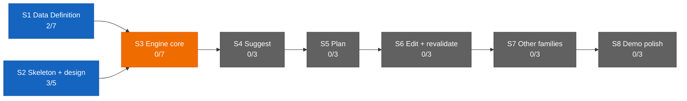

# Dashboard — the state surface

Stamp: 2026-07-22 · 15:13 · ship (quiet handoff) · work PC
V1 5/34 · S1 2/7 · S2 3/5 · sessions: 1 main · 0 parallel
(0 need you) · needs-you 2
How to read this board →
[HOME §Reading the board](HOME.md#reading-the-board)

## Needs you

1. 🟡 The box-is-a-copy re-saves and the post-weld manual acts,
   one standing set: re-save the cockpit routine box from the
   CHARTER MASTER AS UPDATED BY
   [D-047](DECISIONS.md#d-047--2026-07--cloud-born-cockpit--the-cockpits-birth-vehicle-becomes-claude---cloud-list-native-on-every-device-the-automated-hidden-console-birth-is-liftoffs-primary-rung-the-routine-fire-demotes-to-fallback--summon-button-engine-amends-d-046-clause-3-upholds-the-lane-law)
   (born-at clause changed 07-21) · re-save the LANE-WORKER
   routine box — the charter master in `docs/SETUP.md` changed
   TWICE now
   ([#191](https://github.com/wsher0901/roam/pull/191) at 16:19 and
   [#193](https://github.com/wsher0901/roam/pull/193) at 15:09), so
   the copy is two edits stale: step 3 must read "the
   baton-holder's airborne ack" AND carry the anchored-match
   sentence · re-save the COCKPIT box a second time too — #193
   changed its charter master as well (the board-governs clause) ·
   PRUNE the `Default` cloud environment's setup script
   (claude.ai/code settings → Environments): drop the `gh` install
   — #193 proves it CANNOT succeed (`cli.github.com` 403 → exit
   100, which fails the whole script) — and drop the image's
   `deadsnakes`/`ondrej` PPAs, blocked the same way · the home
   PC's credential paste · the clerk routine/session re-saves from
   the updated SETUP masters · from the maiden closeout, still
   owed: archive the maiden lane's session at claude.ai/code and
   grade the maiden (since 07-20/21/22).
   → [SETUP §cloud accounts](SETUP.md#once-and-done--cloud-accounts)
   · [flight-cockpit](specs/flight-cockpit.md) ·
   [cloud-born-cockpit](specs/cloud-born-cockpit.md) ·
   [D-046](DECISIONS.md#d-046--2026-07--flight-cockpit--the-cockpit-is-the-control-tower-online-full-authorship-cloud-command-session-the-no-solo-approval-law-liftoff-auto-fires-the-cockpit-cc-direct-surface-doctrine-clerk-retirement-staged-remote-control-demoted-to-backstop-the-cockpitcontrol-tower-rename-amends-d-041-and-d-043-upholds-the-lane-law-and-the-wake-lock)
2. ⚪ Nine open engine questions sit parked in the Open register
   until S3 opens (since 07-13).
   → [ENGINE §12](ENGINE.md#12-open-register) ·
   [D-028](DECISIONS.md#d-028--2026-07--consolidation-recut--decision-policy--engine-brain-skeleton-form-project-policy-house-style-open-register-grows-69-upholds-d-021-extends-the-d-021-consolidation)
   · [V1.S3](ROADMAP.md#v1s3--engine-core--two-families-deep)

## Sessions

| Session | Task | State | Last push | Your move |
|---|---|---|---|---|
| main · control tower | flight-hardening welded — no task in flight at this seat | 🟢 | 15:13 (this repaint) | none — the next bench is unborn |

↳ main micro: the hardening bench, born and shipped at this seat —
🟢 bench birth (spec · memory · draft PR) · 🟢 the nine
corrections · 🟢 gates + full CI + Actions green · 🟢 ship §6
critic · 🟢 external Web review (PASS on `d118af5`) · 🟢 the
founder's word · 🟢 weld + squash-merge
([#193](https://github.com/wsher0901/roam/pull/193), bc5fbc2) ·
🟢 this board tail

Flight record — the first end-to-end flight of the assembled
chain
([D-046](DECISIONS.md#d-046--2026-07--flight-cockpit--the-cockpit-is-the-control-tower-online-full-authorship-cloud-command-session-the-no-solo-approval-law-liftoff-auto-fires-the-cockpit-cc-direct-surface-doctrine-clerk-retirement-staged-remote-control-demoted-to-backstop-the-cockpitcontrol-tower-rename-amends-d-041-and-d-043-upholds-the-lane-law-and-the-wake-lock)
+ [D-047](DECISIONS.md#d-047--2026-07--cloud-born-cockpit--the-cockpits-birth-vehicle-becomes-claude---cloud-list-native-on-every-device-the-automated-hidden-console-birth-is-liftoffs-primary-rung-the-routine-fire-demotes-to-fallback--summon-button-engine-amends-d-046-clause-3-upholds-the-lane-law))
FLEW on 07-22: liftoff → cloud-born cockpit → bench birth →
label-spawned lane → canary → non-author cockpit review → the
founder's word → the weld
([#191](https://github.com/wsher0901/roam/pull/191)). It landed
one step short — the cockpit's GitHub API dropped mid-flight, so
the merge and the tail passed to the ground seat and both cloud
sessions were archived. Its lessons are no longer just filed:
[#193](https://github.com/wsher0901/roam/pull/193) CLOSED them
into doctrine
([the story](history/workshop/mechanism/flight-hardening.md)) —
one canonical anchored ack token, a rung-1 recipe that can
actually run, the board as the authoritative flight plan, the
cockpit's API-dependency map with a recovery rung, and the
corrected cloud-environment facts. What remains open is named in
[IDEAS](IDEAS.md), the merge-on-signal Action at the head of it —
the permanent fix for the API flap, deliberately unbuilt and
awaiting its own bench. The closeout bench stays UNFLOWN by
founder order (no spec yet; grading the maiden waits with it).
Cap arithmetic today: 1 GitHub-triggered run spent (the one
label-spawned lane on #191) — but the day's counting is not
trustworthy, being blind to API fires and to trigger
redeliveries. No active watches.

## You are here

V1 — The demo · 5/34 █████░░░░░░░░░░░░░░░░░░░░░░░░░░░░░
S1 · Data Definition · 2/7 ██░░░░░ → T3–T6 source vetting ⚪ held
(awaiting relaunch briefs)
S2 · Skeleton & design · 3/5 ███░░ → T5 Design foundations ⚪ idle
S3–S8 · queued in order · 0/22

## Stage map

The live ops surface is the current ops chat (title unrecorded at
the shakedown-audit weld) — its external review of
[#177](https://github.com/wsher0901/roam/pull/177) is DONE (the
baton-holder amendment, folded); the external Web review of
[#187](https://github.com/wsher0901/roam/pull/187) is DONE
(founder-confirmed at the gate, chat title unrecorded); the
external review of
[#193](https://github.com/wsher0901/roam/pull/193) is DONE —
verdict PASS on `d118af5`, taken verbatim onto the record in
[the story](history/workshop/mechanism/flight-hardening.md) →
next: grade the cockpit maiden, once the closeout bench opens.
Last paste: none — this sitting's messages carried the closeout
mandate, the hardening mandate, and the review verdict, not a
Web/Design paste. Under the surface doctrine
([D-046](DECISIONS.md#d-046--2026-07--flight-cockpit--the-cockpit-is-the-control-tower-online-full-authorship-cloud-command-session-the-no-solo-approval-law-liftoff-auto-fires-the-cockpit-cc-direct-surface-doctrine-clerk-retirement-staged-remote-control-demoted-to-backstop-the-cockpitcontrol-tower-rename-amends-d-041-and-d-043-upholds-the-lane-law-and-the-wake-lock)),
Web's one mandatory job is the external review of self-authored
diffs — [#191](https://github.com/wsher0901/roam/pull/191)'s
payload was lane-authored, so the non-author cockpit review plus
the founder's word carried it lawfully without Web;
[#193](https://github.com/wsher0901/roam/pull/193)'s was
tower-authored, so it needed Web and got it, the bare "merge"
held until the verdict landed.
T3–T6 source-vetting relaunch stays held (see You are here).

## Shipped (latest — full record: [the ledger](history/README.md#the-ledger))

| When | What | PR |
|---|---|---|
| 07-22 15:09 | [the repo stops telling a future seat to do things that cannot work: nine corrections from the first end-to-end chain flight — ONE canonical anchored ack token owned by §Canary (after a flight where the watcher matched its own claim prose, then missed an em-dash ack and was saved only by the wake-lock), rung 1's impossible pty-wrapper recipe replaced by the console-attach shape that flew, the board promoted to authoritative flight plan with the birth prompt demoted to a pointer, a git-only vs API-only dependency map with a four-step recovery rung (merge-on-signal Action noted staged and deliberately unbuilt), the cloud environment corrected to `Default` with no `gh` and no way to install it, one LAWS sentence fixing "non-author" to the payload diff, `.gitignore`, a verify-before-rely `[COCKPIT]` title line, and IDEAS triaged; two out-of-mandate catches approved at the gate, the bare "merge" held until the external Web review returned PASS](history/workshop/mechanism/flight-hardening.md) | [#193](https://github.com/wsher0901/roam/pull/193) |
| 07-22 16:19 | [the lane-worker charter's canary line names the baton-holder: the D-046 vocabulary sweep's one missed straggler — SETUP's fenced "You are a Roam cloud lane" box now waits for the baton-holder's airborne ack per §Canary, the six other ground-meaning mentions left intact; flown as the first end-to-end flight of the assembled chain (bench birth → label-spawn → canary → cockpit ack → lane edit → non-author review → the founder's word), the wake-lock catching a mistimed em-dash-vs-middot ack in flight](history/workshop/mechanism/lane-worker-baton.md) | [#191](https://github.com/wsher0901/roam/pull/191) |
| 07-21 14:56 | [the cockpit's birth vehicle becomes `claude --cloud` (D-047): the automated hidden-console birth is liftoff §6's primary rung — list-native, sessions join the phone's GENERAL list by gate-0c evidence — with compose-and-hand, the routine fire (kept as the summon button's engine), and the manual paste as fallbacks; every flight plan opens with the standing clone-provenance first line; three STOP-gates proved clone-from-GitHub and branch-create by live probe; the mandate run by the probe session itself on the founder's in-list word](history/workshop/mechanism/cloud-born-cockpit.md) | [#187](https://github.com/wsher0901/roam/pull/187) |
| 07-20 22:01 | [the `.claude/` harness learns the D-046 vocabulary: the pickup stub's description and the session-start hook's briefing directive name the BATON-HOLDER (control tower on the ground, cockpit in flight) — wording only, zero stragglers by grep; flown as a label-spawned cloud lane, welded from the same seat on the founder's direct word with the reviewer critic's clean verdict](history/workshop/mechanism/harness-vocab-rename.md) | [#180](https://github.com/wsher0901/roam/pull/180) |
| 07-20 15:40 | [the cockpit is the control tower online (D-046): full-authorship cloud command session fired by liftoff with the board-derived flight plan; the no-solo-approval law (external Web review for self-authored diffs — this weld its own first subject); the CC-direct surface doctrine; clerk retirement staged; Remote Control demoted to backstop; the cockpit/control-tower rename with the BATON-HOLDER as lane-command actor, folded to closure through one review amendment + three critic passes; fire.mjs generalized (clerk \| cockpit)](history/workshop/definition/flight-cockpit.md) | [#177](https://github.com/wsher0901/roam/pull/177) |
| 07-20 13:17 | [the Shakedown Flight closes on paper: A/N checklists graded evidence-or-attest — the 07-20 gate answers folded verbatim, hedges included; six forensics findings closed (the exit-127 assert repaired to an honest 1, the resurrection incident's verify-the-branch-stays-dead ripple, the cloud-proxy 403 rail confirmed); both staged clerk lines resolved verified; liftoff's fire:clerk folded in on the founder's gate word; the attestation haze recorded as lived evidence for D-046](history/workshop/mechanism/shakedown-audit.md) | [#175](https://github.com/wsher0901/roam/pull/175) |
| 07-17 23:43 | [the Hands doctrine (D-045): solo · exploratory subagents · agent team · parallel lanes, the one-bench/many-benches/read-only litmus — the founder's passage verbatim into SETUP §Models & effort, D-045 into DECISIONS, a pointer in parallel-lanes §Vehicles; flown fully unattended as payload A of Shakedown phase 2](history/workshop/definition/agent-teams-brain.md) | [#170](https://github.com/wsher0901/roam/pull/170) |
| 07-17 23:39 | [the memory-format CI gate: scripts/check-memory.mjs validates every task memory against TEMPLATE's locked format — frontmatter, six headings in order, dated Status, no surviving placeholders — wired into package.json, ci.yml, and ship §1's mirror; flown fully unattended as payload B of Shakedown phase 2, the two declared doc mentions landed at the weld](history/workshop/mechanism/check-memory.md) | [#171](https://github.com/wsher0901/roam/pull/171) |
| 07-17 16:41 | [the ignore step fails toward build, never toward error: `\|\| exit 1` hardens the docs-only skip against Vercel's shallow-clone horizon (exit 128 turned four productions ERROR tonight; #153's "failure direction is always build" held for exit 1, not 128 — a shared miss, corrected); documented side-effect: a beyond-horizon docs-only push builds once and self-heals](history/workshop/mechanism/vercel-ignore-fix.md) | [#167](https://github.com/wsher0901/roam/pull/167) |
| 07-17 16:22 | [liftoff ignites the clerk by API: fire-clerk.mjs + fire:clerk against the doc-verified routine-fire endpoint (per-routine token, dated experimental beta header, no idempotency — no auto-retry), the second routine's recipe + the machine-local secret path, manual paste retained as fallback; API fires count against the daily cap yet stay invisible to count:runs — liftoff budgets both (A1–A5 graded at the flight audit)](history/workshop/mechanism/clerk-autospawn.md) | [#164](https://github.com/wsher0901/roam/pull/164) |
