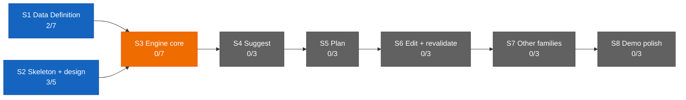

# Dashboard — the state surface

Stamp: 2026-07-17 · 17:05 · liftoff · work PC
V1 5/34 · S1 2/7 · S2 3/5 · sessions: 0 main · 2 parallel
(0 needs you) · needs-you 2
How to read this board →
[HOME §Reading the board](HOME.md#reading-the-board)

## Needs you

1. 🟡 The next cockpit sitting owns the Shakedown phase-2
   landing: reviews + merge words + welds for the two flying
   lanes ([#170](https://github.com/wsher0901/roam/pull/170) ·
   [#171](https://github.com/wsher0901/roam/pull/171)), the
   N1–N6 / A1–A5 grading, and the full-forensics flight audit.
   Also outstanding: the home seat repeats the clerk-credential
   paste at its next sitting — the WORKING routine id is
   `trig_`-prefixed (corrected live at A1) (since 07-17).
   → [SETUP §cloud accounts](SETUP.md#once-and-done--cloud-accounts)
   · [clerk-autospawn](specs/clerk-autospawn.md) ·
   [clerk-notify](specs/clerk-notify.md)
2. ⚪ Nine open engine questions sit parked in the Open register
   until S3 opens (since 07-13).
   → [ENGINE §12](ENGINE.md#12-open-register) ·
   [D-028](DECISIONS.md#d-028--2026-07--consolidation-recut--decision-policy--engine-brain-skeleton-form-project-policy-house-style-open-register-grows-69-upholds-d-021-extends-the-d-021-consolidation)
   · [V1.S3](ROADMAP.md#v1s3--engine-core--two-families-deep)

## Sessions

| Session | Task | State | Last push | Your move |
|---|---|---|---|---|
| main · cockpit | — closed at liftoff 17:05 (Shakedown phase 2 flies unattended) | ⚪ | 17:05 (this repaint) | — |
| cloud · lane | agent-teams-brain ([#170](https://github.com/wsher0901/roam/pull/170)) — the Hands doctrine, D-045 (spec on the lane branch) | 🟡 airborne 17:01 (label→canary 110 s) | 17:00 (canary) | — (idle-waits on any BLOCKED:; the clerk announces) |
| cloud · lane | check-memory ([#171](https://github.com/wsher0901/roam/pull/171)) — the memory-format CI gate (spec on the lane branch) | 🟡 airborne 17:04 (label→canary 189 s) | 17:03 (canary) | — (idle-waits on any BLOCKED:; the clerk announces) |

↳ main micro: — (no active task)

Flight context — Shakedown phase 2, the first fully-unattended
liftoff; founder driving; next cockpit sitting runs reviews +
welds + the audit. The clerk flies on watch:
[session_015Jd4wHuux5BitJ6HRwNMta](https://claude.ai/code/session_015Jd4wHuux5BitJ6HRwNMta),
fired via `fire:clerk` in ~3 s (A1) with "arm the watch" as the
payload. Cap arithmetic: `count:runs` reads 2 (the two lane
labels) · the clerk fire is +1 and invisible to the proxy → day
total 3, truly 12 remaining. Deviations on record: (1) fire 1
answered 400 invalid_routine_id pre-spawn — the pasted id lacked
the documented `trig_` prefix; corrected in `.env.local`, ONE
sanctioned retry fired clean (no session was created by the
failure; assumed unburned — confirm on the routines page at next
glance); (2) fire-clerk's failure path exits via a cosmetic
libuv assert on Windows (exit 127, not 1) — honest-nonzero
holds; audit item for the next sitting; (3) the payloads' one
shared file (SETUP) was resolved at construction — lane A owns
it, lane B's CI-line mention + the LAWS mirror parenthetical are
weld-deferred cockpit acts, declared in B's spec.

## You are here

V1 — The demo · 5/34 █████░░░░░░░░░░░░░░░░░░░░░░░░░░░░░
S1 · Data Definition · 2/7 ██░░░░░ → T3–T6 source vetting ⚪ held
(awaiting relaunch briefs)
S2 · Skeleton & design · 3/5 ███░░ → T5 Design foundations ⚪ idle
S3–S8 · queued in order · 0/22

## Stage map

**"Roam — full-pass audit + maiden flight"** (Web) — Shakedown
Flight phase 1 underway: the watch
([#163](https://github.com/wsher0901/roam/pull/163)) welded after
external review; the ignition
([#164](https://github.com/wsher0901/roam/pull/164)) welds next →
next: phase 2 is IN THE AIR (two lanes + the clerk on watch);
results, gradings, and the audit land at the next cockpit
sitting. Last paste: inline at the 07-17 00:03 handoff. T3–T6
source-vetting relaunch stays held (see You are here).

## Shipped (latest — full record: [the ledger](history/README.md#the-ledger))

| When | What | PR |
|---|---|---|
| 07-17 16:41 | [the ignore step fails toward build, never toward error: `\|\| exit 1` hardens the docs-only skip against Vercel's shallow-clone horizon (exit 128 turned four productions ERROR tonight; #153's "failure direction is always build" held for exit 1, not 128 — a shared miss, corrected); documented side-effect: a beyond-horizon docs-only push builds once and self-heals](history/workshop/mechanism/vercel-ignore-fix.md) | [#167](https://github.com/wsher0901/roam/pull/167) |
| 07-17 16:22 | [liftoff ignites the clerk by API: fire-clerk.mjs + fire:clerk against the doc-verified routine-fire endpoint (per-routine token, dated experimental beta header, no idempotency — no auto-retry), the second routine's recipe + the machine-local secret path, manual paste retained as fallback; API fires count against the daily cap yet stay invisible to count:runs — liftoff budgets both (A1–A5 grade at the flight)](history/workshop/mechanism/clerk-autospawn.md) | [#164](https://github.com/wsher0901/roam/pull/164) |
| 07-17 16:16 | [the clerk gains the standing watch (charter v2, duty 6): lane events reach the founder's phone as turn-end announcements — BLOCKED:/completions/CI-red; the watcher line opens in the mail slot (in verification, N1–N6 grade at the Shakedown Flight); the doorbell-mirror idea superseded; the reviewer agent-type failure graduated to defect](history/workshop/mechanism/clerk-notify.md) | [#163](https://github.com/wsher0901/roam/pull/163) |
| 07-17 15:26 | [the away surface goes live: the clerk maiden flown founder-run, C1–C6 all green (~4.5h idle survival proven, run-count attest closed at 1), the promotion clause executed — clerk PRIMARY for machine-off answering, GitHub app demoted to backstop; clerk-notify + clerk-autospawn staged beside api-ignition](history/workshop/mechanism/cloud-clerk.md) | [#156](https://github.com/wsher0901/roam/pull/156) |
| 07-17 11:09 | [the pre-GATE critic wired in (D-044): ship §6 opens by invoking the reviewer subagent — advisory verdicts riding to the founder with the summary; the critic's maiden wired run flew on its own PR (pass + the verdict-as-message clause)](history/workshop/mechanism/ship-wiring.md) | [#159](https://github.com/wsher0901/roam/pull/159) |
| 07-16 23:55 | [leave at any instant, nothing lost: the nine-row mid-state audit proves every interruption parks clean — watch-duty named at park ("watching #N for X") + pickup's re-arm mirror, the unanswered-BLOCKED Needs-you surface ("lane #N awaits your reply"), the interrupt doctrine in one home (Esc lawful anywhere but THE WELD's atomic commit)](history/workshop/mechanism/handoff-anywhere.md) | [#155](https://github.com/wsher0901/roam/pull/155) |
| 07-16 23:12 | [the delegation maiden flight closed on paper: D-043 (route ladder v2 — ready-flip-then-label the recipe of record, api-ignition + the cloud clerk staged, the Claude app the single away surface), the maiden verify checklist filled, §Answering a lane opened, squash-only + branch auto-delete enforced, the Vercel docs-only build skip live-fired both ways](history/workshop/mechanism/maiden-flight-report.md) | [#153](https://github.com/wsher0901/roam/pull/153) |
| 07-16 22:36 | [the ship-time diff critic born: spec + `.claude/agents/reviewer.md` (read-only tools, advisory verdicts riding to THE GATE, Sonnet 5 · high) — flown end-to-end by the maiden flight's first live cloud lane, the spawn recipe proven: ready-flip, then label](history/workshop/mechanism/reviewer-subagent.md) | [#146](https://github.com/wsher0901/roam/pull/146) |
| 07-16 17:59 | [Time is derived, never recalled: the derivation law gains its time clause, ship/handoff stamps read the shell clock, the Models & effort doctrine set to the 2026-07-16 statement — flown end-to-end by a local lane, the maiden's leg B](history/workshop/definition/time-doctrine.md) | [#147](https://github.com/wsher0901/roam/pull/147) |
| 07-16 12:46 | [the July full-pass audit closed in one pass: external-item clearing, the routine saved-prompt master, the count:runs cap read, rejected-push wake + label idempotency, the reply-ack window, the maiden-flight verify list, the Models & effort doctrine, README + Web currency](history/workshop/mechanism/full-pass-fixes.md) | [#144](https://github.com/wsher0901/roam/pull/144) |