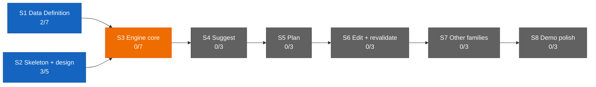

# Dashboard — the state surface

Stamp: 2026-07-16 · 18:01 · ship · work PC
V1 5/34 · S1 2/7 · S2 3/5 · sessions: 1 main · 1 parallel
(1 needs you) · needs-you 5
How to read this board →
[HOME §Reading the board](HOME.md#reading-the-board)

## Needs you

1. 🟡 Paste the current master once: WEB-INSTRUCTIONS into the
   claude.ai → Roam Project → settings box — the box lags the
   approved master (since 07-11).
   → master: [WEB-INSTRUCTIONS](WEB-INSTRUCTIONS.md) · the box is a
   copy · [history](history/workshop/definition/web-instructions.md)
2. 🟡 Run the machine-setup Verify block on this home PC — the work
   PC passed in full (since 07-13).
   → [machine-setup](skills/machine-setup.md) ·
   [vault lens](skills/machine-setup.md#vault-lens) (applied on both
   seats)
3. ⚪ Nine open engine questions sit parked in the Open register
   until S3 opens (since 07-13).
   → [ENGINE §12](ENGINE.md#12-open-register) ·
   [D-028](DECISIONS.md#d-028--2026-07--consolidation-recut--decision-policy--engine-brain-skeleton-form-project-policy-house-style-open-register-grows-69-upholds-d-021-extends-the-d-021-consolidation)
   · [V1.S3](ROADMAP.md#v1s3--engine-core--two-families-deep)
4. ⚪ Write the reviewer-subagent spec — a small task queued after
   the ops leg; NOTE: now flying as the maiden's leg A payload, see
   item 5 (since 07-13).
   → [SETUP §Staged](SETUP.md#staged--turns-on-when-its-stage-opens)
5. 🔴 The delegation maiden flight is MID-AIR: leg A (cloud, route 1
   label-spawn) SPAWN FAILED — label fired 17:02:36, no session
   evidence in ~13 min; leg B (local control) airborne. Your move:
   check the routine's run record at claude.ai/code/routines, then
   retry route 1 (remove + re-add the label) · route 2 (manual
   claude.ai/code session on chore/reviewer-subagent) · or run leg A
   locally (since 07-15).
   → [leg A memory + failure record](https://github.com/wsher0901/roam/blob/chore/reviewer-subagent/docs/memory/reviewer-subagent.md)
   · [PR #146](https://github.com/wsher0901/roam/pull/146) ·
   [parallel-lanes §Canary](skills/parallel-lanes.md#canary-handshake-both-sides)
   ·
   [§Cloud spawn](skills/parallel-lanes.md#cloud-spawn--route-ladder)

## Sessions

| Session | Task | State | Last push | Your move |
|---|---|---|---|---|
| main · cockpit (work PC) | Ops — the delegation maiden flight, block 1 ([verify list](skills/parallel-lanes.md#cloud-spawn--route-ladder)) | 🟡 holding idle | — | leg A respawn route (see Needs-you 5) |
| cloud | [reviewer-subagent](https://github.com/wsher0901/roam/blob/chore/reviewer-subagent/docs/memory/reviewer-subagent.md) · [PR #146](https://github.com/wsher0901/roam/pull/146) | 🔴 cloud spawn failed — route 1, no session in ~13 min | 17:16 (failure record) | choose the respawn route (Needs-you 5) |

↳ main micro: preflight 🟢 · leg A label 🟢 → spawn 🔴 · leg B
airborne → landed → shipped 🟢 · flight report ⚪ (block 2)

Flight context: count:runs read 0 at preflight, 1 after the leg A
label (the label-event proxy counts the trigger though no session
appeared), and 1 — unmoved — through leg B's whole local flight:
local lanes are cap-free, as designed. Leg B flew the entire lane
law unassisted (canary 17:18 → ack 17:19 → three edits → CI mirror
→ Actions-green ready-flip → completion @mention) and was welded on
the founder's word at 17:59
([the story](history/workshop/definition/time-doctrine.md)).

## You are here

V1 — The demo · 5/34 █████░░░░░░░░░░░░░░░░░░░░░░░░░░░░░
S1 · Data Definition · 2/7 ██░░░░░ → T3–T6 source vetting ⚪ held
(awaiting relaunch briefs)
S2 · Skeleton & design · 3/5 ███░░ → T5 Design foundations ⚪ idle
S3–S8 · queued in order · 0/22

## Stage map

One Web thread concluded this sitting: the July full-pass audit —
its findings shipped as full-pass-fixes
([#144](https://github.com/wsher0901/roam/pull/144)); T3–T6
source-vetting relaunch stays held (see You are here).

## Shipped (latest — full record: [the ledger](history/README.md#the-ledger))

| When | What | PR |
|---|---|---|
| 07-16 17:59 | [Time is derived, never recalled: the derivation law gains its time clause, ship/handoff stamps read the shell clock, the Models & effort doctrine set to the 2026-07-16 statement — flown end-to-end by a local lane, the maiden's leg B](history/workshop/definition/time-doctrine.md) | [#147](https://github.com/wsher0901/roam/pull/147) |
| 07-16 12:46 | [the July full-pass audit closed in one pass: external-item clearing, the routine saved-prompt master, the count:runs cap read, rejected-push wake + label idempotency, the reply-ack window, the maiden-flight verify list, the Models & effort doctrine, README + Web currency](history/workshop/mechanism/full-pass-fixes.md) | [#144](https://github.com/wsher0901/roam/pull/144) |
| 07-16 10:37 | [Lane liveness (D-042): live-vs-reclaimable derived from the commit heartbeat and read at the claim check and pickup's worktree sweep, fed by the session-start hook's verdict — a live lane is never adopted or pruned](history/workshop/mechanism/lane-liveness.md) | [#142](https://github.com/wsher0901/roam/pull/142) |
| 07-16 08:57 | [a CI gate (check:ledger) proving history/ files and the ledger index stay in one-to-one bijection by #PR, plus a ship §7 weld-staging line so a dropped or orphaned ledger line turns the build red instead of leaving a silent gap](history/workshop/mechanism/ledger-integrity.md) | [#140](https://github.com/wsher0901/roam/pull/140) |
| 07-15 15:35 | [the Max routine cap firmed to confirmed fact (15/day, flat across Max tiers): the SETUP and liftoff live-number hedges retired](history/workshop/definition/cap-confirm.md) | [#138](https://github.com/wsher0901/roam/pull/138) |
| 07-15 14:39 | [Delegation architecture (D-041): the away-mode chooser (local · handoff · go-remote · liftoff), the go-remote tether posture, idle-wait, label-spawned cloud lanes](history/workshop/mechanism/delegation-architecture.md) | [#136](https://github.com/wsher0901/roam/pull/136) |
| 07-15 12:58 | [LAWS tightness (Option C): command + one-line whys (D-027 upheld), procedure grain expelled to handoff §1.5, the stale decide trigger and preview conditional fixed](history/workshop/definition/laws-tightness.md) | [#134](https://github.com/wsher0901/roam/pull/134) |
| 07-15 12:08 | [Retroactivity sweep: repair three later-found gaps — HOME's surviving Cloud-ledger ghost, handoff's non-vocabulary "waiting", recall's FOUNDATION + DESIGN-KICKOFF routing omissions](history/workshop/definition/retroactivity-sweep.md) | [#132](https://github.com/wsher0901/roam/pull/132) |
| 07-15 11:18 | [HOME currency pass: bring the bible current with D-040/D-032/D-039/#128 and close six newcomer-test gaps — four rewordings, five new Terms, the recall read-path](history/workshop/definition/home-currency-pass.md) | [#130](https://github.com/wsher0901/roam/pull/130) |
| 07-15 10:24 | [Skills precision pass: codify already-decided behavior across the corpus (decide · handoff · liftoff · parallel-lanes · recall); the abort-ledger ghost fully retired](history/workshop/mechanism/skills-precision-pass.md) | [#128](https://github.com/wsher0901/roam/pull/128) |
