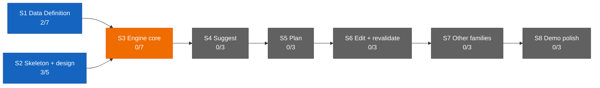

# Dashboard — the state surface

Stamp: 2026-07-24 · 01:42 · handoff · home PC
V1 5/34 · S1 2/7 · S2 3/5 · sessions: 1 main · 0 parallel
(0 need you) · needs-you 0
How to read this board →
[HOME §Reading the board](HOME.md#reading-the-board)

## Needs you

Nothing — the board is CLEAR. The two standing manual acts
cleared on the founder's word at
[#218](https://github.com/wsher0901/roam/pull/218)'s gate: the
cockpit routine box re-saved from the post-D-052 master, and the
WEB-INSTRUCTIONS v5 master pasted into the Project box, already
governing the ops chat. Both seats FULLY ARMED; every surface
current.

The nine open engine questions stay parked in
[ENGINE §12](ENGINE.md#12-open-register) until
[V1.S3](ROADMAP.md#v1s3--engine-core--two-families-deep) opens;
they are a register, not an action. ENGINE's `type: spec`
frontmatter oddity is folded there too
([IDEAS](IDEAS.md), the founder's 07-23 gate word).

## Sessions

| Session | Task | State | Last push | Your move |
|---|---|---|---|---|
| main · control tower | — (sitting closed at handoff; nothing open, nothing parked) | 🟢 | 01:42 (this repaint) | — |

↳ main micro: — (no active task)

The ground goes dark with this handoff — the home PC is halting;
no lane was flying and no bench was open, so nothing needed
parking. Origin carries `main` only; the next pickup claims a
clean floor. SIX benches welded this sitting
— the currency audit
([#204](https://github.com/wsher0901/roam/pull/204)), the gh
second path ([#207](https://github.com/wsher0901/roam/pull/207),
D-049), session lifecycle
([#211](https://github.com/wsher0901/roam/pull/211), D-050),
self-seat birth
([#213](https://github.com/wsher0901/roam/pull/213), D-051 — THE
LIVE TEST rides the next real flight), the response doctrine
([#216](https://github.com/wsher0901/roam/pull/216), D-052), and
the guardrail audit
([#218](https://github.com/wsher0901/roam/pull/218), D-053: the
harness at best practice, the proof on record). The queue: THE
CHRONICLE LAYER (its own chat).

## You are here

V1 — The demo · 5/34 █████░░░░░░░░░░░░░░░░░░░░░░░░░░░░
S1 · Data Definition · 2/7 ██░░░░░ → T3–T6 source vetting ⚪ held
(awaiting relaunch briefs)
S2 · Skeleton & design · 3/5 ███░░ → T5 Design foundations ⚪ idle
S3–S8 · queued in order · 0/22

## Stage map

## Claude Web + Design discussion

The live ops surface is the current ops chat — governed by the v5
master since the founder's paste tonight. Its most recent
external review —
[#218](https://github.com/wsher0901/roam/pull/218) (the guardrail
audit, tower-authored) — is DONE, verdict PASS on `bd2f6ef`
(seven files, the verification block copy-runnable, both stub
clauses verbatim, the gates re-run independently), delivered
inline with the founder's merge word. Earlier reviews, all DONE:
[#216](https://github.com/wsher0901/roam/pull/216) (PASS on
`5f4be89`) · [#213](https://github.com/wsher0901/roam/pull/213)
(PASS on `342e344`) ·
[#211](https://github.com/wsher0901/roam/pull/211) (PASS on
`edc0c9a` + `1ffebdf`) ·
[#207](https://github.com/wsher0901/roam/pull/207) (PASS on
`2b97a86`) · [#204](https://github.com/wsher0901/roam/pull/204)
(PASS on `614e0f8`) → next: grade the cockpit maiden, once the
closeout bench opens; THE CHRONICLE LAYER gets its own chat.
Under the surface doctrine
([D-046](DECISIONS.md#d-046--2026-07--flight-cockpit--the-cockpit-is-the-control-tower-online-full-authorship-cloud-command-session-the-no-solo-approval-law-liftoff-auto-fires-the-cockpit-cc-direct-surface-doctrine-clerk-retirement-staged-remote-control-demoted-to-backstop-the-cockpitcontrol-tower-rename-amends-d-041-and-d-043-upholds-the-lane-law-and-the-wake-lock)),
Web's one mandatory job is the external review of self-authored
diffs — the v5 box now says so itself.
T3–T6 source-vetting relaunch stays held (see You are here).

## Shipped (latest — full record: [the ledger](history/README.md#the-ledger))

| When | What | PR |
|---|---|---|
| 07-24 01:33 | [the harness found ALREADY AT BEST PRACTICE, the proof welded to the record (D-053): the founder's maximum-depth audit of the whole governing layer against Anthropic's guidance; the two real improvements shipped — LAWS' verification loop promoted to a copy-runnable block (proven live: this bench's gate ran the block verbatim as its mirror) and two stub trigger-surfaces sharpened, the harness picking both up mid-bench; five alternatives rejected with reasons; the critic's one finding — the hygiene bench's own bare D-053 mentions — repaired pre-flip](history/workshop/definition/guardrail-audit.md) | [#218](https://github.com/wsher0901/roam/pull/218) |
| 07-24 00:51 | [one standard for how every surface speaks to the founder (D-052): the goal verbatim — minimum reading time to decision, explicit steps over abstractions, purpose-shaped explanation — five clauses in ONE home (HOME §Response doctrine), the founder's §Command card with D-049's teleport warning where it will be read, the cockpit's FLEET TABLE report, the four-part status template rewritten into all three rituals (pickup's ⏸ lead above everything), and WEB-INSTRUCTIONS v4 → v5 — the paste-block loop dead, the mandatory-review role leading, the on-the-record word-paste in the procedure](history/workshop/definition/response-doctrine.md) | [#216](https://github.com/wsher0901/roam/pull/216) |
| 07-24 00:28 | [the fragilest component is deleted, not maintained (D-051): rung 1 fires `claude --cloud` BLIND — nothing captured, exit status only — and the cockpit SEATS ITSELF by its D-049 env-derived self-URL; the console-attach capture retired dated (it never failed — it was the component most likely to break silently); the missing greeting push IS the failure signal (/tasks · the list · retry), the pending row going stale honestly; the stray-collision close sharpened by the critic to a short factual note, never R4b's script; THE LIVE TEST rides the next real flight by the founder's word](history/workshop/mechanism/self-seat-birth.md) | [#213](https://github.com/wsher0901/roam/pull/213) |
| 07-23 23:38 | [what a session's start, pause, and close leave behind (D-050): closed ≠ dead — the close-lock's wall softens to injected read-only doctrine, one doctrine in four homes and the wall hook itself (the one flagged gap file, both paths run live), full removal REJECTED, R4b + seat-stamp byte-strict; the ⏸ interrupt capture standing (block · state · pickup's "continue?" lead); the claude/* residue sweep graduates to pickup hygiene; IDEAS becomes an inbox-not-archive with the first assert-first compaction (420→266, 11 deleted enumerated, both stay-clauses exercised); chronicle layer + self-seat birth queued](history/workshop/mechanism/session-lifecycle.md) | [#211](https://github.com/wsher0901/roam/pull/211) |
| 07-23 22:38 | [the cockpit gains a second API path (D-049): gh installs from the allowlisted Ubuntu archive and authenticates through the GitHub proxy — REST-shaped (gh api works repo-scoped; GraphQL porcelain 403s, the proxy pointing to REST); the probe flew NON-PASS on its own definition, STOP held, and the gate reopened on the founder-witnessed REST read; the API map two-pathed (only both paths dead demote), the charter R2 gains the automatic gh rung, self-ID from session env, the Claude-Session trailer noted; five findings ride first-class incl. the toolset bluff (probe-don't-assume extends to a session's own tools) and teleport-relocates-execution](history/workshop/mechanism/gh-second-path.md) | [#207](https://github.com/wsher0901/roam/pull/207) |
| 07-23 21:29 | [the docs currency audit: the clerk sweep came back already-clean (#197 held) — the real catch was the NEXT generation of staleness: the disproven `[COCKPIT]` title line dropped from liftoff §6 + SETUP with the verify-before-rely answer recorded in place, #193's board-governs doctrine landed in HOME's manual plus three more HOME edges (FOUNDATION's writer drops the paste block, go-remote joins the skills list, §Delegation names route 1 the recorded maiden winner), cloud-born-cockpit's two disproven recipes supersession-noted beyond the known clerk set, machine-setup gains the COCKPIT_ pair as step 11; four dated notes, zero deletions, zero record-body rewrites, orphans NONE by inbound-reference census; flown across two seats through a park, adopted from origin alone](history/workshop/mechanism/currency-audit.md) | [#204](https://github.com/wsher0901/roam/pull/204) |
| 07-23 21:07 | [.env.example carries zero CLERK_ cruft: the vestigial clerk comment prose scrubbed from the "Routine fires" block so the file names only the live cockpit routine, the payload matching the founder's intent rather than the literal "two placeholder lines" (already gone by #197); flown as a full-liftoff run-through — bench-first birth, canary, cockpit airborne ack, one-file scrub — then carried through an independent non-author review that re-verified CI on the true merge tip after the lane cited a run one commit behind](history/workshop/mechanism/env-clerk-scrub.md) | [#200](https://github.com/wsher0901/roam/pull/200) |
| 07-23 12:02 | [the repo stops pointing at a vehicle that cannot fire: the clerk routine was deleted 07-22, every live instruction reaching for the clerk removed and every verified record tombstoned (C1–C6, N2/N3, A1/A4 kept), liftoff's ladder bottomed out at the D-048 phone bootstrap, `fire.mjs` cockpit-only with the drain idiom untouched, no new D-number by design, and one live defect caught just outside the mandate's file list — parallel-lanes still armed the clerk as both fallback and notification watcher](history/workshop/mechanism/clerk-retirement.md) | [#197](https://github.com/wsher0901/roam/pull/197) |
| 07-22 16:36 | [a cockpit that survives, announces, and replaces its own GitHub connector loss (D-048): redundancy inside a session ruled impossible, so resilience became a five-rung ladder OUT of the session (prevent · detect · repair · degrade · self-rescue) with a tombstone and refusal guard; `summon.yml` ships live on `workflow_dispatch` + a push to `ops/summon`, reusing `fire.mjs`; merge-on-signal REJECTED with reasons — R2's premise since amended by D-049, the ladder standing](history/workshop/mechanism/cockpit-resilience.md) | [#195](https://github.com/wsher0901/roam/pull/195) |
| 07-22 16:19 | [the lane-worker charter's canary line names the baton-holder: the D-046 vocabulary sweep's one missed straggler; flown as the first end-to-end flight of the assembled chain, the wake-lock catching a mistimed em-dash-vs-middot ack in flight](history/workshop/mechanism/lane-worker-baton.md) | [#191](https://github.com/wsher0901/roam/pull/191) |

Note: [#201](https://github.com/wsher0901/roam/pull/201) (liftoff
board weld) and [#202](https://github.com/wsher0901/roam/pull/202)
(the liftoff flight harvest into IDEAS) are chore/docs micro-PRs,
not history/ stories, so they carry no ledger line — the ledger is
history-keyed. #202's findings live in [IDEAS](IDEAS.md).
