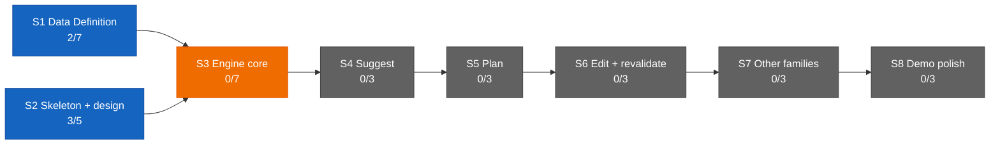

# Dashboard — the state surface

Stamp: 2026-07-27 · 21:41 · ship-tail · home PC
V1 5/34 · S1 2/7 · S2 3/5 · sessions: 1 main · 0 parallel
(0 need you) · needs-you 2
How to read this board →
[HOME §Reading the board](HOME.md#reading-the-board)

## Needs you

1. 🟡 "apply the vault lens" once per seat — the [#229](https://github.com/wsher0901/roam/pull/229)
   weld moved the frozen record under `docs/record/`, so each
   seat's Obsidian graph filter re-seeds to `-path:record` on
   that phrase (since 07-27).
   → [machine-setup §Vault lens](skills/machine-setup.md#vault-lens) ·
   [D-057](record/DECISIONS.md#d-057--2026-07--the-record-shelf--the-frozen-record-moves-under-one-roof-docsrecord-is-born-history--specs--decisions-in-memory-stays-living-at-root-the-enabling-ruling--a-mechanical-link-path-segment-repair-inside-a-frozen-file-is-maintenance-not-a-content-edit-append-only-governs-meaning-not-bytes-intra-record-links-resolve-by-construction-upholds-append-only-one-home-and-the-weave-rule)
2. 🟡 Re-paste the WEB-INSTRUCTIONS box in the Web project —
   [#229](https://github.com/wsher0901/roam/pull/229) edited
   [WEB-INSTRUCTIONS](WEB-INSTRUCTIONS.md) (two record paths), and
   the box is a copy that must be re-pasted after every edit
   (since 07-27).
   → [HOME §Where information goes](HOME.md#where-information-goes)

The nine open engine questions stay parked in
[ENGINE §12](ENGINE.md#12-open-register) until
[V1.S3](ROADMAP.md#v1s3--engine-core--two-families-deep) opens;
they are a register, not an action. ENGINE's `type: spec`
frontmatter oddity is folded there too
([IDEAS](IDEAS.md), the founder's 07-23 gate word).

## Sessions

| Session | Task | State | Last push | Your move |
|---|---|---|---|---|
| main · control tower | — (the 07-27 three-bench queue COMPLETE · 3/3; the sitting returns to the founder) | 🟢 | 21:41 (this repaint) | — |

↳ main micro: 🟢 bench 1 record shelf (#229) · 🟢 bench 2 ATLAS
(#231) · 🟢 bench 3 chronicle layer (#233)

THE QUEUE IS COMPLETE — three benches welded in one sitting, each
through its own external review and the founder's word: THE
RECORD SHELF ([#229](https://github.com/wsher0901/roam/pull/229),
[D-057](record/DECISIONS.md#d-057--2026-07--the-record-shelf--the-frozen-record-moves-under-one-roof-docsrecord-is-born-history--specs--decisions-in-memory-stays-living-at-root-the-enabling-ruling--a-mechanical-link-path-segment-repair-inside-a-frozen-file-is-maintenance-not-a-content-edit-append-only-governs-meaning-not-bytes-intra-record-links-resolve-by-construction-upholds-append-only-one-home-and-the-weave-rule))
— docs/record/ born, 155 renames, the checker hardened; ATLAS
([#231](https://github.com/wsher0901/roam/pull/231),
[D-058](record/DECISIONS.md#d-058--2026-07--atlas--the-system-spine-the-workshop-depicted-as-six-diagrams-on-one-page-the-posture-is-the-boards--it-renders-originates-nothing-dated-stamp-least-authoritative-the-prose-governs-every-box-linked-to-its-owning-doctrine-so-a-currency-audit-verifies-it-mechanically-upholds-the-derivation-law-one-home-and-the-weave-rule))
— [the system spine](ATLAS.md), six diagrams rendering the
workshop; and THE CHRONICLE LAYER
([#233](https://github.com/wsher0901/roam/pull/233),
[D-059](record/DECISIONS.md#d-059--2026-07--the-chronicle-layer--living-stories-above-the-frozen-record-one-story-per-item-the-ending-rule--settled-in-any-format-means-the-story-is-written-a-later-fix-is-incorporated-and-the-ending-rewritten-at-that-weld-retirement-is-a-settlement-docschronicle-one-file-per-story-indexmd-shelving-four-shelves-immutability-beneath--record-untouched-stories-link-down-as-footnotes-down-links-only--a-story-never-cites-another-storys-prose-supersedes-the-07-23-three-chapter-shape-the-ship-synthesis-at-weld-step-deferred-to-the-first-story-weld))
— the story layer decided and
[its census drafted](chronicle/INDEX.md) at 65 proposed stories,
by the workshop's first agent-team use. NO BENCH 4 — the master
mandate is complete; nothing is open, origin carries `main` only.
The census's NINE founder-input-owed endings live in
[the INDEX](chronicle/INDEX.md) — a register for future story
welds, not an action; the first story weld (its own bench)
carries the deferred ship synthesis-at-weld step.

## You are here

V1 — The demo · 5/34 █████░░░░░░░░░░░░░░░░░░░░░░░░░░░░
S1 · Data Definition · 2/7 ██░░░░░ → T3–T6 source vetting ⚪ held
(awaiting relaunch briefs)
S2 · Skeleton & design · 3/5 ███░░ → T5 Design foundations ⚪ idle
S3–S8 · queued in order · 0/22

## Stage map

```mermaid
flowchart LR
  S1["S1 Data Definition<br/>2/7"]
  S2["S2 Skeleton + design<br/>3/5"]
  S3["S3 Engine core<br/>0/7"]
  S4["S4 Suggest<br/>0/3"]
  S5["S5 Plan<br/>0/3"]
  S6["S6 Edit + revalidate<br/>0/3"]
  S7["S7 Other families<br/>0/3"]
  S8["S8 Demo polish<br/>0/3"]
  S1 --> S3 --> S4 --> S5 --> S6 --> S7 --> S8
  S2 --> S3
  classDef done fill:#2e7d32,stroke:#1b5e20,color:#ffffff
  classDef active fill:#1565c0,stroke:#0d47a1,color:#ffffff
  classDef locked fill:#ef6c00,stroke:#e65100,color:#ffffff
  classDef pending fill:#616161,stroke:#424242,color:#ffffff
  class S1,S2 active
  class S3 locked
  class S4,S5,S6,S7,S8 pending
```

## Claude Web + Design discussion

The live ops surface is the current ops chat, governed by the v5
master — it decided the 07-27 three-bench queue and carried all
three of its external reviews to DONE. Most recent:
[#233](https://github.com/wsher0901/roam/pull/233) (the chronicle
layer, tower-authored) — PASS on `dea1e6e`, verified across four
layers on the reviewer's own clone: the D-056 capture-then-kill
order proven from the push log, the census audited against the
reviewer's own independent ledger list (all 99 lines spanned; no
invented ending), the founder's four folds delta-verified. Before
it, [#231](https://github.com/wsher0901/roam/pull/231) (ATLAS) —
PASS on `657040c`, all 46 links fragment-verified, diagram
accuracy hand-checked — and
[#229](https://github.com/wsher0901/roam/pull/229) (the record
shelf) — PASS on `999c061`, 155 rename pairs proven
prose-invariant. → next: the first story weld's review, when the
founder opens that bench (it carries the deferred ship
synthesis-at-weld step).
Earlier reviews, all DONE:
[#225](https://github.com/wsher0901/roam/pull/225) (PASS on
`fc4dcf7`) · [#223](https://github.com/wsher0901/roam/pull/223)
(PASS on `9b798b2`) ·
[#221](https://github.com/wsher0901/roam/pull/221) (PASS on
`3e4d1ba`) · [#218](https://github.com/wsher0901/roam/pull/218)
(PASS on `bd2f6ef`) ·
[#216](https://github.com/wsher0901/roam/pull/216) (PASS on
`5f4be89`) · [#213](https://github.com/wsher0901/roam/pull/213)
(PASS on `342e344`) ·
[#211](https://github.com/wsher0901/roam/pull/211) (PASS on
`edc0c9a` + `1ffebdf`) ·
[#207](https://github.com/wsher0901/roam/pull/207) (PASS on
`2b97a86`) · [#204](https://github.com/wsher0901/roam/pull/204)
(PASS on `614e0f8`) → also owed: grade the cockpit maiden, once
the closeout bench opens.
Under the surface doctrine
([D-046](record/DECISIONS.md#d-046--2026-07--flight-cockpit--the-cockpit-is-the-control-tower-online-full-authorship-cloud-command-session-the-no-solo-approval-law-liftoff-auto-fires-the-cockpit-cc-direct-surface-doctrine-clerk-retirement-staged-remote-control-demoted-to-backstop-the-cockpitcontrol-tower-rename-amends-d-041-and-d-043-upholds-the-lane-law-and-the-wake-lock)),
Web's one mandatory job is the external review of self-authored
diffs — the v5 box now says so itself.
T3–T6 source-vetting relaunch stays held (see You are here).

## Shipped (latest — full record: [the ledger](record/history/README.md#the-ledger))

| When | What | PR |
|---|---|---|
| 07-27 21:34 | [the story layer is decided and its shelves are drafted (D-059): living stories above the frozen record, governed by the founder's six rulings — ONE STORY PER ITEM, and the ending rule at the design's heart (settled in any format means written; a later fix is INCORPORATED and the ending rewritten at that weld — never a second story); docs/chronicle/ born with INDEX.md as a DRAFT CENSUS of 65 proposed stories across four shelves, produced by the workshop's FIRST AGENT-TEAM USE — three read-only teammates, one shelf each, the lead reading the Roam shelf itself; the D-056 discipline ran in the externally-corrected order (captures pushed BEFORE shutdown, proven from the push log at review); nine endings the record cannot derive marked founder-input-owed rather than guessed, the T3–T6 batch-1 arc leading them; the founder's four folds landed at the review; the ship synthesis-at-weld step deferred by ruling to the first story weld](record/history/workshop/definition/chronicle-layer.md) | [#233](https://github.com/wsher0901/roam/pull/233) |
| 07-27 20:42 | [the workshop gains its system spine (D-058): docs/ATLAS.md is born — six mermaid diagrams on one page (the task loop with the weld's four acts inside it, the file flow, away & return closed into a circle, a lane's life, the surfaces, the state surfaces), composed FROM the living prose at HEAD; the posture IS the decision — renders, originates nothing, dated stamp, least-authoritative, every doctrine box linked to its owning section through checker-visible weave lines (in-diagram click-links rejected with both mechanical reasons on record); HOME gains the routing row whose upsert rule doubles as the maintenance law, plus the review-licensed catalog entry; the critic's one real catch was the sharpest possible for this page — the ack token drawn with a non-canonical separator, the #191 failure class — repaired character-for-character](record/history/workshop/definition/atlas.md) | [#231](https://github.com/wsher0901/roam/pull/231) |
| 07-27 20:13 | [the frozen record moves under one roof (D-057): docs/record/ is born and history, specs, and DECISIONS move in as 155 recorded renames (memory/ stays living at root); THE ENABLING RULING — a link-path-segment repair inside a frozen file is MAINTENANCE, not a content edit, append-only governs meaning not bytes; the review criterion stated machine-checkably (record diff with link targets blanked = byte-identical, sole exception the bench's own spec) and proven on the reviewer's own clone; the sweep one deterministic recompute, 1,580 links across 158 files, its by-construction premise qualified honestly by the external review (eight docs-root-relative intra-record links were broken and repaired the same way); the critic's real catch — a DASHBOARD ledger link with nested brackets invisible to the checker — repaired AND check-links.mjs hardened, 13 previously-skipped links entering the count](record/history/workshop/definition/record-shelf.md) | [#229](https://github.com/wsher0901/roam/pull/229) |
| 07-24 17:21 | [no ritual lets a live agent team outlive the sitting that made it (D-056): D-055 had made single-sitting-only law and left it enforced by nothing. THE DECISION IS AN INVERSION of the candidate clause that opened the bench — "never park a live team" governs the PROCESSES, which are not what is at risk: teammates die cheaply and respawn cheaply, while what dies irrecoverably is what they FOUND, since a team's output lives in transcripts that vanish with the session. So the duty became CAPTURE, THEN KILL — handoff §1.2, before any park: findings into the record first (this session's OWN bench memory, never a lane's diary, else an IDEAS line riding §5's micro-PR), then shutdown by name, then report, with the not-instant honesty and refusals named in the close report on the road out. land routes to handoff with zero duplicated procedure; pickup gains the ghost-teammate note; TEMPLATE's ⏸ block gains conditional TEAM FINDINGS. The critic found THREE already-shipped holes — the liftoff road with nowhere to land, a wording that licensed writing into a lane's diary, and an IDEAS fallback with no committing vehicle — plus a logic error in the bench's own justification, rewritten as policy: D-056 corrects D-055's reasoning FORWARD, that entry left unedited under append-only](record/history/workshop/mechanism/team-aware-leaving.md) | [#225](https://github.com/wsher0901/roam/pull/225) |
| 07-24 16:44 | [where agent teams fit this workshop and where they must not (D-055): the experimental flag was already ON with nothing reaching for it, so the question was never whether teams get used but whether their first use would be governed. THE BOUNDARY — teams are for EXPLORATION AND REVIEW at a ground seat, LANES REMAIN THE AUTHORSHIP MECHANISM, and a team never authors a bench, never merges, never runs a ritual — with the reasons stated rather than asserted; TWO RISKS AS LAW: single-sitting only (an explicit carve-out to D-050's interrupt promise, written in BOTH places that promise is read — an interrupt is safe for your session and fatal to your teammates) and a teammate-authored diff is SELF-AUTHORED under no-solo-approval; the reviewer's model settled by VERIFICATION — the `opus` alias resolved mechanically from a headless run's own billing record and recorded before `reviewer.md` was touched, an order the external review checked in the log rather than trusting; three rejections with reasons. The critic ran TWICE: the first as Sonnet 5 (this session's definition was cut at startup, before the edit), the second forced onto Opus 5 — and the Opus pass found a THIRD stale copy plus the missing D-045/D-020 forward pointer, so of three stale copies the bench found one and the critic found two](record/history/workshop/definition/agent-teams.md) | [#223](https://github.com/wsher0901/roam/pull/223) |
| 07-24 15:20 | [how a flight ends becomes a first-class ritual (D-054): land ships as ONE skill with TWO modes routed by the fleet the cockpit derives from origin — RETIRE, consolidating the duties charter rule 6 already carried, and PAUSE-AND-TRANSFER, answering the case that had none; its core is THE FENCE, a commit that makes the lane's next push non-fast-forward so the wake-lock turns the rejection into a stop and the resume point is the branch tip BY CONSTRUCTION, with the honesty clause beside it (wake-lock-mediated, never a guaranteed freeze); the board's fleet-at-ground table is the single material passed down, sessions are cattle and branches are the work, pickup gains the FLEET RESUME ask with live cap arithmetic, rule 6 reduces to a pointer, and the effort doctrine moves to Opus 5 · xhigh; five alternatives rejected with reasons; the critic's two findings repaired pre-flip, the 🟡 one judged REQUIRED by one-home at the external review](record/history/workshop/mechanism/landing-skill.md) | [#221](https://github.com/wsher0901/roam/pull/221) |
| 07-24 01:33 | [the harness found ALREADY AT BEST PRACTICE, the proof welded to the record (D-053): the founder's maximum-depth audit of the whole governing layer against Anthropic's guidance; the two real improvements shipped — LAWS' verification loop promoted to a copy-runnable block (proven live: this bench's gate ran the block verbatim as its mirror) and two stub trigger-surfaces sharpened, the harness picking both up mid-bench; five alternatives rejected with reasons; the critic's one finding — the hygiene bench's own bare D-053 mentions — repaired pre-flip](record/history/workshop/definition/guardrail-audit.md) | [#218](https://github.com/wsher0901/roam/pull/218) |
| 07-24 00:51 | [one standard for how every surface speaks to the founder (D-052): the goal verbatim — minimum reading time to decision, explicit steps over abstractions, purpose-shaped explanation — five clauses in ONE home (HOME §Response doctrine), the founder's §Command card with D-049's teleport warning where it will be read, the cockpit's FLEET TABLE report, the four-part status template rewritten into all three rituals (pickup's ⏸ lead above everything), and WEB-INSTRUCTIONS v4 → v5 — the paste-block loop dead, the mandatory-review role leading, the on-the-record word-paste in the procedure](record/history/workshop/definition/response-doctrine.md) | [#216](https://github.com/wsher0901/roam/pull/216) |
| 07-24 00:28 | [the fragilest component is deleted, not maintained (D-051): rung 1 fires `claude --cloud` BLIND — nothing captured, exit status only — and the cockpit SEATS ITSELF by its D-049 env-derived self-URL; the console-attach capture retired dated (it never failed — it was the component most likely to break silently); the missing greeting push IS the failure signal (/tasks · the list · retry), the pending row going stale honestly; the stray-collision close sharpened by the critic to a short factual note, never R4b's script; THE LIVE TEST rides the next real flight by the founder's word](record/history/workshop/mechanism/self-seat-birth.md) | [#213](https://github.com/wsher0901/roam/pull/213) |
| 07-23 23:38 | [what a session's start, pause, and close leave behind (D-050): closed ≠ dead — the close-lock's wall softens to injected read-only doctrine, one doctrine in four homes and the wall hook itself (the one flagged gap file, both paths run live), full removal REJECTED, R4b + seat-stamp byte-strict; the ⏸ interrupt capture standing (block · state · pickup's "continue?" lead); the claude/* residue sweep graduates to pickup hygiene; IDEAS becomes an inbox-not-archive with the first assert-first compaction (420→266, 11 deleted enumerated, both stay-clauses exercised); chronicle layer + self-seat birth queued](record/history/workshop/mechanism/session-lifecycle.md) | [#211](https://github.com/wsher0901/roam/pull/211) |

Note: [#201](https://github.com/wsher0901/roam/pull/201) (liftoff
board weld) and [#202](https://github.com/wsher0901/roam/pull/202)
(the liftoff flight harvest into IDEAS) are chore/docs micro-PRs,
not history/ stories, so they carry no ledger line — the ledger is
history-keyed. #202's findings live in [IDEAS](IDEAS.md).
