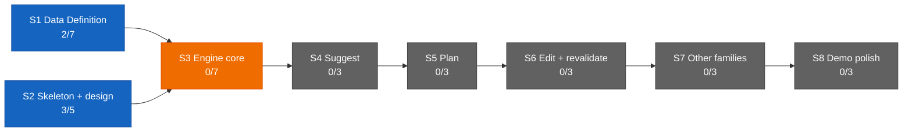

# Dashboard — the state surface

Painted 2026-07-30 · 13:52 by report-shapes · from work PC
Control tower at the work PC · needs-you 2 · git outranks this
board. How to read it →
[HOME §Reading the board](HOME.md#reading-the-board)

## Needs you

1. 🟡 **Apply the vault lens at the HOME PC** — when you next sit
   there. It re-seeds that seat's Obsidian graph filter to
   `-path:record`; the work PC is done, and a per-seat act clears
   only when every seat runs it. (since 07-27)
   → [machine-setup §Vault lens](skills/machine-setup.md#vault-lens)
2. ⚪ **Delete the dead `CLERK_` lines** from each seat's
   `.env.local` — whenever convenient. They point at a routine
   deleted 07-22: inert, gitignored, never a leak. (since 07-29)
   → [the retired clerk charter](record/retired/clerk-charter.md)

## The baton

CONTROL TOWER — work PC, since 2026-07-30 (pickup)
Last flight: none this sitting — the floor has been ground-side
throughout.

## In flight

| Who | For | State | Move |
|---|---|---|---|
| commander's bench · report-shapes | the report skeleton + the board diet | 🟡 | at THE GATE — say "review" in the Web chat |

## Working on

- The workshop diet — five benches deep: what each file is FOR,
  and what that excludes. This bench is the speaking surfaces.

The standing order
([D-060](record/DECISIONS.md#d-060--2026-07--the-three-phase-standing-order--settle-and-test-the-vault-then-roam-v1s1t3t6-and-v1s2t5-are-paused-until-phase-2-closes-the-founders-2026-07-28-sequencing-recorded-per-laws-pause-routing-upholds-the-pacing-law)),
one phase per line:

- PHASE 1 — settle & test: benches done; the first-story shakedown
  flight remains.
- PHASE 2 — the vault: chronicle story lanes + a polish pass;
  opens with your scope ruling (all 66, or the load-bearing dozen).
- PHASE 3 — Roam: T3–T6 relaunched from scratch, plus
  [V1.S2.T5](ROADMAP.md#v1s2--skeleton--design-foundations-parallel-lane-with-s1)
  design foundations.

## Recent

**Completed**

- The IDEAS entry contract — one idea per line; closed ideas
  compress and stay as the outcome ledger.
  [#248](https://github.com/wsher0901/roam/pull/248)
- The box-master diet — the cockpit charter cut to rules and
  pointers; the connector ladder moved to HOME.
  [#246](https://github.com/wsher0901/roam/pull/246)
- SETUP compressed to the entry contract — every entry a
  replication spec, 28 VERIFY probes.
  [#244](https://github.com/wsher0901/roam/pull/244)

**Issues**

- ✓ The pointer-sweep lesson — grep the DESTINATION, not the words
  you predict — caught and resolved at
  [#246](https://github.com/wsher0901/roam/pull/246).
- ⏳ `npm run count:runs` fails under the work PC's Git Bash while
  the script run directly succeeds. → its line in
  [IDEAS](IDEAS.md)

## Where we are (Roam)

V1 — The demo · 5/34 █████░░░░░░░░░░░░░░░░░░░░░░░░░░░░
S1 · Data Definition · 2/7 ██░░░░░ (T3–T6 paused → phase 3)
S2 · Skeleton & design · 3/5 ███░░ (T5 paused → phase 3)
S3–S8 · queued in order · 0/22

```mermaid
flowchart LR
  S1["S1 Data Definition<br/>2/7"]
  S2["S2 Skeleton + design<br/>3/5"]
  S3["S3 Engine core<br/>0/7"]
  S4["S4 Suggest<br/>0/3"]
  S5["S5 Plan<br/>0/3"]
  S6["S6 Edit + revalidate<br/>0/3"]
  S7["S7 Other families<br/>0/3"]
  S8["S8 Demo polish<br/>0/3"]
  S1 --> S3 --> S4 --> S5 --> S6 --> S7 --> S8
  S2 --> S3
  classDef done fill:#2e7d32,stroke:#1b5e20,color:#ffffff
  classDef active fill:#1565c0,stroke:#0d47a1,color:#ffffff
  classDef locked fill:#ef6c00,stroke:#e65100,color:#ffffff
  classDef pending fill:#616161,stroke:#424242,color:#ffffff
  class S1,S2 active
  class S3 locked
  class S4,S5,S6,S7,S8 pending
```

## Web + Design

- (Web) "Ops — docs audit" — the sitting's ops chat; carries the
  external review of each bench. → next: review this bench when
  you say the word.

## Next

The first-story shakedown flight — phase 1's second half; it
proves [land](skills/land.md) and the blind cockpit birth, and it
is the first flight that can end by itself.
