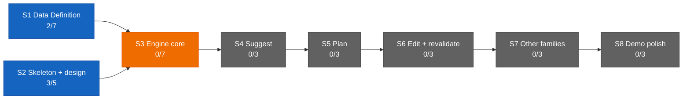

# Dashboard — the state surface

Stamp: 2026-07-29 · 09:22 · ship tail · work PC
V1 5/34 · S1 2/7 · S2 3/5 · sessions: 1 main · 0 parallel
(0 need you) · needs-you 3
How to read this board →
[HOME §Reading the board](HOME.md#reading-the-board)

## Needs you

1. 🟡 "apply the vault lens" at the HOME PC — it re-seeds each
   seat's Obsidian graph filter to `-path:record` after the
   [#229](https://github.com/wsher0901/roam/pull/229) record move.
   WORK PC DONE 2026-07-28 · HOME PC OWED — a per-seat act clears
   only when every seat runs it (since 07-27).
   → [machine-setup §Vault lens](skills/machine-setup.md#vault-lens) ·
   [D-057](record/DECISIONS.md#d-057--2026-07--the-record-shelf--the-frozen-record-moves-under-one-roof-docsrecord-is-born-history--specs--decisions-in-memory-stays-living-at-root-the-enabling-ruling--a-mechanical-link-path-segment-repair-inside-a-frozen-file-is-maintenance-not-a-content-edit-append-only-governs-meaning-not-bytes-intra-record-links-resolve-by-construction-upholds-append-only-one-home-and-the-weave-rule)

2. 🟡 RE-SAVE THE COCKPIT ROUTINE BOX at
   claude.ai/code/routines — [#238](https://github.com/wsher0901/roam/pull/238)
   edited the charter MASTER (the standing job · auto-land ·
   the tombstone wake-rule) and
   [#240](https://github.com/wsher0901/roam/pull/240) edited it
   again (rule 5's gloss → a pure pointer); the routine's saved
   prompt is a COPY. ONE re-save covers both. Until it happens, a
   routine-fired cockpit is born without any of them (since
   07-28).
   → [SETUP §cloud accounts](SETUP.md#once-and-done--cloud-accounts) ·
   [D-061](record/DECISIONS.md#d-061--2026-07--the-landing-doctrine-recut-to-three-scenarios--the-cockpits-standing-job-advise-on-fleet-status-and-on-each-gate-reaching-decision-execute-the-founders-rulings-from-the-phone-auto-land-when-the-fleet-empties-and-nothing-awaits-the-founder-desk-takeover-when-pickup-finds-a-live-cockpit-holding-decisions-and-the-founders-freeze-unchanged-the-tombstone-wake-rule-makes-a-superseded-cockpit-retire-by-the-full-ritual-amends-d-054s-two-mode-routing-upholds-no-solo-approval-and-the-derivation-law)

3. 🟡 RE-PASTE THE WEB-INSTRUCTIONS BOX in the Claude Web project
   — [#240](https://github.com/wsher0901/roam/pull/240) shipped
   the master at v6, and the box is a copy. v6 makes this its own
   law (FULL COPY, ALWAYS), and the version line in the box is
   what a fresh chat drift-checks against at ingest, so a stale
   box now announces itself (since 07-29).
   → [WEB-INSTRUCTIONS](WEB-INSTRUCTIONS.md) ·
   [D-063](record/DECISIONS.md#d-063--2026-07--response-doctrine-v2--web-instructions-v6--two-channels-sentences-for-the-founder-fenced-blocks-for-machines-process-is-proof-not-prose-the-chat-start-ingest-contract-the-relay-rule--origin-is-the-only-courier-codes-output-is-never-pasted-to-web-reviews-speak-in-goal-and-outcome-the-core-file-alert-the-agenda-convention-brief-renders-the-full-picture-the-master-gains-a-version-history-amends-d-052)

The 07-28 re-paste ([#236](https://github.com/wsher0901/roam/pull/236))
cleared its own item; item 3 is a NEW one, opened by the v6 master.

The nine open engine questions stay parked in
[ENGINE §12](ENGINE.md#12-open-register) until
[V1.S3](ROADMAP.md#v1s3--engine-core--two-families-deep) opens;
they are a register, not an action. ENGINE's `type: spec`
frontmatter oddity is folded there too
([IDEAS](IDEAS.md), the founder's 07-23 gate word).

## Sessions

| Session | Task | State | Last push | Your move |
|---|---|---|---|---|
| main · control tower | — ([web-instructions-v6](record/history/workshop/definition/web-instructions-v6.md) shipped [#240](https://github.com/wsher0901/roam/pull/240); nothing open) · 0/0 | 🟢 | 09:22 (this repaint) | — |

↳ main micro: — (no active task)

SEQUENCING — the standing order, now
[D-060](record/DECISIONS.md#d-060--2026-07--the-three-phase-standing-order--settle-and-test-the-vault-then-roam-v1s1t3t6-and-v1s2t5-are-paused-until-phase-2-closes-the-founders-2026-07-28-sequencing-recorded-per-laws-pause-routing-upholds-the-pacing-law):
**PHASE 1 — SETTLE & TEST** (three benches down; next the
first-story shakedown flight: blind cockpit birth · the fence /
[land](skills/land.md) MODE P ·
[pickup](skills/pickup.md#6--fleet-resume-on-the-founders-answer)
fleet-resume · land MODE R) → **PHASE 2 — THE VAULT** (chronicle
story lanes + a connections-and-content polish pass; the phase
opens with the founder's scope ruling, all 66 vs the load-bearing
dozen) → **PHASE 3 — ROAM**
([V1.S1](ROADMAP.md#v1s1--data-definition-the-gate-docs--spike-scripts-only-no-app-code)
T3–T6 relaunched from scratch per
[the brief](record/history/workshop/definition/chronicle-answers.md),
audit riders included, plus
[V1.S2.T5](ROADMAP.md#v1s2--skeleton--design-foundations-parallel-lane-with-s1)).
T3–T6 and T5 are PAUSED until phase 2 closes.

THIS SITTING: the nine-answers bench
([#236](https://github.com/wsher0901/roam/pull/236)) closed the
census's founder-owed register — all nine endings written, three
of them recording UNCERTAINTY as the settled state because that
is what the answer was. Two the bench derived rather than asking
twice: both summon secrets exist by name (values never read), and
no weld since [#213](https://github.com/wsher0901/roam/pull/213)
is cockpit-seated. T3–T6: RELAUNCH FROM SCRATCH, briefed with
four audit riders. The reviewer registration defect CLOSED after
five clean native runs. The chronicle layer settled and took its
own shelf row —
[the census](chronicle/INDEX.md) now stands at 66. The ship-time
critic earned its keep: four of its nine findings were the bench
breaking its own no-rounding rule in text already approved, all
narrowed back to the evidence pre-flip, and the external review
upheld a fifth — the standing order pauses roadmap work, so
[D-060](record/DECISIONS.md#d-060--2026-07--the-three-phase-standing-order--settle-and-test-the-vault-then-roam-v1s1t3t6-and-v1s2t5-are-paused-until-phase-2-closes-the-founders-2026-07-28-sequencing-recorded-per-laws-pause-routing-upholds-the-pacing-law)
landed as a pure append. Three fresh
[IDEAS](IDEAS.md) lines (the S3.T1 pair · decide tags · the
go-remote retirement question); the 07-17 defect line closed
citing the bench.

THEN THE LANDING RECUT
([#238](https://github.com/wsher0901/roam/pull/238)) — phase 1's
first half finished: a flight no longer ends only when the
founder says so.
[D-061](record/DECISIONS.md#d-061--2026-07--the-landing-doctrine-recut-to-three-scenarios--the-cockpits-standing-job-advise-on-fleet-status-and-on-each-gate-reaching-decision-execute-the-founders-rulings-from-the-phone-auto-land-when-the-fleet-empties-and-nothing-awaits-the-founder-desk-takeover-when-pickup-finds-a-live-cockpit-holding-decisions-and-the-founders-freeze-unchanged-the-tombstone-wake-rule-makes-a-superseded-cockpit-retire-by-the-full-ritual-amends-d-054s-two-mode-routing-upholds-no-solo-approval-and-the-derivation-law)
gives the cockpit a written STANDING JOB (advise on every gate,
execute rulings, never merge on its own advice), AUTO-LAND when
the fleet empties and nothing awaits the founder, and a DESK
TAKEOVER when the founder returns mid-flight; the freeze is
unchanged. THE CRITIC FOUND THREE STRUCTURAL FAULTS the bench had
built itself — LAWS still said "push, write nothing" (the exact
behaviour D-061 rejects by name, and LAWS outranks a skill); a
superseded cockpit would have repainted the board and erased the
takeover stamp of the desk that superseded it; and the takeover
sat behind an entry guard that excluded its own trigger. All
repaired pre-flip. The external review then directed the
generalization the bench had flagged rather than assumed:
[D-062](record/DECISIONS.md#d-062--2026-07--the-wake-rule-generalized--any-superseded-seat-exits-by-its-own-closing-ritual-never-bare-a-cockpit-by-the-landing-ritual-a-ground-control-tower-by-capture-then-close-with-team-findings-captured-first-no-superseded-seat-writes-a-board-because-the-baton-has-already-moved-closes-d-056s-deferred-road-in-full-upholds-d-056-and-d-061)
— ANY superseded seat exits by its own closing ritual, team
findings captured first, no board written — which closes the
[D-056](record/DECISIONS.md#d-056--2026-07--team-aware-leaving-rituals--no-ritual-lets-a-live-agent-team-outlive-the-sitting-that-made-it-handoff-shuts-the-team-down-before-parking-anything-and-captures-its-findings-into-the-record-first-land-states-the-cockpit-cannot-lead-a-team-case-once-and-routes-the-ground-seat-to-handoff-pickup-gains-the-ghost-teammate-recovery-note-and-the--block-gains-what-the-team-had-found-closes-d-055s-deferred-gap-upholds-one-home-and-the-park-protocol)
deferred road in full.

AND THE WEB SURFACE REWRITTEN
([#240](https://github.com/wsher0901/roam/pull/240)) — the master
goes v5 → v6 and the response doctrine v1 → v2 with it
([D-063](record/DECISIONS.md#d-063--2026-07--response-doctrine-v2--web-instructions-v6--two-channels-sentences-for-the-founder-fenced-blocks-for-machines-process-is-proof-not-prose-the-chat-start-ingest-contract-the-relay-rule--origin-is-the-only-courier-codes-output-is-never-pasted-to-web-reviews-speak-in-goal-and-outcome-the-core-file-alert-the-agenda-convention-brief-renders-the-full-picture-the-master-gains-a-version-history-amends-d-052)).
TWO CHANNELS is the change everything else follows from:
sentences for you, fenced blocks for machines, nothing technical
outside a fence. v6 adds the chat-start ingest contract, THE
RELAY RULE (origin is the only courier — you are never asked to
ferry Code's output to Web), reviews that speak in
goal-and-outcome, the core-file alert, an agenda, a full-picture
brief, and the master's own version history. THE BENCH'S HARDEST
ACT WAS REFUSING TO WRITE: ordered to replace the box
byte-faithful, it found the approved text dropped two whole v5
sections and flagged them with their content rather than
reconstructing what you had not supplied — you then ruled each,
reviving one guardrail and letting three go on purpose.

NEXT: the first-story shakedown flight, phase 1's second half —
it proves [land](skills/land.md) and the blind cockpit birth, the
two pieces confirmed never flown, and it is now the first flight
that can end by itself.

## You are here

V1 — The demo · 5/34 █████░░░░░░░░░░░░░░░░░░░░░░░░░░░░
S1 · Data Definition · 2/7 ██░░░░░ → T3–T6 source vetting ⚪ paused
(relaunch from scratch, briefed; phase 3 per
[D-060](record/DECISIONS.md#d-060--2026-07--the-three-phase-standing-order--settle-and-test-the-vault-then-roam-v1s1t3t6-and-v1s2t5-are-paused-until-phase-2-closes-the-founders-2026-07-28-sequencing-recorded-per-laws-pause-routing-upholds-the-pacing-law))
S2 · Skeleton & design · 3/5 ███░░ → T5 Design foundations ⚪ paused
(phase 3)
S3–S8 · queued in order · 0/22

## Stage map

```mermaid
flowchart LR
  S1["S1 Data Definition<br/>2/7"]
  S2["S2 Skeleton + design<br/>3/5"]
  S3["S3 Engine core<br/>0/7"]
  S4["S4 Suggest<br/>0/3"]
  S5["S5 Plan<br/>0/3"]
  S6["S6 Edit + revalidate<br/>0/3"]
  S7["S7 Other families<br/>0/3"]
  S8["S8 Demo polish<br/>0/3"]
  S1 --> S3 --> S4 --> S5 --> S6 --> S7 --> S8
  S2 --> S3
  classDef done fill:#2e7d32,stroke:#1b5e20,color:#ffffff
  classDef active fill:#1565c0,stroke:#0d47a1,color:#ffffff
  classDef locked fill:#ef6c00,stroke:#e65100,color:#ffffff
  classDef pending fill:#616161,stroke:#424242,color:#ffffff
  class S1,S2 active
  class S3 locked
  class S4,S5,S6,S7,S8 pending
```

## Claude Web + Design discussion

**"Ops — chronicle, record shelf & atlas"** (Web) — the ops chat,
governed by the v5 master; its review duty is DISCHARGED for this
sitting. It answered the census's nine owed endings, ruled the
four drafting-batch flags, and carried
[#236](https://github.com/wsher0901/roam/pull/236)'s external
review to PASS on `4ee7ab1` — verified independently on the
reviewer's own clone: every ending traced to the founder's quoted
words with uncertainty preserved where that was the answer, both
derivations honest (secrets by name only; the weld derivation
naming its own limit), the dangling double-dispatch pointer noted
without being counted as evidence, gates re-run (links · ledger
100↔100 · memory valid). Its two repairs both landed:
[D-060](record/DECISIONS.md#d-060--2026-07--the-three-phase-standing-order--settle-and-test-the-vault-then-roam-v1s1t3t6-and-v1s2t5-are-paused-until-phase-2-closes-the-founders-2026-07-28-sequencing-recorded-per-laws-pause-routing-upholds-the-pacing-law)
minted for the standing order, and item 6 completed (the phone
still carries the app → demotion, not retirement-by-platform).
→ next: the first-story shakedown flight's review, and the
first story weld after it (which carries the deferred ship
synthesis-at-weld step). Before this: the 07-27 queue —
[#233](https://github.com/wsher0901/roam/pull/233) (PASS on
`dea1e6e`) · [#231](https://github.com/wsher0901/roam/pull/231)
(PASS on `657040c`) ·
[#229](https://github.com/wsher0901/roam/pull/229) (PASS on
`999c061`).
Earlier reviews, all DONE:
[#225](https://github.com/wsher0901/roam/pull/225) (PASS on
`fc4dcf7`) · [#223](https://github.com/wsher0901/roam/pull/223)
(PASS on `9b798b2`) ·
[#221](https://github.com/wsher0901/roam/pull/221) (PASS on
`3e4d1ba`) · [#218](https://github.com/wsher0901/roam/pull/218)
(PASS on `bd2f6ef`) ·
[#216](https://github.com/wsher0901/roam/pull/216) (PASS on
`5f4be89`) · [#213](https://github.com/wsher0901/roam/pull/213)
(PASS on `342e344`) ·
[#211](https://github.com/wsher0901/roam/pull/211) (PASS on
`edc0c9a` + `1ffebdf`) ·
[#207](https://github.com/wsher0901/roam/pull/207) (PASS on
`2b97a86`) · [#204](https://github.com/wsher0901/roam/pull/204)
(PASS on `614e0f8`) → also owed: grade the cockpit maiden, once
the closeout bench opens.
Under the surface doctrine
([D-046](record/DECISIONS.md#d-046--2026-07--flight-cockpit--the-cockpit-is-the-control-tower-online-full-authorship-cloud-command-session-the-no-solo-approval-law-liftoff-auto-fires-the-cockpit-cc-direct-surface-doctrine-clerk-retirement-staged-remote-control-demoted-to-backstop-the-cockpitcontrol-tower-rename-amends-d-041-and-d-043-upholds-the-lane-law-and-the-wake-lock)),
Web's one mandatory job is the external review of self-authored
diffs — the v5 box now says so itself.
T3–T6 source-vetting relaunch stays held (see You are here).

## Shipped (latest — full record: [the ledger](record/history/README.md#the-ledger))

| When | What | PR |
|---|---|---|
| 07-29 09:19 | [the Web surface's instruction master goes v5 → v6 and the response doctrine v1 → v2 with it (D-063): D-052 optimized the SHAPE of a reply while leaving its CONTENTS mixed — one paragraph carrying a status, a sha, a gate count and an instruction, with the founder left to sort the machine's business from their own. TWO CHANNELS fixes it at the root (sentences for the founder, fenced blocks for machines, no technical content outside a fence), and PROCESS IS PROOF, NOT PROSE follows from it; seven rules, one home, carried word-identical in the box. v6 adds what v5 had no home for: the chat-start INGEST CONTRACT with the box drift-checked against its own master's version line; THE RELAY RULE — origin is the only courier, so the founder is never asked to ferry Code's output, the one exception named honestly; reviews in GOAL-AND-OUTCOME with per-sha verdicts; the core-file alert; the agenda convention; a full-picture brief; and the FULL COPY, ALWAYS law with the version-history table that makes the drift-check possible. THE BENCH'S HARDEST ACT WAS REFUSING TO WRITE — ordered to replace the fence byte-faithful, it found the approved text dropped two whole v5 sections and FLAGGED them with their full content rather than reconstructing what the founder had not supplied; the founder then ruled each, reviving the ROADMAP-stage guardrail and letting three go on purpose, so the record says which were deliberate. The critic caught the bench's own ship hygiene and an ⏳ used outside rule 7's glyph set; the external review resolved that one the other way — ADMITTING ⏳ to the doctrine in both homes — and added the explicit-go law, the prose ban widened to verification narrative, and the charter rule 5 gloss reduced to a pure pointer](record/history/workshop/definition/web-instructions-v6.md) | [#240](https://github.com/wsher0901/roam/pull/240) |
| 07-28 17:13 | [the landing doctrine recut to the founder's three-scenario model (D-061), and supersession stops being the one road out that runs no ritual (D-062): D-054 routed landing by the FLEET but left the TRIGGER in one place — the founder's word — which fits exactly one of the three situations a flight actually ends in. The cockpit gains a written STANDING JOB (advise on fleet status and on each gate reaching decision, execute the founder's rulings, NEVER merge on its own advice); AUTO-LAND fires the full ritual unprompted the same turn no lanes work AND nothing awaits the founder, behind four guards, one re-liftoff the stated cost of an early fire; DESK TAKEOVER hands the baton back when the founder returns mid-flight; the freeze is unchanged. THE SHIP-TIME CRITIC FOUND THREE STRUCTURAL FAULTS THE BENCH BUILT ITSELF — LAWS still said "push, write nothing", the exact behaviour D-061 rejects BY NAME and LAWS outranks a skill; a superseded cockpit would have repainted the board and ERASED the takeover stamp of the desk that superseded it; and the takeover sat behind an entry guard admitting only a grounded fleet, unreachable reading pickup top-down — all repaired pre-flip, plus a fourth that would have killed a healthy lane. The external review then directed the generalization the bench flagged rather than assumed: D-062, ANY superseded seat exiting by its own closing ritual with team findings captured first and no board written, closing the D-056 deferred road in full](record/history/workshop/mechanism/land-doctrine-v2.md) | [#238](https://github.com/wsher0901/roam/pull/238) |
| 07-28 13:22 | [the census's nine founder-owed endings are answered and written into the record: the founder ruled on all nine, and the INDEX's owed register became nine settled-for-now endings — THREE RECORDING UNCERTAINTY AS THE SETTLED STATE, because that is what the answer was; two the bench DERIVED rather than asking twice (both summon secrets exist by name, values never read; no weld since #213 is cockpit-seated — a derivation whose own limit is named, since no weld is weaker than no flight); T3–T6 RELAUNCH FROM SCRATCH with the external reviewer's four audit riders each marked verify-licenses-at-spike, the failure evidence held to exactly what the record carries and one dangling pointer noted honestly rather than counted; the reviewer registration defect CLOSED after five clean native runs; the chronicle layer settled and took its own shelf row, the census restamping 65 → 66. THE SHIP-TIME CRITIC EARNED ITS KEEP — four of its nine findings were the bench breaking its own no-rounding rule in text the founder had already approved, all narrowed back to the evidence pre-flip, and the external review upheld a fifth: the standing order pauses roadmap work, so the founder amended the files-touched and D-060 landed as a pure append](record/history/workshop/definition/chronicle-answers.md) | [#236](https://github.com/wsher0901/roam/pull/236) |
| 07-27 21:34 | [the story layer is decided and its shelves are drafted (D-059): living stories above the frozen record, governed by the founder's six rulings — ONE STORY PER ITEM, and the ending rule at the design's heart (settled in any format means written; a later fix is INCORPORATED and the ending rewritten at that weld — never a second story); docs/chronicle/ born with INDEX.md as a DRAFT CENSUS of 65 proposed stories across four shelves, produced by the workshop's FIRST AGENT-TEAM USE — three read-only teammates, one shelf each, the lead reading the Roam shelf itself; the D-056 discipline ran in the externally-corrected order (captures pushed BEFORE shutdown, proven from the push log at review); nine endings the record cannot derive marked founder-input-owed rather than guessed, the T3–T6 batch-1 arc leading them; the founder's four folds landed at the review; the ship synthesis-at-weld step deferred by ruling to the first story weld](record/history/workshop/definition/chronicle-layer.md) | [#233](https://github.com/wsher0901/roam/pull/233) |
| 07-27 20:42 | [the workshop gains its system spine (D-058): docs/ATLAS.md is born — six mermaid diagrams on one page (the task loop with the weld's four acts inside it, the file flow, away & return closed into a circle, a lane's life, the surfaces, the state surfaces), composed FROM the living prose at HEAD; the posture IS the decision — renders, originates nothing, dated stamp, least-authoritative, every doctrine box linked to its owning section through checker-visible weave lines (in-diagram click-links rejected with both mechanical reasons on record); HOME gains the routing row whose upsert rule doubles as the maintenance law, plus the review-licensed catalog entry; the critic's one real catch was the sharpest possible for this page — the ack token drawn with a non-canonical separator, the #191 failure class — repaired character-for-character](record/history/workshop/definition/atlas.md) | [#231](https://github.com/wsher0901/roam/pull/231) |
| 07-27 20:13 | [the frozen record moves under one roof (D-057): docs/record/ is born and history, specs, and DECISIONS move in as 155 recorded renames (memory/ stays living at root); THE ENABLING RULING — a link-path-segment repair inside a frozen file is MAINTENANCE, not a content edit, append-only governs meaning not bytes; the review criterion stated machine-checkably (record diff with link targets blanked = byte-identical, sole exception the bench's own spec) and proven on the reviewer's own clone; the sweep one deterministic recompute, 1,580 links across 158 files, its by-construction premise qualified honestly by the external review (eight docs-root-relative intra-record links were broken and repaired the same way); the critic's real catch — a DASHBOARD ledger link with nested brackets invisible to the checker — repaired AND check-links.mjs hardened, 13 previously-skipped links entering the count](record/history/workshop/definition/record-shelf.md) | [#229](https://github.com/wsher0901/roam/pull/229) |
| 07-24 17:21 | [no ritual lets a live agent team outlive the sitting that made it (D-056): D-055 had made single-sitting-only law and left it enforced by nothing. THE DECISION IS AN INVERSION of the candidate clause that opened the bench — "never park a live team" governs the PROCESSES, which are not what is at risk: teammates die cheaply and respawn cheaply, while what dies irrecoverably is what they FOUND, since a team's output lives in transcripts that vanish with the session. So the duty became CAPTURE, THEN KILL — handoff §1.2, before any park: findings into the record first (this session's OWN bench memory, never a lane's diary, else an IDEAS line riding §5's micro-PR), then shutdown by name, then report, with the not-instant honesty and refusals named in the close report on the road out. land routes to handoff with zero duplicated procedure; pickup gains the ghost-teammate note; TEMPLATE's ⏸ block gains conditional TEAM FINDINGS. The critic found THREE already-shipped holes — the liftoff road with nowhere to land, a wording that licensed writing into a lane's diary, and an IDEAS fallback with no committing vehicle — plus a logic error in the bench's own justification, rewritten as policy: D-056 corrects D-055's reasoning FORWARD, that entry left unedited under append-only](record/history/workshop/mechanism/team-aware-leaving.md) | [#225](https://github.com/wsher0901/roam/pull/225) |
| 07-24 16:44 | [where agent teams fit this workshop and where they must not (D-055): the experimental flag was already ON with nothing reaching for it, so the question was never whether teams get used but whether their first use would be governed. THE BOUNDARY — teams are for EXPLORATION AND REVIEW at a ground seat, LANES REMAIN THE AUTHORSHIP MECHANISM, and a team never authors a bench, never merges, never runs a ritual — with the reasons stated rather than asserted; TWO RISKS AS LAW: single-sitting only (an explicit carve-out to D-050's interrupt promise, written in BOTH places that promise is read — an interrupt is safe for your session and fatal to your teammates) and a teammate-authored diff is SELF-AUTHORED under no-solo-approval; the reviewer's model settled by VERIFICATION — the `opus` alias resolved mechanically from a headless run's own billing record and recorded before `reviewer.md` was touched, an order the external review checked in the log rather than trusting; three rejections with reasons. The critic ran TWICE: the first as Sonnet 5 (this session's definition was cut at startup, before the edit), the second forced onto Opus 5 — and the Opus pass found a THIRD stale copy plus the missing D-045/D-020 forward pointer, so of three stale copies the bench found one and the critic found two](record/history/workshop/definition/agent-teams.md) | [#223](https://github.com/wsher0901/roam/pull/223) |
| 07-24 15:20 | [how a flight ends becomes a first-class ritual (D-054): land ships as ONE skill with TWO modes routed by the fleet the cockpit derives from origin — RETIRE, consolidating the duties charter rule 6 already carried, and PAUSE-AND-TRANSFER, answering the case that had none; its core is THE FENCE, a commit that makes the lane's next push non-fast-forward so the wake-lock turns the rejection into a stop and the resume point is the branch tip BY CONSTRUCTION, with the honesty clause beside it (wake-lock-mediated, never a guaranteed freeze); the board's fleet-at-ground table is the single material passed down, sessions are cattle and branches are the work, pickup gains the FLEET RESUME ask with live cap arithmetic, rule 6 reduces to a pointer, and the effort doctrine moves to Opus 5 · xhigh; five alternatives rejected with reasons; the critic's two findings repaired pre-flip, the 🟡 one judged REQUIRED by one-home at the external review](record/history/workshop/mechanism/landing-skill.md) | [#221](https://github.com/wsher0901/roam/pull/221) |
| 07-24 01:33 | [the harness found ALREADY AT BEST PRACTICE, the proof welded to the record (D-053): the founder's maximum-depth audit of the whole governing layer against Anthropic's guidance; the two real improvements shipped — LAWS' verification loop promoted to a copy-runnable block (proven live: this bench's gate ran the block verbatim as its mirror) and two stub trigger-surfaces sharpened, the harness picking both up mid-bench; five alternatives rejected with reasons; the critic's one finding — the hygiene bench's own bare D-053 mentions — repaired pre-flip](record/history/workshop/definition/guardrail-audit.md) | [#218](https://github.com/wsher0901/roam/pull/218) |

Note: [#201](https://github.com/wsher0901/roam/pull/201) (liftoff
board weld) and [#202](https://github.com/wsher0901/roam/pull/202)
(the liftoff flight harvest into IDEAS) are chore/docs micro-PRs,
not history/ stories, so they carry no ledger line — the ledger is
history-keyed. #202's findings live in [IDEAS](IDEAS.md).
