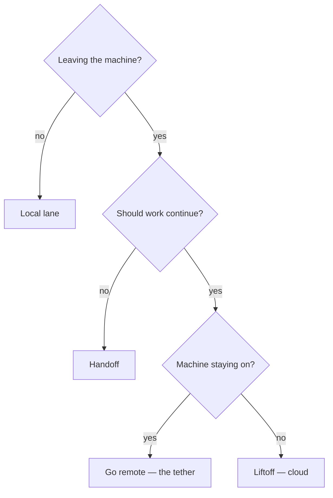

# Home — the manual & encyclopedia

Roam is one engine for travel planning: from as little as an origin
and free dates it suggests trips, plans them day by day, and
re-validates the whole plan on every edit — catching the small
checkable details (weather per activity, tides, closures, crowds,
flight-time sense) that other planners miss. It never fabricates:
every claim carries a source and a confidence, and anything
unverifiable is labeled unverified — the reliability law. Full
identity: FOUNDATION.md.

Three documents govern the workshop; this page explains all of them.
LAWS.md INSTRUCTS — the universal rules every session loads and must
obey. ENGINE.md holds the STANDING CHOICES of the product's brain —
the engine on paper. DECISIONS.md holds HISTORY — every choice as an
append-only D-number with its rationale and the alternatives it
rejected. THIS FILE answers "how does anything work, and why is it
like that": it explains and links, holds ZERO live state, and
duplicates no rule — where a rule is restated here for readability,
the restatement is a reading aid and the linked home stays canonical.
Any "where are we" question is answered by DASHBOARD.md (repainted by
rituals) or by sitting down and talking — never by content here.

Sources:
[reliability law](FOUNDATION.md#the-reliability-law)
[FOUNDATION.md](FOUNDATION.md)
[LAWS.md](LAWS.md)
[ENGINE.md](ENGINE.md)
[DECISIONS.md](record/DECISIONS.md)
[DASHBOARD.md](DASHBOARD.md)

## Start here — the questions

| Question | Go to |
|---|---|
| What are we building, and for whom? | [FOUNDATION.md](FOUNDATION.md) |
| What's the plan, in what order? | [ROADMAP.md](ROADMAP.md), read with the [Roadmap manual](#roadmap-manual) |
| Where are we right now? | [DASHBOARD.md](DASHBOARD.md) — or just talk: control-tower sessions brief unprompted ([pickup](skills/pickup.md)) |
| What are the working laws? | [LAWS.md](LAWS.md) |
| Why did we choose X? | [DECISIONS.md](record/DECISIONS.md); engine rules consolidated: [ENGINE](ENGINE.md) |
| What does the workshop run on? | [SETUP.md](SETUP.md) |
| How does anything work around here? | [§The mechanisms](#the-mechanisms) |
| What does a term mean? | [§Terms](#terms) |
| What's the contract of a task? | its spec in [docs/record/specs/](record/specs/README.md) |
| What's the story of a task in flight? | its memory file in [docs/memory/](memory/README.md), living on the task's branch |
| What's the story of a shipped task? | its file in [docs/record/history/](record/history/README.md) |
| What has shipped? | [DASHBOARD §Recent](DASHBOARD.md#recent) for the last few; [the ledger](record/history/README.md#the-ledger) for all of it |
| How do I read the data files? | [§Reading the data files](#reading-the-data-files) |
| I'm sitting at a new or second machine | [machine-setup](skills/machine-setup.md) |
| How do I start a Design session? | [DESIGN-KICKOFF.md](DESIGN-KICKOFF.md) |
| I've been away for weeks | open [DASHBOARD.md](DASHBOARD.md), then just talk — [pickup](skills/pickup.md) rebuilds the rest |

## A day in the workshop

You sit down at either PC and open Claude Code in the repo — the
session hook pulls main and reads the board before you type a word.
Say anything ("hi" works): pickup claims the baton and hands you
the sit-down briefing — what shipped while you were away, which
sessions flipped state, what needs you, one recommended next step.
You give the words the briefing asked for, answer any `BLOCKED:`
question, and the fleet moves on without you.

Then the main session: you and the control tower drive one task —
discuss, decide, and author in-session (CC-direct, the standard
working mode). Every task is born on its own branch with a draft
PR; commits flow as the work's heartbeat. The moment a task's work
is complete, ship runs itself and brings you THE GATE — the
independent review the no-solo-approval law requires, external and
on the Web surface when the diff is self-authored — then your yes,
then the weld.

Somewhere in the afternoon you say "run T3–T6 in parallel" and four
benches are born, four lanes fly; the pacing law keeps only Now plus
one parallel slot on your desk. Leaving is one sentence: "done for
today" parks every local lane and halts the machine; "take it to
the cloud" lifts the eligible ones and fires the cockpit — the
control tower online — briefed with the flight plan; "go remote"
tethers the machine to your phone instead (a backstop posture), so
you drive the fleet from your pocket. The first two close the
session; go remote keeps it open. Either way the board is repainted
before the lights go out, and the next seat — tomorrow, or your
phone tonight — starts by reading it. Nothing important ever lives
only in a conversation.

Sources:
[pickup](skills/pickup.md)
[ship](skills/ship.md)
[handoff](skills/handoff.md)
[liftoff](skills/liftoff.md)
[bench-first](#task-anatomy--lifecycle)
[pacing law — LAWS §Workflow](LAWS.md#workflow-non-negotiable)

The three touchpoints
([LAWS §The three touchpoints](LAWS.md#the-three-touchpoints)) are
the founder's ONLY ritual duties:

1. **The merge word** — every merge waits for your explicit yes;
   the sole exception is the micro-PR.
2. **The review word** — when a diff is self-authored, THE GATE
   asks you to say "review" on the Web surface; that review
   precedes the merge word.
3. **The leaving ritual** — the leaving phrase or `/handoff`, with
   the Web/Design paste carried inline before it — no question
   asked (and pasting Web/Design blocks into Code during the day).

Sources:
[LAWS §The three touchpoints](LAWS.md#the-three-touchpoints)
[micro-PR](#micro-prs)
[THE GATE — ship §6](skills/ship.md#6--the-gate)

The promise behind the design: everything else — recording,
bookkeeping, status, claim checks, delegation, briefings — runs
itself. Genuine uncertainty and judgment calls still come to you;
housekeeping never does.

Four tools, four verbs — and only one of them writes. Claude WEB
reviews (and thinks): its one MANDATORY job is the external review
of self-authored diffs (the no-solo-approval law,
[LAWS §Workflow](LAWS.md#workflow-non-negotiable)); as an optional
thinking room, what it concludes still travels as a paste block
(WEB-INSTRUCTIONS) — a tool since
[D-046](record/DECISIONS.md#d-046--flight-cockpit-the-control-tower-online),
not a requirement: CC-direct is the standard working mode at both
seats — discuss, decide, author, bookkeep in-session. Claude DESIGN
draws: a no-write surface whose deliverables enter the repo only as
extracted token values (DESIGN-KICKOFF). Claude CODE writes: every
repo change flows through it as a PR. Obsidian READS: the vault is
docs/; quick capture goes only into IDEAS.md, and nothing rituals
own — above all the board — is ever hand-edited.

Sources:
[WEB-INSTRUCTIONS](WEB-INSTRUCTIONS.md)
[DESIGN-KICKOFF](DESIGN-KICKOFF.md)
[IDEAS.md](IDEAS.md)
[board](#the-board)

## The files — what each one is for

| File | What it is | Who writes it | When / lifecycle |
|---|---|---|---|
| [LAWS.md](LAWS.md) | the universal working laws every session loads (root [CLAUDE.md](../CLAUDE.md) imports it) | founder-approved PRs | living; changes rare and deliberate |
| [FOUNDATION.md](FOUNDATION.md) | timeless product identity & principles | founder-approved PRs (+ D-number) | living; only sentences no shipped version can falsify |
| [ROADMAP.md](ROADMAP.md) | the version ladder — versions → stages → task checkboxes; the ONLY stored task state | structure via [decide](skills/decide.md); ticks via [ship](skills/ship.md)'s weld | living, rolling-wave depth |
| [DASHBOARD.md](DASHBOARD.md) | the rendered state surface | rituals only — never hand-edited | living; repainted at ritual moments, never trusted over git |
| [ATLAS.md](ATLAS.md) | the system spine — the workshop as eight designed figures (SVG, [docs/atlas/](atlas)) on one page; renders, originates nothing (the prose governs) | the bench that changes what a figure depicts — re-drawn in that same PR | living; dated stamp, least-authoritative; loses every disagreement with its linked prose |
| [DECISIONS.md](record/DECISIONS.md) | the decision log, one D-number per choice — a SHORT heading that is the anchor, an `In full:` line carrying the complete statement ([D-068](record/DECISIONS.md#d-068--the-short-anchor-law)) | [decide](skills/decide.md) | append-only, which governs MEANING not bytes ([D-057](record/DECISIONS.md#d-057--the-record-shelf)): no entry's words are ever changed or removed, and a mechanical format or link repair is maintenance. Headings freeze at mint |
| [SETUP.md](SETUP.md) | everything the workshop runs on — stack, configs, tools; once-and-done vs per-machine vs staged | ops PRs | living |
| [ENGINE.md](ENGINE.md) | the engine on paper — pipeline stages, decided rules in slots, OPEN register | [decide](skills/decide.md) ripples; invents nothing | living consolidation; seeds the [V1.S3](ROADMAP.md#v1s3--engine-core--two-families-deep) contract |
| [IDEAS.md](IDEAS.md) | the single untriaged inbox — no Issues, no boards ([D-023](record/DECISIONS.md#d-023--universal-draft-pr-at-birth-and-micro-pr-carve-out)); OPEN + CLOSED under the entry contract at its head ([D-066](record/DECISIONS.md#d-066--the-ideas-entry-contract)) | Claude Code, the moment an idea or defect is voiced | triaged out into [ROADMAP](ROADMAP.md) via decide; closed ideas COMPRESS to one line and STAY as the outcome ledger |
| [DESIGN.md](DESIGN.md) | Roam's TASTE — direction, typography, color tokens, reference images, the states rule; OVERRIDES the machine's global design law ([D-084](record/DECISIONS.md#d-084--the-global-design-stack)) | the founder, via a taste pass; seats fill only what the founder has ruled | living; born with every taste slot TBD — a TBD is an unmade decision, never a blank to fill |
| [DESIGN-KICKOFF.md](DESIGN-KICKOFF.md) | the Claude Design session preamble + governance rules | ops PRs | living until the repo-synced design system replaces it |
| [WEB-INSTRUCTIONS.md](WEB-INSTRUCTIONS.md) | master copy of the Claude Web Project-instructions box | ops PRs | living; re-pasted into the box after every edit (the box is a copy, never the source) |
| [COCKPIT-CHARTER.md](COCKPIT-CHARTER.md) | master copy of the cockpit routine's saved prompt, adopted verbatim into every `--cloud` birth | ops PRs | living; re-saved into the routine box after every edit (the box is a copy) |
| [LANE-WORKER.md](LANE-WORKER.md) | master copy of the cloud lane-worker routine's saved prompt | ops PRs | living; re-saved into the routine box after every edit (the box is a copy) |
| HOME.md | this manual & encyclopedia; zero live state | founder-approved PRs | living |
| [data/FACTS.md](data/FACTS.md) | every fact the engine must know + every traveler parameter + the telemetry vocabulary ([Appendix C](data/FACTS.md#appendix-c--telemetry-vocabulary-what-the-app-records)) | [V1.S1](ROADMAP.md#v1s1--data-definition-the-gate-docs--spike-scripts-only-no-app-code) tasks via PRs | living; IDs stable, extension append-only |
| [data/SOURCES.md](data/SOURCES.md) | the vetted source registry, one entry per source slot | source-vetting tasks (T2–T6), consolidated at [T7](ROADMAP.md#v1s1--data-definition-the-gate-docs--spike-scripts-only-no-app-code) | living; grades move under the demotion law |
| [data/SCHEMA.md](data/SCHEMA.md) | human-readable mirror of the SQL schema | [V1.S1.T7](ROADMAP.md#v1s1--data-definition-the-gate-docs--spike-scripts-only-no-app-code) | placeholder until T7 ships |
| [record/specs/](record/specs/README.md) | per-task contracts + [TEMPLATE](record/specs/TEMPLATE.md) | born at task birth when discussion opened the task; [ship](skills/ship.md) finalizes | open → shipped or superseded; never deleted |
| [memory/](memory/README.md) | in-flight task stories in the locked format ([TEMPLATE](memory/TEMPLATE.md)) | the task's own seat — baton-holder at rituals, lanes at their four moments | lives on the task's branch; MOVES to record/history/ at ship |
| [record/history/](record/history/README.md) | permanent shipped narratives, one per task | [ship](skills/ship.md)'s atomic weld | frozen after landing (link repairs only) |
| [record/retired/](record/retired/clerk-charter.md) | retired ARTIFACTS kept whole — a box master or config text that is dead but still cited (RECORD, never instruction) | the bench that retires the thing, when its text lives nowhere else | frozen; never re-armed, never pasted |
| [record/probes/](record/probes/cloud-birth-in-ci.md) | PROBE RESULTS that shipped no bench — what was tried, what it cost, where it died, and the untried next step | the bench that evicts the narrative, when no branch or story carried it | frozen; a revisit writes a new record, never edits this one |
| [chronicle/](chronicle/INDEX.md) | living stories above the frozen record, one per settled item — [INDEX](chronicle/INDEX.md) is the door | the weld that settles or advances an item | incorporated, the ending rewritten in place — never a second story |
| [skills/](skills) | ritual procedures + workshop manuals, vault-readable | founder-approved PRs + promoted gotchas | living |
| docs/.obsidian/ | Obsidian's own workspace config | Obsidian | gitignored, never committed |
| [../CLAUDE.md](../CLAUDE.md) | two-line shim importing [LAWS](LAWS.md) into every session | ops PRs | changes only if LAWS moves |
| [../AGENTS.md](../AGENTS.md) | vendor note for non-Claude agents (Next.js docs pointer) | scaffold | rarely touched |
| [../README.md](../README.md) | the public front door — what Roam is, where docs live | ops PRs | grows a demo section at [V1.S8](ROADMAP.md#v1s8--demo-polish) |
| `.claude/settings.json` | shared harness config — hooks wiring, permission allow/deny lists, plugins, env flags | ops PRs | living |
| `.claude/settings.local.json` | machine-local config (tokens, per-machine plugins) | each machine, by hand | gitignored; never in the repo |
| `.claude/hooks/session-start.mjs` | session-start hook: sync main, inject the board, order the briefing | ops PRs | living |
| `.claude/hooks/user-prompt-submit.mjs` | user-prompt-submit hook: the close-lock — once a FULL [handoff](skills/handoff.md) or [liftoff](skills/liftoff.md) has written `.claude/session-closed`, it stamps every prompt with the closed-session doctrine, making the session read-only conversational (closed ≠ dead) rather than refusing it; silent on a live session | ops PRs | living |
| `.claude/hooks/session-end.mjs` | session-end hook: the crash net — auto-commit + push WIP on lane branches | ops PRs | living |
| `.claude/skills/*/SKILL.md` | trigger stubs, one per ritual/manual — each only points to its [docs/skills/](skills) procedure | ops PRs | point-only; never hold procedure text |

Portraits of the load-bearing ones — what each is FOR, and what
would break without it:

**FOUNDATION** is the product's identity: what Roam is, the spine,
what Roam checks, the reliability law, the principles — only
sentences that stay true across versions. It is the yardstick every
PR and every lane review is judged against. Without it, "is this
Roam?" would be re-litigated in every conversation, and scope would
drift with whoever spoke last. It is read at judgment moments —
ship's PR pre-review, lane pre-review, decide's ripple scan,
equipment vetting, the Design kickoff's identity line — and reaches
the engine code through ENGINE's seeding.

Sources:
[FOUNDATION](FOUNDATION.md)
[ship](skills/ship.md)
[decide](skills/decide.md)
[equipment vetting](SETUP.md#staged--turns-on-when-its-stage-opens)
[Design kickoff](DESIGN-KICKOFF.md)
[ENGINE](ENGINE.md)

**ROADMAP** is the build order made falsifiable: versions and stages
with testable completion criteria, tasks as checkboxes — the only
place task state is stored at all. Without it there is no "next", no
claim check, and no honest progress bar; with it, one glance settles
what is done, active, and queued.

Sources:
[ROADMAP](ROADMAP.md)

**DASHBOARD** renders everything the ladder and the narratives
already know into one screen — and is deliberately disposable:
rituals repaint it wholesale from sources, and git outranks it on any
disagreement. Without it the founder would reconstruct state from
branches and PRs by hand; because it is derived, it can never become
a second truth.

Sources:
[DASHBOARD](DASHBOARD.md)

**LAWS** is the constitution — the non-negotiables every session
loads before its first word (workflow, task anatomy, lanes, safety,
self-improvement). Without it every session would improvise its own
workflow, and the guarantees the rest of this page describes would be
habits instead of laws.

Sources:
[LAWS](LAWS.md)

**DECISIONS** is the append-only memory of choices: each D-number
records what was decided, why, and what it rejected — so settled
questions stay settled. Without it the same debates would replay
forever, and nobody could tell a principle from an accident.

Sources:
[DECISIONS](record/DECISIONS.md)

**ENGINE** — The engine's blueprint, shaped like the engine itself:
ten pipeline stages, each with inputs, outputs, a short procedure,
its binding rules, and a Sources line. What is decided reads as
rules; what is not decided is a numbered OPEN slot in the Open
register — filling one takes a D-number. The V1.S3 contract and V1.S4
brain prompt are written FROM this file; engine PRs are reviewed
AGAINST it. It grows by accretion: new sources, families, and metrics
plug into stages; the shape stays.

Sources:
[ENGINE](ENGINE.md)

### SETUP
The workshop's inventory, pure listing: the stack, what is
configured once in the repo or the cloud, what every machine owes
(machine-setup is the skill that pays it), and what is staged for a
future stage. Status never lives here — the DASHBOARD holds it.

**specs/** holds each task's stable contract — goal, scope edges,
plan, Done-means — born from the discussion that opened the task, so
conclusions don't evaporate with the chat. Without specs, ship would
have nothing objective to gate on, and "done" would mean "tired".

Sources:
[specs/](record/specs/README.md)
[ship](skills/ship.md)

**memory/** holds each task's living story in the locked format
(Status first), rewritten cognitively at rituals and at the lane
trigger moments. It is how a session that has never seen the task
before — tomorrow's baton-holder, a rescuer of a dead lane — picks
it up
cold. Without it, every interruption would cost the whole context.

Sources:
[memory/](memory/README.md)

**history/** is where memories retire: one narrative file per shipped
task, moved at the weld with its shipped date and PR number. Git
keeps the technical record; record/history/ keeps the meaning.
Without it,
"why does this exist?" would eventually have no answer a human can
read.

Sources:
[history/](record/history/README.md)

**IDEAS** is the one inbox: any idea or defect voiced outside the
current task's scope becomes a dated line, unasked. Without it, stray
thoughts would either derail the current task or be lost; with it,
nothing is scope until triaged, and nothing is forgotten either.

Sources:
[IDEAS](IDEAS.md)

**skills/** holds the ritual procedures and workshop manuals as
vault-readable pages — the founder can read every ritual in Obsidian,
and the `.claude/skills/` stubs that trigger them cannot drift
because they only point. Without this split, the workshop's
automation would be invisible and unauditable.

Sources:
[skills/](skills)

**data/** is the engine's ground truth on paper: FACTS (what the
engine must know, what it may be told, and what the app records about
itself — Appendix C), SOURCES (where each fact verifiably comes
from), SCHEMA (how it will be stored). Without this layer the
reliability law would be a slogan; with it, every claim the product
ever renders traces to a vetted, graded source.

Sources:
[data/](data/FACTS.md)
[FACTS](data/FACTS.md)
[Appendix C](data/FACTS.md#appendix-c--telemetry-vocabulary-what-the-app-records)
[SOURCES](data/SOURCES.md)
[SCHEMA](data/SCHEMA.md)

**DESIGN-KICKOFF** carries the rules into Claude Design, which cannot
read the repo's instructions: the pasted preamble sets identity,
scope, and the no-write law for every Design session. Without it each
session would need the rules re-explained — or worse, wouldn't get
them.

Sources:
[DESIGN-KICKOFF](DESIGN-KICKOFF.md)

## The mechanisms

How the workshop actually works, one mechanism at a time. The laws
themselves live in LAWS; the procedures in docs/skills/; this section
explains why they fit together.

Sources:
[LAWS](LAWS.md)
[docs/skills/](skills)

### Task anatomy & lifecycle

**Birth — bench-first.** Every task, control tower and cockpit
included, starts
identically: freshly pulled main → branch → spec (when discussion
opened the task) + memory stub → a DRAFT PR pushed to origin BEFORE
any session works it (D-023; procedure: parallel-lanes §Bench-first
birth). The point of the bench: from its first minute, a task exists
in public — branch, contract, story, and window all on origin — so no
work ever lives in only one place, and any seat (or any rescuer) can
see and claim it. The draft PR is the task's public window for its
whole life.

Sources:
[D-023](record/DECISIONS.md#d-023--universal-draft-pr-at-birth-and-micro-pr-carve-out)
[parallel-lanes §Bench-first birth](skills/parallel-lanes.md#bench-first-birth-baton-holder-procedure)

**Work — the heartbeat.** Commits are the heartbeat; every commit is
pushed. Small steps live as checkboxes in the spec's Done-means (or
in the PR description when the ROADMAP line was already fully
specified and no spec exists). Contract changes dual-write: the spec
receives the edit, and the memory narrates what changed and why — the
contract stays clean while the story keeps the reasoning.

Sources:
[ROADMAP](ROADMAP.md)

**Ship — the atomic weld.** When the work is complete, ship runs
itself: tests and linter, an honest Done-means check, weave-lint, the
memory's final rewrite, the draft→ready flip, a plain-language
summary — then THE GATE: the founder's explicit yes, never inferred.
On approval comes the weld: ONE bookkeeping commit on the same
branch — the ROADMAP checkbox ticks, the memory file MOVES to
record/history/ (frontmatter gains its shipped date and PR number),
the spec
finalizes — then squash-merge, branch deleted, main pulled. Why
atomic: state and work land together or die together. There is no
instant where main claims "done" without containing the work, or
contains the work while claiming "not done" — a crash between merging
and bookkeeping cannot exist, because they are the same merge.
(Workshop tasks with no roadmap line ship the same way, keyed by
slug, minus the tick.)

Sources:
[ship](skills/ship.md)
[ROADMAP](ROADMAP.md)
[history/](record/history/README.md)

**Status is never stored — it is read.** A task's status is not a
field anywhere. It is read from the bench, the box, and the note:
git (does the branch exist; is the PR draft or ready; what was
pushed when), the ROADMAP checkbox (which flips only inside the
weld), and the memory's Status section (the narrative handshake
surface). The board renders these; it originates nothing. That is why
nothing here can rot: there is no status copy to forget to update.

Sources:
[board](#the-board)

### Information relay & retention

Claude has no memory. Every session — tomorrow's, the other PC's, a
cloud lane's — wakes knowing nothing it wasn't handed. The repo IS
the memory: every session is an amnesiac walking into a workshop
arranged so thoroughly that notes on the benches replace
remembering. Everything in this section exists to answer one
question: how does what one session learned reach the next one,
whole?

**The relay map — what is written where, by whom, when:**

- **A lane's own memory, at four moments**
  ([the diary rule](skills/parallel-lanes.md#the-four-memory-moments-the-lanes-diary-rule)):
  the handshake claim when it wakes; each decision or dead end AS
  IT HAPPENS; the moment it blocks (with a matching `BLOCKED:` PR
  comment); and the completion rewrite BEFORE flipping its PR
  ready. Dead ends are recorded precisely because they are
  invisible in the final diff — the next reader must not re-walk
  them.
- **Handoff's cognitive rewrite**
  ([handoff](skills/handoff.md), FULL): at every leaving, each
  active task's memory (except live lanes, which keep their own) is
  REWRITTEN for a cold reader — not appended to. Rewriting forces
  re-reading; a memory that is only ever appended to becomes a log,
  and logs rot.
- **The inline Web/Design paste** ([handoff step
  2](skills/handoff.md#2--the-inline-webdesign-paste-full-only)):
  the founder's leaving message carries it — any text before the
  trigger (a leaving phrase or `/handoff`) is the paste, taken
  verbatim; a bare trigger means none. This is the ONE manual carry
  in the entire loop, and it cannot be automated: Claude Web and
  Claude Design cannot write the repo, and no session can see the
  founder's other browser tabs. Only the founder carries that
  knowledge across — so the leaving message carries it inline, no
  question asked.
- **Ship's weld** (above): the moment a task's story stops being
  in-flight and becomes permanent history — in the same commit as
  the work it narrates.
- **Pickup's reconciliation** ([pickup](skills/pickup.md)): every
  sitting starts by reading git AND the board AND the memories —
  and where they disagree, git wins, said plainly. If the board is
  stale it is repainted on the spot from sources. The board's
  maiden week supplied the canonical example: it listed
  already-merged branches as still sitting on origin, but they were
  phantoms — stale local remote-tracking refs no ritual had ever
  pruned; GitHub had deleted them at merge. One fetch-with-prune
  and a repaint healed it, exactly as designed: the note lied, git
  didn't.

**The retention guarantees** — what survives what:

| Event | What survives | What is lost |
|---|---|---|
| A machine dies mid-work | every pushed commit — and pushing every commit is law; the bench artifacts (branch, spec, memory, draft PR) live on origin from birth | at most the working tree's unpushed edits |
| A session ends uncleanly on a lane branch | the session-end hook auto-commits and pushes WIP as an explicit `wip:` commit | nothing, if the network held; otherwise the commit waits locally for the next push |
| A lane dies or a spawn fails | the pre-birthed bench; every pushed commit; the failure itself, written into the lane's memory and the lane's In-flight row (+ Needs-you mirror) — nothing is silently parked ([the chooser law](LAWS.md#workflow-non-negotiable)) | only the lane's unpushed thoughts |
| A ritual is skipped | all git state, and therefore all status — status is read, not stored; the next [pickup](skills/pickup.md) reconciles and repaints | the day's Web/Design narrative, if FULL handoff (which reads the paste from the leaving message) never ran — that knowledge has no other carrier |
| Weeks away | everything: the board renders where things stand, memories hold each story, pickup rebuilds the briefing from sources | nothing — at worst the board is stale until pickup heals it |

**Origin is the only courier.** Nothing passes between the work PC,
the home PC, and cloud lanes except what origin carries: pushed
commits, pushed branches, PRs, and the board (itself just a pushed
file). Machines share no other channel — no local state matters,
which is why any seat can die, be reinstalled, or go offline
without the project losing a sentence. If it isn't on origin, it
doesn't exist.

**Reading it back — recall.** Everything above is the write path;
recall is the read path. It fires on its own judgment for any question
about the past, ongoing, or future state of the project, routes the
question through the routing table (the read mirror of
[§Where information goes](#where-information-goes)), and answers FROM
the files with a Sources block — never from conversational memory. Its
honesty rails: "not recorded" beats reconstruction, and because chats
are disposable, anything that never left a conversation is truthfully
not recorded — that fix belongs to [handoff](skills/handoff.md)'s
harvest, not to recall. Home: [recall](skills/recall.md) ·
[D-039](record/DECISIONS.md#d-039--recall-answers-from-files).

### The rituals

Rituals are the workshop's verbs — the only writers of shared
state. Each fires itself; the founder never has to remember one.
(How they fire: [§Skills](#skills). Two are a pair: ship ends by
running handoff in QUIET mode. Two split by seat: handoff leaves a
DESK, land ends a FLIGHT.)

**pickup** — fires unprompted on the founder's first message of a
control-tower session (delegated lanes skip it). It claims the
baton,
reads ROADMAP + DASHBOARD + every active memory + live git,
self-heals stranded micro-PRs, sweeps `claude/*` workspace residue
(cloud sessions leave heads they cannot delete —
[pickup §3](skills/pickup.md#3--gather-git-outranks-the-board)
verifies zero unique work, holds on live-session doubt, else
deletes), repaints the board if stale, and
renders the sit-down briefing: you-are-here bars, cloud lanes, focus
blocks, needs-you list, one next action. The founder sees the whole
workshop in one screen and starts talking.

Sources:
[pickup](skills/pickup.md)
[ROADMAP](ROADMAP.md)
[DASHBOARD](DASHBOARD.md)

**handoff** — the leaving ritual; fires on leaving phrases ("done for
today", "bye"), explicit call, or as ship's QUIET tail. FULL mode
secures all work onto origin, reads the Web/Design paste from the
leaving message, rewrites every active non-lane memory for a cold
reader, repaints the board, and ships the note as a micro-PR — then
closes the session. QUIET (ship's tail) only repaints and recommends
what's next; it never closes the session.

Sources:
[handoff](skills/handoff.md)

**ship** — fires the moment a task's work is complete; a task is
never declared done in conversation without it. It syncs the branch
with main, gates (tests, linter, spec, weave-lint), rewrites the
memory, flips the draft PR ready, and summarizes in plain language —
then stops at THE GATE for the founder's explicit yes. On approval it
performs the atomic weld, squash-merges, deletes the branch, pulls
main, and runs its QUIET tail.

Sources:
[ship](skills/ship.md)
[atomic weld](#task-anatomy--lifecycle)

**decide** — fires unasked on a roadmap-level change — a task added,
subtracted, moved, or pivoted; a stage reordered or paused — or any
standing product/workshop convention change; task-local implementation
calls stay in the task's memory instead. It appends the next
D-number to DECISIONS in the locked format and applies the ripple —
every file the decision touches — in the SAME commit, so the log and
reality never diverge. A decision is never a micro-PR; standalone
ones get their own branch and the founder's approval.

Sources:
[decide](skills/decide.md)
[DECISIONS](record/DECISIONS.md)

**liftoff** — fires on "take it to the cloud" and equivalents; closes
the session. It runs a FULL handoff first (origin must be whole
before anything spawns), triages every open item through the
eligibility gate, births anything unbirthed bench-first, spawns
eligible lanes cloud-side, verifies each canary handshake, repaints
the board as the flight plan — every lane airborne, held, or
failed, each with its reason — and ends by FIRING THE COCKPIT
([D-046](record/DECISIONS.md#d-046--flight-cockpit-the-control-tower-online)),
handing it the baton for the flight. The board IS the flight plan
and the birth prompt only points at it — a prompt is a delivery
channel and channels truncate, so where they disagree the board
governs ([#193](https://github.com/wsher0901/roam/pull/193)). From the trigger phrase on it
needs
zero mid-ritual approvals: the founder is leaving.

Sources:
[liftoff](skills/liftoff.md)

**land** — the flight's ending ritual, and the cockpit's alone:
handoff leaves a desk, land ends a flight. Several things can START one and
only some are the founder's word
([D-061](record/DECISIONS.md#d-061--the-landing-doctrine-recut-to-three-scenarios)):
AUTO-LAND, which the cockpit fires itself the same turn no lanes
are working and nothing awaits the founder; DESK TAKEOVER, when a
pickup adopts the flight's decision queue and writes COCKPIT
SUPERSEDED; THE FREEZE, the founder's "ground the fleet"; and a
bare "land" as manual retire — the enumeration that governs lives
at
[land §the trigger table](skills/land.md#the-trigger-table--what-starts-a-landing).
Whichever fires it, the ritual then
derives the fleet from origin and routes itself into one of two
modes. RETIRE, when
nothing is flying: a final board repaint, every retired branch
verified dead, and a report ending "Safe to archive me." PAUSE-AND-
TRANSFER, when work is still flying and the founder is walking back
to a desk: a live fleet snapshot first, then a FENCE on each lane —
a commit carrying the full pause block, which makes the lane's next
push non-fast-forward, wakes it into a Status it does not own, and
stops it, so the resume point is the branch tip by construction. The
board's fleet-at-ground table is the single thing passed down; the
old sessions are archived, never revived, and
[pickup §6](skills/pickup.md#6--fleet-resume-on-the-founders-answer)
births fresh workers on the fenced branches when the founder says
continue.

Sources:
[land](skills/land.md)
[D-054](record/DECISIONS.md#d-054--the-landing-skill)

### The baton

The control tower is the ONE session the founder is actively
driving — the
only seat that runs rituals, writes main's bookkeeping, and repaints
the board. The baton is the right to be that session: claimed by
pickup on fresh origin, released by FULL handoff or liftoff (both of
which close the session — liftoff's fire hands the baton to the
cockpit it summons, the control tower online, for the length of the
flight). Between control towers the baton is dormant —
nobody holds it, and lanes fly on regardless (baton law).

Sources:
[pickup](skills/pickup.md)
[handoff](skills/handoff.md)
[liftoff](skills/liftoff.md)
[baton law](LAWS.md#parallel-lanes--cloud)

Why exactly one: the board and main's bookkeeping have a single
writer at a time precisely so they can be trusted. Two control
towers
would mean two sessions repainting the same surface and running
rituals against each other — the classic two-truths failure this
architecture exists to prevent. The founder can sit anywhere, but
only in one place at a time.

Supersession handles the stale seat: every repaint stamps date,
ritual, and seat on the board. A session that discovers its own
seat-stamp superseded — the founder has sat down somewhere else —
self-closes: push what exists, write nothing. And release is
physical, not merely procedural — the close-lock: FULL handoff and
liftoff end by writing `.claude/session-closed` as their last act,
and from then on the prompt hook stamps every input to that session
with the closed-session doctrine: closed ≠ dead — the session is
READ-ONLY CONVERSATIONAL, answering by fresh derivation from
origin, naming the current baton-holder, refusing every write,
command act, and ritual. The session-start
hook deletes the flag before anything else, so new sessions are
always live.

Sources:
[handoff](skills/handoff.md)
[liftoff](skills/liftoff.md)

### Lanes, local & cloud

A lane is one parallel work stream — a background agent, a worktree
session, or a cloud session — flying one task on its own branch.
The lane law is seat-blind: local and cloud lanes follow identical
rules, so a task's artifacts never betray where they were made (the
seat-invariance law — only ritual stamps name seats). Mechanics live
in parallel-lanes; the shape of the law, in prose:

The baton-holder (control tower or cockpit) births every lane
bench-first — branch, spec,
memory
stub, draft PR, all verified on origin BEFORE any session exists.
Then the canary handshake: the lane's first act is one trivial pushed
commit (its memory Status → "claimed"); the baton-holder answers by
writing "airborne" into that same memory — or "spawn failed → run
locally" into memory and the lane's In-flight row (+ Needs-you mirror)
if no canary arrives. A lane that sees failed/aborted, or silence past the
timeout, self-terminates cleanly. Why this dance: the bench proves
the world can see the task; the canary proves the lane can reach the
world. A worker that cannot push is a zombie writing into the void —
the handshake starves zombies before they cost a day's work, a lesson
bought when early cloud sandboxes couldn't push to origin and their
work died with them (D-020).

Sources:
[lane law](LAWS.md#parallel-lanes--cloud)
[parallel-lanes](skills/parallel-lanes.md)
[bench-first](#task-anatomy--lifecycle)
[D-020](record/DECISIONS.md#d-020--parallel-lanes-v2)

While flying, a lane pushes every commit, never shares a file with
any sibling (so merges can't collide), keeps its own memory at the
four moments, and speaks only through its PR — `BLOCKED:` comments
for questions, the ready-flip plus plain summary for completion.
Those pushed commits are also the lane's heartbeat: the
baton-holder
reads them for liveness and never adopts or prunes a lane whose
heartbeat is fresh — reclaiming a bench takes a terminal Status or
real silence past the staleness window.

Sources:
[four moments](skills/parallel-lanes.md#the-four-memory-moments-the-lanes-diary-rule)

What a lane may touch:

| Surface | A lane… |
|---|---|
| its own branch — code, spec, its memory | writes freely, pushing every commit |
| its own PR | speaks through it: `BLOCKED:` comments, ready-flip, summary |
| main — the [board](DASHBOARD.md), [IDEAS](IDEAS.md), [ROADMAP](ROADMAP.md) ticks, [history/](record/history/README.md), any merge | NEVER — baton-holder rituals own all of main's bookkeeping |

Why the ROADMAP tick is the founder's line: the checkbox is the only
stored task state, and it flips only inside ship's weld, downstream
of the founder's yes. If a lane could tick it, "done" would stop
meaning "founder-approved and merged" — the one meaning it must keep.
Ideas a lane surfaces reach IDEAS the same way: harvested by a
baton-holder ritual, never written by the lane.

Sources:
[ship](skills/ship.md)
[IDEAS](IDEAS.md)

Delegation is one fork of the chooser law (next section):
mid-session lanes default LOCAL (background agents, worktrees); CLOUD
delegation happens only through liftoff, whose gate is now hard
disqualifiers — secrets exposure, cloud-incompatible needs, or a
file-collision with a flying sibling — with fully-specified the sort
key, not a bar. Ineligible, held, or waiting items are never silently
parked: each gets its status written into its own memory and the board
(the chooser law).

Sources:
[liftoff](skills/liftoff.md)
[chooser law — LAWS §Workflow](LAWS.md#workflow-non-negotiable)

### The cockpit's API paths & recovery ladder

THE SPLIT WITH THE CHARTER, stated so neither file claims the
other's job
([D-065](record/DECISIONS.md#d-065--the-box-master-diet)):
[COCKPIT-CHARTER.md](COCKPIT-CHARTER.md) carries the STANDING
DUTY — probe before commanding, climb this ladder, never
improvise — and the one line a superseded session must be able to
say without reading anything. THIS SECTION CARRIES THE PROCEDURE:
the two paths, what dies with each, and the rungs in order. A
cockpit reads it from its own clone at the moment it needs it.

A cockpit's powers split cleanly in two, and knowing which half
just died is the whole of the recovery. Written from the flight of
2026-07-22, where the connector dropped after the weld and the
cockpit could not press merge on its own work
([#191](https://github.com/wsher0901/roam/pull/191)).

**Git-only acts — ALWAYS available** (they need the clone, nothing
else): clone · read · edit · commit · push · review a diff · write
a weld (the bookkeeping commit). A cockpit that has lost the API
is still a full AUTHOR.

**API-only acts**: open a PR · apply a label (so: spawn a lane) ·
merge · read check runs. A cockpit that has lost the API has lost
COMMAND.

The cockpit has TWO API paths
([D-049](record/DECISIONS.md#d-049--gh-second-path),
probe-proven 2026-07-23): the **GitHub MCP connector**, and
**`gh api` REST through the session's GitHub proxy** (the
mechanics and their VERIFY probe live at
[SETUP §cloud accounts](SETUP.md#once-and-done--cloud-accounts)).
Each API-only act runs on either path; the second is REST-SHAPED,
so it is always a `gh api` call, never porcelain that rides
GraphQL (`gh pr list` is proxy-blocked, its own 403 pointing to
REST). What stays true: the raw `GH_TOKEN`/`GITHUB_TOKEN` is a
placeholder — a script reading it directly still 401s; only
gh-through-proxy works. So a single connector flap no longer
demotes a cockpit from commander to author — R2's gh rung carries
the act and command continues; only BOTH paths dead demote, and
then the recovery rungs apply.

One free audit link rides every commit either way: from CLI
v2.1.179 the harness appends an automatic `Claude-Session:` git
trailer naming the authoring session — any commit on origin can
be traced back to the session that wrote it without any scraping.

**THE LADDER — climb in order.** This is the procedure
[the charter](COCKPIT-CHARTER.md)'s rule 6 sends a cockpit here to
read.

**R0 · PREVENT.** Never sleep on one long monitor while waiting.
POLL on a cadence instead: fetch origin, re-read the lane's
memory Status, check the PR, and report ONLY on change. The
trade, plainly: polling costs usage and context, so the cadence
is a dial — minutes, not seconds, widened when nothing is moving.
Idle sessions are where connectors are reported to drop; this is
a mitigation, not a guarantee.

**R1 · DETECT.** Immediately before ANY command act — merge,
apply a label, open a PR, read CI — run ONE cheap connector probe
first and report its result in the same turn. Never attempt a
command act on an unverified connector.

**R2 · REPAIR IN PLACE.**

- **(a) Retry once.** The client auto-reconnects with backoff
  (about five attempts) before marking a server failed, so the
  retry may simply succeed.
- **(b) THE gh RUNG — automatic.** Retry the SAME act via the
  second path: `gh api` REST through the proxy (shape: `gh api
  repos/OWNER/REPO/pulls`), never porcelain that rides GraphQL
  (`gh pr list` is proxy-blocked; its 403 points to REST). Probe
  with an API READ first — `gh api user` or equivalent, NEVER an
  env-var echo: permission classifiers treat `GH_TOKEN` as a
  secret and block the echo. If gh succeeds, COMMAND CONTINUES —
  report the flap in the same turn and carry on; the climb ends
  here.
- **(c) Try to revive the connector from the shell.** Run
  `claude mcp list`, and any reconnect/restart subcommand your
  installed version exposes — read `claude mcp --help` FIRST and
  never guess a flag. Whether a session can revive its own
  injected connector this way is UNPROVEN; if it works, say so
  plainly so the answer reaches the record.
- **(d) Only when BOTH paths are dead and revival failed, TELL
  THE FOUNDER** — as its own turn, this text alone, never buried
  in a paragraph:

  ```text
  ⚠️ CONNECTOR DOWN — type /mcp in this thread to retry
  the GitHub server, then reply 'retry'. I keep authoring
  meanwhile; nothing is lost.
  ```

**R3 · DEGRADE.** Keep working git-only: author, commit, push,
weld. Commanding pauses; nothing is lost or redone. Which acts
survive and which do not is the dependency map above — do not
re-derive it. Then, by where the founder is:

- **At a desk — hand the baton back.** Land: final board repaint,
  park the tail with its reason written down, hand the baton to
  the control tower, which has `gh` and finishes the merge. (This
  is what the 2026-07-22 flight did.)
- **Away — birth a fresh cockpit.** Land first, then birth a
  replacement by
  [liftoff §6](skills/liftoff.md#6--ledger-handoff--fire-the-cockpit)'s
  ladder. A `--cloud` birth is free, list-native, and draws no
  daily cap; the new cockpit re-derives everything from git, so
  nothing is lost — only the session's conversation, which was
  never the record.

**R4 · SELF-RESCUE.** Push ONE empty commit to the reserved
branch `ops/summon` — a push is git, not API, so it still works —
then LAND. That push fires `.github/workflows/summon.yml`, which
raises a replacement cockpit, and the dying one lands under the
tombstone.

**R4b · SUPERSESSION.** Never let the founder command a dead
cockpit by accident.

- **TOMBSTONE** — once you have landed superseded, your FINAL
  message is this, alone, with nothing after it. THE CHARTER
  CARRIES IT TOO, deliberately: a superseded session must be able
  to say it WITHOUT READING ANYTHING BUT THE BOARD — which rule 8
  has already put in its hands, since the wake-rule reads the board
  first. The opening and the close
  are fixed; THE MIDDLE LINE IS READ OFF THE BOARD, because a
  successor is not always a cockpit
  ([D-075](record/DECISIONS.md#d-075--the-self-seat-duty-gains-a-live-desk-case)).

  ```text
  ⛔ LANDED — SUPERSEDED. Do not command this session.
  A replacement cockpit has been summoned and will greet you;
  the board carries its link.
  Safe to archive me.
  ```

  When the baton went to a DESK instead — a desk takeover summons
  no cockpit — the middle line reads:

  ```text
  The control tower at <the board's seat> holds the baton now.
  ```

  NEVER SPEAK THE COCKPIT SENTENCE AGAINST A DESK: it promises a
  greeting the board cannot deliver. Flight 3's retiring seat hit
  exactly this and refused to speak the line, correctly — a seat
  that may write nothing caught a false sentence in its own last
  message and had no way to fix it.

- **REFUSAL GUARD** — on ANY founder message after that,
  re-derive from origin; if the board's seat stamp is not yours,
  reply with the tombstone line and NOTHING ELSE — no work, no
  writes.
- **SUCCESSOR DUTY — COCKPITS ONLY** — if you ARE the replacement
  cockpit, your first act after deriving state is a board repaint
  that marks the predecessor landed · superseded with its session
  URL and seats you. If the successor is a DESK the duty is not
  yours: the desk writes that board itself, by
  [pickup](skills/pickup.md#the-desk-takeover--a-live-cockpit-holding-decisions)'s
  desk takeover. Either way the board must always name exactly one
  live commanding seat. Your
  OWN url, here and at any seating, is derived from the session
  env, never scraped from a console:
  `https://claude.ai/code/${CLAUDE_CODE_REMOTE_SESSION_ID/#cse_/session_}`

**LAST RESORT, beneath every rung — the GitHub mobile app**, or
the phone bootstrap paste
([SETUP §cloud accounts](SETUP.md#once-and-done--cloud-accounts))
when there is no terminal and no GitHub. The founder's own hands;
always works, and the thing this whole chain exists to spend
sparingly.

**Rejected, not staged:** a merge-on-signal GitHub Action. It was
the obvious permanent fix and
[D-048](record/DECISIONS.md#d-048--cockpit-resilience)
turns it down for two reasons: it would restore only MERGE while a
connector-dead cockpit still cannot spawn lanes or open benches,
and — decisively — every session pushes as the founder, so a
push-triggered merge cannot tell the baton-holder from a lane or a
redelivered webhook, which breaks no-solo-approval structurally. A
push-triggered SUMMON is lawful by the same test: a stray spawn is
recoverable noise (one cap run), not a law breach.

Sources:
[COCKPIT-CHARTER](COCKPIT-CHARTER.md) (the standing duty and the
tombstone line; this section is the procedure it points at)
[D-065](record/DECISIONS.md#d-065--the-box-master-diet)
(the diet that moved the ladder here)
[SETUP §cloud accounts](SETUP.md#once-and-done--cloud-accounts)
[D-048](record/DECISIONS.md#d-048--cockpit-resilience)
[D-049](record/DECISIONS.md#d-049--gh-second-path)

### Delegation — the away-mode chooser

Where work runs is one decision, one variable at each fork. Are you at
the keyboard? Then parallelizable work becomes a LOCAL lane — a
background agent or a worktree session — while you drive the main
task. Are you leaving? Then ask whether work should continue. If
nothing continues, handoff parks the shop and closes the session. If
work continues, one more question decides: is the machine staying on?
If the machine is going dark — the standard away posture since
[D-046](record/DECISIONS.md#d-046--flight-cockpit-the-control-tower-online)
— liftoff lifts the eligible work to the cloud and fires the
cockpit, briefed from the board. If it must stay on, go remote —
the tether, the backstop posture: the control tower relocates to
your phone,
nothing is parked, nothing is closed, the baton stays put.


```mermaid
flowchart TD
  A{Leaving the machine?} -->|no| L[Local lane]
  A -->|yes| B{Should work continue?}
  B -->|no| H[Handoff]
  B -->|yes| C{Machine staying on?}
  C -->|yes| G[Go remote — the tether]
  C -->|no| F[Liftoff — cloud]
```

Each away leaf carries its own notification channel and reply loop.
After liftoff the cockpit IS the channel: its decision-shaped
turn-end reports arrive as Claude-app pushes, and your replies in
that one thread are command — one surface, full authorship. The
tether pushes to the Claude app; you answer a blocked lane right
in the app and it resumes in-thread. A cloud lane pushes through
GitHub; you answer as a PR comment and the routine feeds your reply to
the running session. After handoff there is no channel — and that is
correct: nothing is flying, so silence is the right state until the
next pickup. The cloud launch route was proven once, at the
2026-07-16 maiden flight; the recorded winner is route 1 —
label-spawn, ready-flip then label
([parallel-lanes §Cloud spawn](skills/parallel-lanes.md#cloud-spawn--route-ladder)).

Sources:
[chooser law — LAWS §Workflow](LAWS.md#workflow-non-negotiable)
[go-remote](skills/go-remote.md)
[liftoff](skills/liftoff.md)
[handoff](skills/handoff.md)

### Micro-PRs

Main is PR-only, and every merge waits for the founder — with exactly
one carve-out. A micro-PR touches ONLY DASHBOARD.md and/or IDEAS.md,
is written by a ritual (handoff, liftoff, ship's tail — or pickup's
stale-repaint, which rides the same carve-out), and squash-merges
immediately without asking (D-002 as recut by D-023).

Sources:
[DASHBOARD.md](DASHBOARD.md)
[IDEAS.md](IDEAS.md)
[D-002](record/DECISIONS.md#d-002--handoff-note-merge-policy)
[D-023](record/DECISIONS.md#d-023--universal-draft-pr-at-birth-and-micro-pr-carve-out)

Why it is safe: both files are derived or inbox surfaces — the
board is repainted wholesale from sources by the next ritual
anyway, and IDEAS gains lines and COMPRESSES settled ones into its
outcome ledger, never deleting an outcome — so the worst possible
bad merge is a stale rendering or a noisy line, each healed
mechanically, and a mis-compressed line is recoverable from git
plus the closing vehicle it names. No code, no laws, no contracts,
no history can
ride one. And the physical gate survives: main still takes no
direct pushes, and `.claude/settings.json` grants no session a
standing `gh pr merge` allowance (its bypass variants are
explicitly denied) — the allowance exists only inside the ritual
skills' narrow `allowed-tools`, so even the self-merge can only
happen where a ritual is running. Approval was
skipped for exactly one reason: the founder approving a note the
system just wrote to itself adds nothing but friction to the
leaving habit.

### The board

DASHBOARD.md is the workshop's one state surface — and deliberately
the least authoritative file in the repo. Its repaint model is
event-driven: rituals repaint it wholesale from sources (pickup when
stale, handoff, liftoff, ship's tail) — never edited by hand, never
patched incrementally, never on a timer. Every repaint recomputes all
counts from ROADMAP checkboxes at render time (the derivation law:
LAWS §Knowledge & tracking) and stamps its header with date · ritual
· seat, so staleness is self-declaring. Git outranks it on any
disagreement — the board is a rendering of the truth, not the truth.

Sources:
[DASHBOARD.md](DASHBOARD.md)
[pickup](skills/pickup.md)
[handoff](skills/handoff.md)
[liftoff](skills/liftoff.md)
[ship](skills/ship.md)
[ROADMAP](ROADMAP.md)
[LAWS §Knowledge & tracking](LAWS.md#knowledge--tracking)

How to read every board section, glyph, and bar: §Reading the board.
The board's shape is defined once, in handoff §4; rituals render it,
nothing else writes it.

Sources:
[§Reading the board](#reading-the-board)
[handoff §4](skills/handoff.md)

### Skills

The rituals run on Claude Code's skill system, split in two
deliberately. The procedure — the actual numbered steps — lives
vault-readable in docs/skills/, woven into the link graph like any
other doc, so the founder can read every ritual in Obsidian and a PR
can amend one like any law. The trigger lives in
`.claude/skills/<name>/SKILL.md` as a thin stub: frontmatter naming
the skill and its firing description, and a one-line body — "Read
docs/skills/<name>.md and follow it exactly." A stub that only points
cannot drift from its procedure (D-024; now a law in LAWS §Knowledge
& tracking).

Sources:
[docs/skills/](skills)
[D-024](record/DECISIONS.md#d-024--architecture-v2-narrative-layer-and-skills)
[LAWS §Knowledge & tracking](LAWS.md#knowledge--tracking)

Skills are model-invoked: the stub's description is what the model
reads to know WHEN to fire — leaving phrases summon handoff,
take-it-to-the-cloud phrasing summons liftoff, landing phrases
summon land (in flight, never on the ground), task completion
summons ship, a roadmap-level statement summons decide, and the
session-start hook directs control-tower sessions to render pickup
unprompted. Rituals fire on moments, not remembered commands — though
the founder may invoke one directly when the invocation carries
something: `/handoff` at the end of a leaving message is the inline
paste's carrier
([D-040](record/DECISIONS.md#d-040--handoff-input-inversion)).

Sources:
[handoff](skills/handoff.md)
[liftoff](skills/liftoff.md)
[land](skills/land.md)
[ship](skills/ship.md)
[decide](skills/decide.md)
[pickup](skills/pickup.md)

One more deliberate narrowing: no session holds a standing merge
permission — it is granted per-ritual. The stubs for the five
board-writing rituals — pickup, ship, handoff, liftoff, land —
carry `allowed-tools: Bash(gh pr merge --squash
--delete-branch:*)` — the only merge allowance anywhere — so the
capability to merge exists exactly where a ritual (and, for
non-micro PRs, the founder's fresh yes) is present, and nowhere
else.

## Reading the board
The DASHBOARD is THE STANDING REPORT — the one that renders when
nobody is speaking — so it obeys the same skeleton as any other
report: STATE AND ACTS ONLY. Stories live in the record; position
lives once, in the bars; nothing here is retold from the ledger
([D-067](record/DECISIONS.md#d-067--the-report-skeleton-and-the-board-diet)).
It is repainted only at ritual moments — pickup when stale ·
handoff · liftoff · ship's tail — never hand-edited; between
rituals, GIT OUTRANKS IT.

Glyphs: 🟢 done · 🟡 ongoing · 🔴 issue · ⚪ idle · ⏸ paused.
Bars fill left to right (█ done · ░ remaining). Stage-map colors:
green done · blue active · orange locked behind a dependency ·
gray queued.

THE SECTIONS, in order: the painted line + glance · NEEDS YOU ·
THE BATON · IN FLIGHT · WORKING ON · RECENT · WHERE WE ARE (Roam)
· WEB + DESIGN · NEXT. What each one may contain is defined ONCE,
in [handoff §4](skills/handoff.md#4--repaint-dashboard-the-board-spec--single-source),
and every repainting ritual paints THAT shape — this page does not
restate it, so the two can never drift.

Sources:
[DASHBOARD](DASHBOARD.md)
[the ledger](record/history/README.md#the-ledger)
[handoff §4](skills/handoff.md)
[D-067](record/DECISIONS.md#d-067--the-report-skeleton-and-the-board-diet)

## Response doctrine

How every surface speaks to the founder — ONE standard, this its
one home
([D-052](record/DECISIONS.md#d-052--response-doctrine)).
Rituals and charters REFERENCE this section; none copies it.

1. TWO CHANNELS — sentences for the founder; fenced blocks for
   machines. No technical content outside a fence.
2. THREE QUESTIONS, IN ORDER, WITH TIMING — every response
   answers: what's the situation? what is needed from the founder
   — counted? what exactly does the founder do, and WHEN — now ·
   after <event> · nothing? A step added mid-discussion states
   its place in the sequence.
3. PROCESS IS PROOF, NOT PROSE — verification detail lives in the
   block or the record; the prose states only the outcome.
4. HUMAN-READABLE — short sentences, plain words; jargon only
   when load-bearing, translated on first use. If it looks
   stressful to read, it already failed.
5. DEPTH ON REQUEST — "more" opens the detail; never volunteered.
6. STATE IS DERIVED LIVE — any status or GitHub claim comes from
   origin at answer time.
7. GLYPH VERDICTS — 🟢/🟡/🔴/⏸/⏳ lead every status item; every
   🔴/⏸ names the fix or resume word AND where it goes.
8. THE REPORT SKELETON — every work-report turn-end, on every
   surface, ritual or not, renders five slots in order: VERDICT
   (glyph + state + finding count) · YOUR ACT (exact word or
   paste · which surface · when — or "nothing") · OFF-ORIGIN
   (content that exists only in the session, else the slot is
   omitted) · one-breath context · a pointer to the record, never
   a retelling. PUSH FIRST, REPORT SECOND: beyond the founder's
   acts and off-origin content, a report may contain nothing that
   is not already on origin.
9. THE EXTERNAL BLOCKER LEADS — when progress is blocked by
   something OUTSIDE THE WORKSHOP'S CONTROL (a platform outage,
   API degradation, arbiter silence), the report's FIRST line,
   above the verdict slot, is:

   ```text
   🔴 STOPPED — EXTERNAL: <what> · since <t> · <the one thing the
   founder can do, or "nothing — waiting">
   ```

   It REPEATS EVERY TURN until the blocker clears, because a
   blocker announced once and then dropped reads as cleared; and
   the board's glance line carries the same banner at the next
   repaint ([handoff §4](skills/handoff.md#4--repaint-dashboard-the-board-spec--single-source)).
   BURYING AN EXTERNAL BLOCKER IN PROSE IS A REPORT DEFECT,
   however accurate the prose — this is the one state where more
   work cannot help, so a format that lets it sink is optimising
   for the writer's momentum over the reader's decision.

Sources:
[D-083](record/DECISIONS.md#d-083--the-external-blocker-rule)
(rule 9 — the external-blocker rule)
[D-067](record/DECISIONS.md#d-067--the-report-skeleton-and-the-board-diet)
(v2 + rule 8 — the report skeleton and the board diet)
[D-063](record/DECISIONS.md#d-063--response-doctrine-v2-and-web-instructions-v6)
(v2 — the current form)
[D-052](record/DECISIONS.md#d-052--response-doctrine)
(v1 — the standard's origin)
[LAWS §Knowledge & tracking](LAWS.md#knowledge--tracking)

## Command card

The platform commands the founder uses — one line each: what it
does · when to reach for it. Rituals point here; none re-lists.

- `/tasks` — lists the cloud sessions from any terminal; press `t`
  on one to teleport in. Reach for it to find a flight from any
  later sitting.
- `claude --teleport [id]` / `/teleport` — pulls a cloud session
  into this terminal. Reach for it to drive a flight from the
  desk. (Execution RELOCATES to this machine —
  [D-049](record/DECISIONS.md#d-049--gh-second-path)'s
  probe finding: a teleported session is a local session from
  then on.)
- `/mcp` — retries a failed connector in the current session; the
  founder rung of
  [the recovery ladder](#the-cockpits-api-paths--recovery-ladder)'s
  R2. Reach for it when a session reports CONNECTOR DOWN.
- `/compact` · `/context` — context management: compact the
  conversation · inspect what fills it. Reach for them when a
  long session slows or forgets.
- `/schedule` — creates and manages routines from the CLI. Reach
  for it to stand up recurring cloud runs.
- `/remote-env` — picks the default cloud environment. Reach for
  it if a cloud birth lands in the wrong environment.
- `claude --cloud "<prompt>"` — births a cloud session from a
  terminal; rung 2's compose-and-hand shape
  ([liftoff §6](skills/liftoff.md#6--ledger-handoff--fire-the-cockpit)).
- "land" · "ground the fleet" · "pause everything — I'm going
  local" — your word that ENDS A FLIGHT; type it to the cockpit,
  which runs [land](skills/land.md). It retires the flight when
  nothing is flying, or fences every live lane and hands the fleet
  back to your desk when work still is. Reach for the first when an
  outing is done, the others when you are returning to a keyboard
  and want the work waiting there. YOU MAY NOT NEED ANY OF THEM:
  the cockpit AUTO-LANDS itself the moment no lanes are working
  and nothing awaits your word, and its landing report arrives
  unprompted — so a quiet flight is not one to go check on
  ([D-061](record/DECISIONS.md#d-061--the-landing-doctrine-recut-to-three-scenarios)).
  And if you simply sit down at a desk while the flight still
  holds questions for you, [pickup](skills/pickup.md) takes the
  queue over — no landing word needed.
- Esc — interrupts the running turn, safe everywhere except the
  weld's atomic commit;
  [D-050](record/DECISIONS.md#d-050--session-lifecycle-closed-is-not-dead)'s
  ⏸ capture catches what was in flight. ONE CARVE-OUT: the ⏸
  block preserves the LEAD's work, never the teammates
  themselves — what they FOUND survives only if written down,
  which is the block's conditional TEAM FINDINGS field
  ([TEMPLATE](memory/TEMPLATE.md)). See
  [§Agent teams](#agent-teams) risk (a).
- `/model` · `/effort` · `/rename` — argument forms work in cloud
  sessions (e.g. `/model opus`); reach for them to retune or
  retitle a flight in place.

Sources:
[liftoff §7](skills/liftoff.md#7--close)
[SETUP §cloud accounts](SETUP.md#once-and-done--cloud-accounts)

## Agent teams

THE BOUNDARY, RECUT 2026-08-07: **an agent team at a ground seat
is the DEFAULT vehicle for parallel work, and a teammate MAY
author a bench** — its own branch, under unrelaxed lane law
([D-082](record/DECISIONS.md#d-082--the-vehicle-chooser), which
amends [D-055](record/DECISIONS.md#d-055--agent-teams-the-boundary)).
Cloud lanes are reached for on a NAMED CONDITION; the table is
single-homed at
[parallel-lanes §The vehicle chooser](skills/parallel-lanes.md#the-vehicle-chooser)
and this section does not restate it.

**What did NOT move:** a team still never merges and never runs a
ritual, and both of
[D-055](record/DECISIONS.md#d-055--agent-teams-the-boundary)'s
risks stand exactly as written below. The recut is about
AUTHORSHIP, not about supervision — D-055's reasoning that teams
share one working tree and have no PR isolation is answered by
giving each teammate its own bench, not by waiving anything.

What a team IS, in one line: several full Claude Code sessions —
a fixed lead plus teammates, each with its own context window —
sharing a task list and messaging each other directly. That last
part is the difference from
[exploratory subagents](#terms), which only report back to
whoever called them.

WHY THE LINE IS DRAWN THERE, stated rather than asserted:

- Lanes are cloud-isolated, PR-gated, canary-claimed and
  wake-locked, with days of hardening behind them
  ([parallel-lanes](skills/parallel-lanes.md)). Teams are local,
  in-session, share ONE working tree, and have no PR isolation of
  any kind.
- Authoring a bench is sequential, same-file work — the exact
  shape the official guidance points AWAY from teams and back at
  a single session or subagents.
- What teams are documented to be strong at is what this workshop
  actually wants from them: research and review, competing-
  hypothesis debugging, and new modules with disjoint files.

TWO RISKS, BOTH LAW:

**(a) SINGLE-SITTING ONLY.** A team lives and dies inside one
sitting. `/resume` and `/rewind` do NOT restore in-process
teammates, and a resumed lead may go on messaging teammates that
no longer exist. So a team is never left mid-flight expecting a
later pickup to restore it — finish it or shut it down before the
sitting ends. ENFORCED, not merely stated:
[handoff §1.2](skills/handoff.md#12--shut-the-team-down-full-only)
captures the team's findings and shuts it down BEFORE anything is
parked, and [pickup §2](skills/pickup.md#2--self-heal) carries the
ghost-teammate recovery note for the case that slips through
([D-056](record/DECISIONS.md#d-056--team-aware-leaving-rituals)).
This is an explicit CARVE-OUT to
[D-050](record/DECISIONS.md#d-050--session-lifecycle-closed-is-not-dead)'s
interrupt promise: the ⏸ capture block preserves THE LEAD's work,
never the teammates themselves. What they FOUND survives only
because the block carries a conditional TEAM FINDINGS field
([TEMPLATE](memory/TEMPLATE.md)) and
[handoff §1.2](skills/handoff.md#12--shut-the-team-down-full-only)
captures it first. Read together, the three say one thing — an
interrupt is safe for your session and fatal to your teammates,
so their findings must already be on disk.

**(b) A TEAMMATE-AUTHORED DIFF IS SELF-AUTHORED.** A teammate is
a full session pushing as the founder, so it earns no independent
review by existing: the no-solo-approval law applies unchanged —
external Web review before the founder's word. The law's home is
[LAWS §Workflow](LAWS.md#workflow-non-negotiable); it is restated
here deliberately, because this is where teams are read and a
rule met one scroll from its exception is a rule missed.

MODEL & EFFORT, the trap worth knowing: teammates do NOT inherit
the lead's `/model` — that is a `/config` setting, and a
teammate's model is FIXED AT SPAWN. Effort, by contrast, IS
inherited. The founder-side configuration lives once, in
[SETUP §Models & effort](SETUP.md#once-and-done--cloud-accounts);
this section does not repeat it.

A teammate may also be spawned FROM a subagent definition, which
gives `.claude/agents/reviewer.md` a double life: its `model` and
`tools` govern BOTH the ship-time critic and any teammate spawned
from it, so that one line is a two-surface decision. Its `skills`
and `mcpServers` frontmatter are NOT applied to a teammate —
teammates load those from project and user settings like any
ordinary session.

Sources:
[D-055](record/DECISIONS.md#d-055--agent-teams-the-boundary)
[LAWS §Workflow](LAWS.md#workflow-non-negotiable)
[parallel-lanes](skills/parallel-lanes.md)
[SETUP §Models & effort](SETUP.md#once-and-done--cloud-accounts)

## Where information goes
One home per class. New information APPENDS there via the named
vehicle; changed information UPSERTS in place via the same writer —
never a second copy anywhere. The weave links to a fact's home; it
never duplicates it.

| Information | Home | Appended by | Upserted by |
|---|---|---|---|
| Task story · decisions-in-flight · dead ends · blocks | its [memory/<id>.md](memory/TEMPLATE.md) | the working session, at the four diary moments | cognitive rewrite at handoff; frozen at weld |
| Shipped narrative | [record/history/](record/history/README.md) (four doors) | the atomic weld, quadrant per the legend | frozen — link repairs only |
| Chronology of everything shipped | [the ledger](record/history/README.md#the-ledger) | one weld-prepended line | never — append-only |
| Fresh gotcha / machine trap | the task's memory, or [DASHBOARD](DASHBOARD.md) Needs-you | the session / a ritual | promoted to LAWS · a skill · SETUP via PR when permanent |
| Permanent workshop rule | [LAWS](LAWS.md) | PR + D-number | D-number PR only |
| Any decision | [DECISIONS](record/DECISIONS.md) | decide, append-only | never — amendments are new entries |
| Plan structure | [ROADMAP](ROADMAP.md) | decide-gated PR | structure via D; ticks by ship only |
| Status · progress · counts | [DASHBOARD](DASHBOARD.md) | ritual repaint, at render time | the repaint IS the upsert; never hand-edited |
| System map — the workshop as diagrams | [ATLAS](ATLAS.md) | the bench that changes what a diagram depicts | full re-render in that same PR; renders, originates nothing — the prose governs |
| Living story of a settled item | [chronicle/](chronicle/INDEX.md) | the weld that settles the item writes its story | the weld that advances it — incorporated, the ending rewritten in place; never a second story |
| Unvisited idea | [IDEAS](IDEAS.md) §Open | ritual harvest / micro-PR, per the entry contract at that file's head | triaged out via decide when adopted; when settled it COMPRESSES to one line and moves to §Closed — never deleted |
| A settled idea's outcome | [IDEAS](IDEAS.md) §Closed — the outcome ledger | the ritual or decide that settled it | one line each, its closing vehicle linked; frozen thereafter |
| Probe result with no bench | [record/probes/](record/probes/cloud-birth-in-ci.md) | the bench that evicts it from IDEAS | frozen — a revisit writes a new record |
| Engine rule / OPEN slot fill | [ENGINE](ENGINE.md) | decide | decide — the register shrinks by D-number |
| Tooling · stack · config inventory | [SETUP](SETUP.md) | ops PR | ops PR; status never (the board's job) |
| External-box master text (a box this repo authors, another product stores) | its own top-level master file — [WEB-INSTRUCTIONS](WEB-INSTRUCTIONS.md) · [COCKPIT-CHARTER](COCKPIT-CHARTER.md) · [LANE-WORKER](LANE-WORKER.md) · [DESIGN-KICKOFF](DESIGN-KICKOFF.md) ([D-064](record/DECISIONS.md#d-064--the-box-master-class-and-setup-entry-contract)) | ops PR | ops PR + a version-history row; the box is re-pasted/re-saved after every merge |
| Fact vocabulary (F-* · TP-* · telemetry) | [FACTS](data/FACTS.md) | decide; IDs append-only | definitions via D; IDs never reused |
| Source vetting verdicts | `SOURCES-<family>` → [SOURCES](data/SOURCES.md) at T7 | vetting lanes | grade moves via demotion evidence + D |
| Design-session governance | [DESIGN-KICKOFF](DESIGN-KICKOFF.md) | ops PR | ops PR |
| Explanations · terms · mechanisms | [HOME](HOME.md) (this file) | PR | PR |
| Identity | [FOUNDATION](FOUNDATION.md) | founder-approved PR + D-number | same — rare by design |

## Terms

The newcomer test, which this section must always pass: a stranger
reading only this section can decode any sentence in the repo. Each
term gets one or two plain-English lines and a link home — follow
the link for the full story.

### Naming & structure

- **Vn.Sm.Tk (the ID system)** — Version → Stage → Task; the one
  official way to name planned work (V1.S3.T1 = Version 1, Stage 3,
  Task 1). Home: [§Roadmap manual](#roadmap-manual).
- **version / stage / task** — a version is an outcome milestone
  (the ladder lives in
  [ROADMAP §The versions](ROADMAP.md#the-versions)); a stage is an
  ordered slice of one with a completion criterion; a task is the
  PR-sized unit (one task = one branch = one PR).
  Home: [§Roadmap manual](#roadmap-manual).
- **workshop slug** — the kebab-case name (e.g. engine-swap) that
  stands in for a roadmap ID when work has no
  [ROADMAP](ROADMAP.md) line — ops, docs, infrastructure. It keys
  the branch, memory, and history files exactly as an ID would;
  shipping it skips only the ROADMAP tick.
  Home: [§Roadmap manual](#roadmap-manual).
- **[P] / [seq]** — task tags: [P] = parallel-safe (touches files
  no sibling task touches); [seq] = must follow its dependency.
  Home: [§Roadmap manual](#roadmap-manual).
- **rolling wave** — the planning-depth law: the active version
  fully staged and tasked, the next a rough bucket, the one after
  name-only, sockets pooled unversioned
  ([D-004](record/DECISIONS.md#d-004--planning-notation-and-rolling-wave-depth),
  amended by
  [D-022](record/DECISIONS.md#d-022--version-ladder-and-lifespan-split)).
  Home: [§Roadmap manual](#roadmap-manual).
- **spec** — a task's stable contract (goal, scope edges, plan,
  Done-means), born from the discussion that opened the task;
  skipped when the roadmap line is already fully specified.
  Home: [specs/](record/specs/README.md) ·
  [§Task anatomy](#task-anatomy--lifecycle).
- **frontmatter** — the YAML block (type / title / status, plus
  per-class keys) atop every doc; renders as a table on GitHub and
  as Properties in Obsidian. Templates:
  [specs/TEMPLATE](record/specs/TEMPLATE.md) ·
  [memory/TEMPLATE](memory/TEMPLATE.md).
- **weave rule** — every mention of a roadmap ID, D-number, fact or
  parameter ID, or sibling doc in docs/ is a markdown link, never
  plain text. Home: [LAWS §Knowledge &
  tracking](LAWS.md#knowledge--tracking).
- **retroactivity law** — when a convention is adopted or changed,
  every pre-existing file is backfilled in the same PR;
  later-found gaps are repaired the moment they are found.
  Home: [LAWS §Knowledge & tracking](LAWS.md#knowledge--tracking).
- **derivation law** — derived values (counts, totals, statuses)
  are never written as literals; they are computed from source at
  render time. The reason the [board](#the-board)'s numbers can be
  trusted. Home:
  [LAWS §Knowledge & tracking](LAWS.md#knowledge--tracking).
- **fact families (F-WX, F-SS, F-FE, F-TT, F-CC)** — the five
  groups of world facts the engine checks:
  [Weather](data/FACTS.md#f-wx--weather-14--source-task-v1s1t2),
  [Sky & sea](data/FACTS.md#f-ss--sky--sea-10--source-task-v1s1t3),
  [Feasibility](data/FACTS.md#f-fe--feasibility-14--source-task-v1s1t4),
  [Time & transport](data/FACTS.md#f-tt--time--transport-8--source-task-v1s1t5),
  [Crowds & calendar](data/FACTS.md#f-cc--crowds--calendar-8--source-task-v1s1t6).
- **TP parameters (TP-01..47)** — everything a traveler may TELL
  the engine; all optional, all defaulting to Null.
  Home: [FACTS Appendix
  A](data/FACTS.md#appendix-a--traveler-parameters-tp-0147--per-d-011--d-012).
- **source slot** — the join key between a fact and its vetted
  source: every fact names one slot; one
  [SOURCES](data/SOURCES.md) entry exists per slot.
  Home: [§Reading the data files](#reading-the-data-files).
- **Dictionary (of a fact)** — the exact payload keys a vetted
  source must supply for that fact; doubles as the schema-drift
  contract that live payloads are monitored against.
  Home: [§Reading the data files](#reading-the-data-files).
- **grades A–D** — source reliability grades, assigned at vetting
  and living afterwards: A renders verified, B verified where
  covered, C as a labeled estimate, D always unverified. Canonical
  matrix: [ENGINE §7](ENGINE.md#7-render--honest-pixels).
- **socket** — a named future capability deliberately excluded from
  the current version but designed to plug in later without a
  rewrite. Home: [ROADMAP §Pool](ROADMAP.md#pool--unversioned-sockets).
- **the short-anchor law** — a decision's heading is its link
  address, so it is kept to eight words at most and NEVER edited
  afterwards; the full statement lives one line below it, marked
  `In full:`. That is why a citation reads
  `#d-068--the-short-anchor-law` rather than a paragraph. Home:
  [D-068](record/DECISIONS.md#d-068--the-short-anchor-law) ·
  [decide](skills/decide.md).
- **D-number** — one permanently recorded decision (D-001, D-002,
  …) with rationale and rejected alternatives.
  Home: [DECISIONS](record/DECISIONS.md).

### Workflow & rituals

- **the rituals** — the six self-firing procedures that own all
  shared state: [pickup](skills/pickup.md) (sit-down briefing) ·
  [handoff](skills/handoff.md) (leaving a desk) ·
  [ship](skills/ship.md)
  (task close) · [decide](skills/decide.md) (decision recorder) ·
  [liftoff](skills/liftoff.md) (hand the workshop to the cloud) ·
  [land](skills/land.md) (ending a flight).
  Explained: [§The rituals](#the-rituals).
- **FULL / QUIET (handoff modes)** — FULL is the real leaving
  ritual (secure, read the inline paste, rewrite, repaint, close);
  QUIET is
  [ship](skills/ship.md)'s tail — repaint and recommend only, the
  session stays open. Home: [handoff](skills/handoff.md).
- **control tower** — the ground Claude Code session the founder
  is actively driving; holder of the baton, sole runner of rituals
  and writer of main's bookkeeping. Called "cockpit" before
  [D-046](record/DECISIONS.md#d-046--flight-cockpit-the-control-tower-online)
  — [history/](record/history/README.md) files and DECISIONS entries
  written before D-046 use "cockpit" in this ground meaning. Home:
  [§The baton](#the-baton) ·
  [LAWS §Parallel lanes & cloud](LAWS.md#parallel-lanes--cloud).
- **cockpit** — the cloud command session: a control tower,
  online, with full authorship; born at
  [liftoff](skills/liftoff.md)'s fire (briefed by the
  board-derived flight plan) or a founder summon, holding the
  baton for its bounded flight. Charter:
  [COCKPIT-CHARTER.md](COCKPIT-CHARTER.md) (the master); its
  routine wiring:
  [SETUP §cloud accounts](SETUP.md#once-and-done--cloud-accounts).
- **the baton** — the right to be the control tower: claimed by
  [pickup](skills/pickup.md) on fresh origin, released by FULL
  [handoff](skills/handoff.md) or [liftoff](skills/liftoff.md)
  (whose fire hands it to the cockpit for the flight),
  dormant between sittings. Home: [§The baton](#the-baton).
- **close-lock** — the end of a session as a working seat: FULL
  [handoff](skills/handoff.md) and [liftoff](skills/liftoff.md) write
  `.claude/session-closed` as their last act; from that moment the
  prompt hook stamps every further input with the closed-session
  doctrine. Home:
  [§The baton](#the-baton).
- **closed ≠ dead** — a session past its close-lock stays a
  read-only reference desk: it answers by fresh derivation from
  origin, names the current baton-holder, and never writes,
  commands, or runs a ritual. One session is stricter, not softer:
  a superseded cockpit ends tombstone-only (the charter's rule 8
  carries the line; the procedure is
  [the recovery ladder](#the-cockpits-api-paths--recovery-ladder)'s
  R4b) — and
  since [D-061](record/DECISIONS.md#d-061--the-landing-doctrine-recut-to-three-scenarios)
  that tombstone is its last word AFTER a landing ritual (minus
  the board step), not instead of one. Home:
  [liftoff §7](skills/liftoff.md#7--close) ·
  [handoff §6](skills/handoff.md#6--close-full-only).
- **seat** — where a session physically runs: work PC, home PC, or
  a cloud lane. Ritual stamps name seats; nothing else does.
  Home: [machine-setup](skills/machine-setup.md).
- **seat-invariance** — the law that a task's artifacts must be
  indistinguishable by seat — same birth, same format, same
  quality, wherever made. Home:
  [LAWS §Parallel lanes & cloud](LAWS.md#parallel-lanes--cloud).
- **bench-first** — the universal birth order: branch → spec (if
  discussed) → memory stub → draft PR, all pushed to origin BEFORE
  any session works the task
  ([D-023](record/DECISIONS.md#d-023--universal-draft-pr-at-birth-and-micro-pr-carve-out)).
  Home: [§Task anatomy](#task-anatomy--lifecycle).
- **lane** — one parallel work stream (background agent, worktree
  session, or cloud session) flying one task on its own branch.
  Home: [§Lanes, local & cloud](#lanes-local--cloud) ·
  [parallel-lanes](skills/parallel-lanes.md).
- **exploratory subagents** — parallel research Claude spawns
  inside one task's own session; no branch, no spec, no PR —
  distinct from roadmap [P] lanes, which are separate sessions on
  separate branches. Home:
  [SETUP §Staged](SETUP.md#staged--turns-on-when-its-stage-opens).
- **the lane law** — the seat-blind rulebook every lane obeys:
  bench-first birth, canary handshake, push every commit, share no
  file, keep its own memory, speak through its PR, never write
  main. Home:
  [LAWS §Parallel lanes & cloud](LAWS.md#parallel-lanes--cloud) ·
  [parallel-lanes](skills/parallel-lanes.md#the-lane-law-seat-blind--identical-local-or-cloud).
- **canary handshake** — a lane's first act: one trivial pushed
  commit proving it can reach origin, acknowledged (or failed) by
  the baton-holder in the lane's memory before real work starts.
  Home:
  [parallel-lanes §Canary
  handshake](skills/parallel-lanes.md#canary-handshake-both-sides).
- **heartbeat / liveness** — commits are the heartbeat: a bench
  whose branch committed within the staleness window is LIVE —
  untouchable, never adopted or pruned; a terminal Status or
  silence past the window makes it RECLAIMABLE. Home:
  [parallel-lanes §Liveness](skills/parallel-lanes.md#liveness--live-vs-reclaimable)
  · [LAWS §Workflow](LAWS.md#workflow-non-negotiable).
- **park protocol / rescue-save** — how FULL
  [handoff](skills/handoff.md) stands a local lane down: rescue-save
  (a `wip:` commit + push) ONLY if the tree holds unsaved work, then
  one stamped Status line in the lane's memory — the only moment the
  control tower may touch a lane mid-flight. Home:
  [LAWS §Parallel lanes & cloud](LAWS.md#parallel-lanes--cloud) ·
  [handoff §1.5](skills/handoff.md#15--park-the-local-lanes-full-only).
- **wake-lock** — a lane's first act on ANY wake or resume: re-read
  its own memory Status; a Status it does not own (parked · respawned
  · superseded · failed) means push nothing and terminate
  ([D-032](record/DECISIONS.md#d-032--fleet-continuity)).
  Home: [parallel-lanes §Wake-lock &
  parking](skills/parallel-lanes.md#wake-lock--parking).
- **respawn / adopt** — [liftoff](skills/liftoff.md) re-flying a
  parked lane on its EXISTING bench: no second birth; the worker
  canaries on the same branch and the baton-holder's ack
  overwrites the
  parked Status. Home: [parallel-lanes
  §Respawn](skills/parallel-lanes.md#respawn-on-an-existing-bench-liftoff-adopt).
- **the chooser law (delegation & away-mode)** — one variable per fork: at
  the keyboard → LOCAL lane; leaving + nothing continues → handoff;
  leaving + continues + machine dark → liftoff (the standard away
  posture — it fires the cockpit); leaving + continues + machine
  must stay on → go-remote (backstop). Cloud only via liftoff's
  sanctioned routes;
  nothing is ever silently parked — every held, failed, or waiting
  item is written into its memory and the board. Home:
  [§Delegation](#delegation--the-away-mode-chooser) ·
  [LAWS §Workflow](LAWS.md#workflow-non-negotiable).
- **go-remote / tether** — the away-mode where the machine stays on
  and the control tower relocates to the founder's phone via Remote
  Control. A posture, not a leaving ritual: parks nothing, closes
  nothing, keeps the baton; a BACKSTOP since
  [D-046](record/DECISIONS.md#d-046--flight-cockpit-the-control-tower-online)
  — machine-off + the cockpit is the plan.
  Home: [go-remote](skills/go-remote.md) ·
  [§Delegation](#delegation--the-away-mode-chooser).
- **idle-wait** — a blocked lane on a phone-reachable vehicle (cloud
  session · RC-tethered local session) stays alive and waits for the
  founder's reply instead of parking; the reply resumes it in-thread.
  Home: [parallel-lanes §Wake-lock &
  parking](skills/parallel-lanes.md#wake-lock--parking).
- **label-spawn** — the sanctioned cloud launch: label the
  pre-birthed draft PR `lane:cloud` and a GitHub-triggered routine
  starts the cloud session; zero secrets, phone-drivable. Home:
  [parallel-lanes §Cloud
  spawn](skills/parallel-lanes.md#cloud-spawn--route-ladder).
- **liftoff** — the leaving ritual's cloud variant: FULL handoff,
  then triage, birth, spawn, handshake-verify, a board repaint
  that doubles as the flight plan — and the cockpit fire, with
  that flight plan as the payload. Home:
  [liftoff](skills/liftoff.md).
- **land** — the flight's ending ritual, cockpit-only, and
  liftoff's bookend: derive the fleet from origin, then RETIRE
  (nothing flying — final repaint, branches verified dead, "safe to
  archive me") or PAUSE-AND-TRANSFER (work still flying and the
  founder walking back to a desk). Handoff leaves a DESK; land ends
  a FLIGHT. Not every landing starts with your word — the trigger
  table is the single home of which do
  ([D-061](record/DECISIONS.md#d-061--the-landing-doctrine-recut-to-three-scenarios)).
  Home:
  [land §the trigger table](skills/land.md#the-trigger-table--what-starts-a-landing).
- **the two lands** — the distinction worth holding: a landing the
  COCKPIT fires (AUTO-LAND — the same turn no lanes are working
  and nothing awaits the founder, run unprompted, never at birth,
  never on a timer, never silent, one re-liftoff the stated cost
  of an early fire) versus a landing the FOUNDER fires (the
  freeze — "ground the fleet" — which forces MODE P, or a bare
  "land" on an empty fleet). Home:
  [land §the trigger table](skills/land.md#the-trigger-table--what-starts-a-landing).
- **supersession** — one commanding seat only: when a
  [pickup](skills/pickup.md) finds a LIVE cockpit holding pending
  decisions, the desk adopts the decision queue and writes
  COCKPIT SUPERSEDED to the board with its takeover stamp. The
  board write is what transfers the baton; the old cockpit learns
  of it by the TOMBSTONE WAKE-RULE — on any wake, read the board
  first, and if superseded, self-retire by the full landing
  ritual rather than merely stopping. THE RULE IS GENERAL, not a
  cockpit rule
  ([D-062](record/DECISIONS.md#d-062--the-wake-rule-generalized)):
  ANY superseded seat exits by its OWN closing ritual, never bare
  — a cockpit by [land](skills/land.md), a ground control tower
  by [handoff](skills/handoff.md)'s capture-then-close with team
  findings captured first — and NO superseded seat writes a
  board, because the baton has already moved. Home:
  [pickup §the desk takeover](skills/pickup.md#the-desk-takeover--a-live-cockpit-holding-decisions)
  · [LAWS §Parallel lanes & cloud](LAWS.md#parallel-lanes--cloud).
- **fence** — the pause act itself: a COMMIT on a live lane's
  branch carrying the full ⏸ block and a terminal `held` Status.
  It works through the wake-lock, not an interrupt — the lane's
  next push is rejected, it re-reads a Status it does not own, and
  it stops — so the resume point is the branch tip BY
  CONSTRUCTION, the only loss being an unpushed sliver. Honest
  limit: a lane mid-turn may finish its current step first, so a
  landing report states last-observed state, never a guaranteed
  freeze. Home:
  [land MODE P](skills/land.md#b-fence-each-live-lane).
- **grounded fleet** — what a MODE P landing leaves behind: every
  lane fenced and `held`, the board's fleet-at-ground table naming
  each one's progress and exact next step, and no live cockpit.
  Resumable from ANY seat: the next
  [pickup](skills/pickup.md) asks, and the founder's word
  redeploys the fleet, adopts a branch locally, or holds it. Home:
  [pickup §6](skills/pickup.md#6--fleet-resume-on-the-founders-answer).
- **memory file** — docs/memory/&lt;id&gt;.md: a task's living
  story in the locked format (Status first), on the task's branch,
  rewritten at rituals and the lane moments; MOVES to
  record/history/ at
  ship. Home: [memory/](memory/README.md) ·
  [§Information relay & retention](#information-relay--retention).
- **history file** — docs/record/history/&lt;id&gt;.md: the memory's final
  form, landed by the weld with shipped date and PR number; the
  permanent narrative beside git's technical record.
  Home: [history/](record/history/README.md).
- **atomic weld** — ship's single bookkeeping commit (ROADMAP tick
  + memory→history move + spec finalize) merged together with the
  work, so state and work land or die together. Home:
  [§Task anatomy](#task-anatomy--lifecycle) ·
  [ship](skills/ship.md#7--on-approval--the-atomic-weld).
- **THE GATE** — [ship](skills/ship.md)'s stop point: a
  plain-language summary, then the wait for the founder's explicit
  yes — never inferred; Actions must be green before the gate may
  even be announced. Home: [ship §6](skills/ship.md#6--the-gate) ·
  [§Task anatomy](#task-anatomy--lifecycle).
- **micro-PR** — the one self-merging PR class: written by a
  ritual, touching ONLY [DASHBOARD.md](DASHBOARD.md) and/or
  [IDEAS.md](IDEAS.md)
  ([D-002](record/DECISIONS.md#d-002--handoff-note-merge-policy)
  as amended by
  [D-023](record/DECISIONS.md#d-023--universal-draft-pr-at-birth-and-micro-pr-carve-out)).
  Home: [§Micro-PRs](#micro-prs).
- **box master** — a top-level file holding the exact text of an
  EXTERNAL box you paste into a web UI (the Web instructions, the
  cockpit charter, the lane-worker prompt). The file is the
  source; the box is a copy, so an edit here rides a PR and then a
  re-save, which sits on the board's Needs-you until you do it.
  Home:
  [LAWS §Knowledge & tracking](LAWS.md#knowledge--tracking) ·
  [§Where information goes](#where-information-goes) (the row that
  names every master and its re-save).
- **the board** — [DASHBOARD.md](DASHBOARD.md): the one rendered
  state surface, repainted wholesale by rituals, stamped, and
  always outranked by git. Home: [§The board](#the-board).
- **the three touchpoints** — the founder's only ritual duties:
  THE MERGE WORD, THE REVIEW WORD (a self-authored diff takes your
  "review" to the Web surface before it can take your yes), and
  THE LEAVING RITUAL with its Web/Design paste. Home:
  [§A day in the workshop](#a-day-in-the-workshop) ·
  [LAWS §The three touchpoints](LAWS.md#the-three-touchpoints).
- **the entry contract** — the rule printed at the head of
  [IDEAS.md](IDEAS.md) saying what one line there must look like:
  one idea per line, one line per idea, plain language, a glyph
  first, links short at the tail. The header IS the law — every
  writer grooms to it. Home:
  [D-066](record/DECISIONS.md#d-066--the-ideas-entry-contract).
- **the report skeleton** — the five slots every founder-facing
  turn-end renders, in order: the VERDICT, YOUR ACT, anything
  OFF-ORIGIN, one breath of context, and a pointer to the record.
  Push first and report second — apart from your own acts, a
  report says nothing that is not already on origin. Home:
  [§Response doctrine](#response-doctrine) rule 8 ·
  [D-067](record/DECISIONS.md#d-067--the-report-skeleton-and-the-board-diet).
- **the urgency ladder** — how the board's Needs-you is ordered so
  you can read it top-down: 🔴 blocking now · 🟡 needed, carrying
  its timing word · ⚪ whenever. Home:
  [handoff §4](skills/handoff.md#4--repaint-dashboard-the-board-spec--single-source)
  (the board spec, where every section's contents are defined).
- **the outcome ledger** — the CLOSED half of
  [IDEAS.md](IDEAS.md). A closed idea is compressed to one line
  and KEPT, never deleted, so "what did we decide about that?"
  has an answer even when the idea was declined rather than
  built. Home:
  [D-066](record/DECISIONS.md#d-066--the-ideas-entry-contract).
- **paste block** — the single copy-paste artifact a Claude Web
  chat produces when its discussion changed something; delivered
  only when its content reaches the repo through Claude Code.
  Home: [§A day in the workshop](#a-day-in-the-workshop).
- **claim check** — the mandatory "is this task already open
  elsewhere?" question before any task starts, answered by open
  branches + draft PRs; the founder is asked only on genuine
  ambiguity. Home: [LAWS §Workflow](LAWS.md#workflow-non-negotiable).
- **blocker vs gotcha** — a blocker stops work and names who or
  what unblocks it; a gotcha is a discovered trap that costs time
  but not progress. Both land in the task's memory (task-local) or
  the board's Needs-you (founder-facing); permanent gotchas promote
  to [LAWS](LAWS.md) or a skill.
  Home: [LAWS §Knowledge & tracking](LAWS.md#knowledge--tracking).
- **pacing law** — finish-first: the ongoing task and pending
  blocks outrank new tasks; at most "Now" plus one parallel slot
  needs the founder's attention; stopping is a valid next step
  ([D-009](record/DECISIONS.md#d-009--pacing-law)).
- **design law (global)** — the machine-wide floor for UI work,
  living in `~/.claude/CLAUDE.md` rather than in this repo: one
  named aesthetic direction before any UI code, a banned-as-default
  list (Inter/Roboto/Open Sans/Arial/system-ui, the purple gradient,
  glassmorphism card grids, decorative emoji), typography, color,
  motion, and the five states every screen ships. It applies to
  every project on the machine and is OUTRANKED by any project's
  own taste file. Home:
  [D-084](record/DECISIONS.md#d-084--the-global-design-stack).
- **taste file** — [DESIGN](DESIGN.md), where Roam's own direction,
  typography, color tokens and reference images live. It BEATS the
  global design law wherever the two disagree, and its TBD slots
  are unmade decisions belonging to the founder — a seat asks
  rather than guessing. Home: [DESIGN](DESIGN.md).
- **design-review agent** — the machine's read-only visual critic:
  screenshots a RUNNING surface at 375px and 1440px, grades it
  against the taste file first and the global law second, and
  returns counted findings. A UI-touching diff faces it before THE
  GATE; it never edits and never merges, and it is distinct from
  this repo's `reviewer` subagent, which reads diffs rather than
  pixels. Home:
  [LAWS §Workflow](LAWS.md#workflow-non-negotiable).

### Product & engine

- **Suggest / Plan / Edit (the spine)** — the one loop Roam ships:
  suggest ranked trips from whatever is given → plan the full
  day-by-day → edit anything with whole-plan re-validation.
  Home: [FOUNDATION §The spine](FOUNDATION.md#the-spine).
- **validity engine** — the deterministic checks-and-scoring module
  (the isolated [engine/](../engine/README.md) directory; often
  just "the engine"): it fetches facts, runs the five families'
  checks, and scores plans — distinct from the brain. Built in
  [V1.S3](ROADMAP.md#v1s3--engine-core--two-families-deep).
- **planning brain** — Claude (server-side API) doing the
  conversational planning; consumes the engine's verdicts, never
  invents facts
  ([D-005](record/DECISIONS.md#d-005--stack-re-trial-upholds-d-001)).
- **check module** — one pluggable condition checker per fact
  family; adding one never rewrites what exists — it adds a module,
  and every new check re-tunes the rankings by design. Home:
  [FOUNDATION §What Roam checks](FOUNDATION.md#what-roam-checks).
- **reliability law** — never fabricate: every fact is checked,
  every claim carries source + confidence, anything unverifiable
  renders labeled unverified. Home:
  [FOUNDATION §The reliability law](FOUNDATION.md#the-reliability-law);
  engine rules: [ENGINE §11](ENGINE.md#11-invariants--the-reliability-law).
- **reliability ladder** — the six fallback rungs for
  coverage-risky facts: global source → regional source → computed
  → estimated (labeled) → LLM-research grade (unverified) → refusal
  ([D-010](record/DECISIONS.md#d-010--global-coverage-via-graded-fallback-ladders);
  [ENGINE §3](ENGINE.md#3-acquire--get-the-facts)).
- **preferences-as-defaults** — the engine honors a stated
  preference but surfaces a significantly better alternative when
  one exists; preferences steer, they don't blind. Home:
  [ENGINE §6](ENGINE.md#6-synthesize--build-the-plan).
- **provenance** — every stored traveler value is marked stated,
  inferred, or default; stated beats inferred beats default, newer
  beats older
  ([D-012](record/DECISIONS.md#d-012--elicitation-and-inference-policy);
  [ENGINE §2](ENGINE.md#2-intake--resolve-the-traveler)).
- **floor input** — the guaranteed minimum: origin + dates is
  always enough to get a plan
  ([D-011](record/DECISIONS.md#d-011--traveler-input-vocabulary)).
  Home: [FOUNDATION §What Roam is](FOUNDATION.md#what-roam-is).
- **fact cache** — the bitemporal, append-only store of every
  fetched fact: valid_for (when true in the world) + recorded_at
  (when we learned it); values are superseded, never overwritten
  ([D-015](record/DECISIONS.md#d-015--data-asset-law)).
  Explained: [§Reading the data files](#reading-the-data-files).
- **freshness window** — the maximum cache staleness a fact
  tolerates before refetch; windows tighten as the activity date
  nears. Explained:
  [§Reading the data files](#reading-the-data-files).
- **claim ledger** — the log of every claim the product actually
  rendered (fact, source slot, grade, when shown); paired with
  harvested actuals it yields the calibration report — "was our
  'verified' actually right". Home:
  [FACTS Appendix C2](data/FACTS.md#c2--quality--ground-truth-p5).
- **the quiet asset** — the compounding dataset of
  place-and-condition knowledge that accrues as a side effect of
  caching. Home:
  [FOUNDATION §The dataset](FOUNDATION.md#the-dataset--the-quiet-asset).
- **SI-canonical units** — all storage and engine math is
  SI/metric; conversion to US units happens only at display time
  ([D-013](record/DECISIONS.md#d-013--canonical-units-si-storage);
  [ENGINE §7](ENGINE.md#7-render--honest-pixels)).

## Reading the data files

The engine's knowledge lives in three documents under docs/data/:
FACTS (what the engine must know, what it may be told, and what the
app records about itself — Appendix C), SOURCES (where each fact
verifiably comes from), and SCHEMA (how it will all be stored — a
placeholder until V1.S1.T7). This is the manual for reading them.

Sources:
[docs/data/](data/FACTS.md)
[FACTS](data/FACTS.md)
[Appendix C](data/FACTS.md#appendix-c--telemetry-vocabulary-what-the-app-records)
[SOURCES](data/SOURCES.md)
[SCHEMA](data/SCHEMA.md)
[V1.S1.T7](ROADMAP.md#v1s1--data-definition-the-gate-docs--spike-scripts-only-no-app-code)

**Fact IDs and families.** Every world fact has a stable ID:
F-&lt;family&gt;-&lt;number&gt;, across five families — F-WX weather,
F-SS sky & sea, F-FE feasibility, F-TT time & transport, F-CC crowds
& calendar. IDs never change meaning; extension is append-only. Each
fact entry states What it is, which spine step consumes it, its
geographic scope, its freshness need, its type, and its source slot.
FACTS lists check INPUTS only — how facts become scores is engine
logic (V1.S3), not data.

Sources:
[F-WX weather](data/FACTS.md#f-wx--weather-14--source-task-v1s1t2)
[F-SS sky & sea](data/FACTS.md#f-ss--sky--sea-10--source-task-v1s1t3)
[F-FE feasibility](data/FACTS.md#f-fe--feasibility-14--source-task-v1s1t4)
[F-TT time & transport](data/FACTS.md#f-tt--time--transport-8--source-task-v1s1t5)
[F-CC crowds & calendar](data/FACTS.md#f-cc--crowds--calendar-8--source-task-v1s1t6)
[FACTS](data/FACTS.md)
[V1.S3](ROADMAP.md#v1s3--engine-core--two-families-deep)

**The two jobs.** A fact's "Spine:" line names who consumes it.
Suggest judges TRIP MERIT — "is this trip worth it for these
dates?" (a destination famous for an activity is docked when that
activity's conditions are bad in the window). Plan judges
PLACEMENT of individual activities into days and hours. Edit
re-validates the whole plan and inherits every Plan fact — its
needs are covered by freshness tightening as the activity date
nears. Inside the forecast horizon, Suggest sharpens its merit read
with the real forecast instead of climatology.

**Fact types.** fetched (from an external source) · computed
(math — exact everywhere, no fetch) · curated (maintained in-repo
as data) · estimated (labeled ranges) · LLM-research grade (always
rendered unverified). A computed fact names the slot of its primary
input — no separate fetch occurs.

**Source slots and Dictionaries.** The source slot is the join key
between the two files: every fact names exactly one slot, a slot may
serve many facts, and SOURCES holds exactly one entry per slot. A
fact's "Dictionary:" line lists the exact payload keys a vetted
source must supply — and doubles as the schema-drift contract: live
payloads are monitored against it, and drift feeds source health
(FACTS Appendix C3). Where a fact has no Dictionary line yet, the
vetting task derives one from its What line.

Sources:
[SOURCES](data/SOURCES.md)
[FACTS Appendix C3](data/FACTS.md#c3--source-health-p6)

**Grades.** Each vetted source earns a reliability grade, A–D, which
decides how its facts RENDER — from verified (A) through labeled
estimate (C) to always-unverified (D). The canonical grade → render
matrix is ENGINE §7; grades are living — demoted on sustained
failure, drift, or miscalibration, promoted only by re-vetting
(D-015).

Sources:
[ENGINE §7](ENGINE.md#7-render--honest-pixels)
[D-015](record/DECISIONS.md#d-015--data-asset-law)

**The reliability ladder.** Facts marked ⚠ are coverage-risky:
nothing global and authoritative serves them everywhere. Each
declares a fallback ladder, vetted top-down (D-010): (1) a source
global by construction (numerical models, astronomical math) → (2)
regional authoritative sources → (3) computed from physics → (4)
estimated ranges, labeled → (5) LLM-research grade, rendered
unverified → (6) refusal — the engine says "can't verify here" rather
than guessing. The ladder is how coverage stays global without the
reliability law bending: quality degrades HONESTLY, rung by labeled
rung.

Sources:
[D-010](record/DECISIONS.md#d-010--global-coverage-via-graded-fallback-ladders)

**Freshness windows.** Every fact declares the maximum cache
staleness it tolerates before refetch — from 1–3 hours (near-term
forecasts) to yearly (climate normals) — and windows tighten as the
activity date nears. Freshness is why the cache can be aggressive
without serving stale truth.

**The fact cache.** Storage is bitemporal and append-only (D-015):
every value carries valid_for (when it is true in the world) and
recorded_at (when we learned it), and new values supersede rather
than overwrite old ones. The revision series this preserves —
forecast vs later forecast vs observed actual — is the proprietary
core of the quiet asset. Source data is stored in license-segmented,
attributed layers; world data stays strictly separate from traveler
and event data.

Sources:
[D-015](record/DECISIONS.md#d-015--data-asset-law)
[quiet asset](FOUNDATION.md#the-dataset--the-quiet-asset)

**Units.** Everything stored or computed is SI/metric, exclusively;
conversion to US units happens only at render time (D-013).

Sources:
[D-013](record/DECISIONS.md#d-013--canonical-units-si-storage)

**A SOURCES entry** records, per slot: the facts served · the chosen
source and why · the confirmed payload keys (checked against the
Dictionary) · grade · freshness served · coverage and ladder position
· cost · retention_rights · license_class · attribution duties · the
spike script path and its last verified run · alternatives rejected.
Retention and license are PRIMARY selection criteria, not footnotes:
a caching-prohibited source would hollow the asset layer, so it
disqualifies the slot (D-015). Spike scripts live in `scripts/spikes/`
— each is a plain Node fetch proving the source actually returns the
Dictionary keys.

Sources:
[SOURCES](data/SOURCES.md)
[D-015](record/DECISIONS.md#d-015--data-asset-law)

**The traveler side.** FACTS Appendix A holds the TP parameters —
everything a traveler may TELL the engine. Each row carries an ask
tier (U asked upfront within the six-question cap · L asked later when
it earns its question · N never asked — inferred, defaulted, or
composition-adjusted · S a settings field), who consumes it, and its
handling tier (engine / brain-only / socket). Every stored value
carries provenance; stated-only fields are never inferred (D-011,
D-012). Appendix B lists plan parameters — schema the plans need
(lodging anchor, item lock-state) that are neither world facts nor
traveler inputs.

Sources:
[FACTS Appendix A](data/FACTS.md#appendix-a--traveler-parameters-tp-0147--per-d-011--d-012)
[D-011](record/DECISIONS.md#d-011--traveler-input-vocabulary)
[D-012](record/DECISIONS.md#d-012--elicitation-and-inference-policy)
[Appendix B](data/FACTS.md#appendix-b--plan-parameters-t7-must-schema-not-world-facts)

**Telemetry.** Appendix C defines three registers: behavior events
(captured from day one under a strict privacy floor, used later —
D-014), quality & ground truth (the claim ledger, harvested actuals,
and the calibration they yield), and source health (fetch success,
drift, ladder falls — the demotion law's evidence).

Sources:
[Appendix C](data/FACTS.md#appendix-c--telemetry-vocabulary-what-the-app-records)
[D-014](record/DECISIONS.md#d-014--telemetry-posture)

## Equipment & environment

**The stack**, in one paragraph: Next.js App Router (TypeScript,
React 19) + Supabase (Postgres + Auth) + Vercel; the planning brain
is the Claude API, server-side only; the engine is isolated in
engine/ with a hard boundary (no app imports) so it could one day
move to a Python worker without a rewrite. Frontend layer: Tailwind v4
+ shadcn/ui on Base UI, Motion, MapLibre GL, dnd-kit, the Vercel AI
SDK ("AI SDK UI" flavor), TanStack Query + Zustand. Doctrine:
stream-first, cache-heavy, parallel fan-out, DB co-located. Canonical,
with sources: SETUP §Stack (D-001 · D-005 · D-007). App code lives in
`src/`, engine code in `engine/`, spike scripts in `scripts/spikes/`,
CI in `.github/workflows/ci.yml` (lint + test on every PR — ship's
gate is real).

Sources:
[engine/](../engine/README.md)
[SETUP §Stack](SETUP.md#stack)
[D-001](record/DECISIONS.md#d-001--tech-stack)
[D-005](record/DECISIONS.md#d-005--stack-re-trial-upholds-d-001)
[D-007](record/DECISIONS.md#d-007--shadcnui-builds-on-base-ui)
[ship](skills/ship.md)

**The skills**, one line each: pickup — the sit-down briefing,
unprompted · handoff — the leaving ritual, FULL or QUIET · ship —
task close, gate, and weld · decide — the decision recorder + ripple ·
liftoff — hand the workshop to the cloud · land — the flight's ending
ritual, cockpit-only: retire a finished flight, or fence a live one
and hand it back to the desk · go-remote — the phone
tether, the backstop away posture (machine stays on) · recall — ask
about anything
past, ongoing, or future; answered from the files with receipts,
never from memory, on its own judgment · parallel-lanes — the lane
manual (consulted, not fired) · machine-setup — per-machine setup and
verify.

Sources:
[pickup](skills/pickup.md)
[handoff](skills/handoff.md)
[ship](skills/ship.md)
[decide](skills/decide.md)
[liftoff](skills/liftoff.md)
[land](skills/land.md)
[go-remote](skills/go-remote.md)
[recall](skills/recall.md)
[parallel-lanes](skills/parallel-lanes.md)
[machine-setup](skills/machine-setup.md)

**MCPs, plugins, subagents.** Stage-gated — tooling is added only
when its roadmap stage opens, never stockpiled; the ladder lives in
SETUP §Staged (canonical). Shared plugin switches live in
`.claude/settings.json`; machine-local plugins and every token live
in `.claude/settings.local.json` and local MCP config — the repo is
public, so credentials exist per-machine only, never in it (LAWS
§Safety).

Sources:
[SETUP §Staged](SETUP.md#staged--turns-on-when-its-stage-opens)
[LAWS §Safety](LAWS.md#safety-non-negotiable)

**The design stack**, machine-wide and outside this repo by
design. At USER SCOPE on each machine: Anthropic's
`frontend-design` plugin · three MCP servers — playwright
(screenshots), shadcn (registry components), context7 (current
library APIs) · a `# Design law (global)` section in
`~/.claude/CLAUDE.md` · and the `design-review` agent. The repo
carries only what is Roam's: [DESIGN](DESIGN.md) holds the taste
and OVERRIDES the global law, and a UI-touching diff faces
design-review before THE GATE. Installed on the work PC
2026-08-11; the home PC is pending, and machine-setup step 12 is
the re-runnable procedure. Nothing in git can prove any of it —
that is what the verify lines are for.

Sources:
[D-084](record/DECISIONS.md#d-084--the-global-design-stack)
[DESIGN](DESIGN.md)
[machine-setup](skills/machine-setup.md)
[SETUP §Per machine](SETUP.md#per-machine-procedure-machine-setup-skill)

**Machines.** Two seats plus the cloud: work PC and home PC, each
with exactly one clone, each labeled via `git config roam.machine` so
ritual stamps can name seats. Setup, verification, and the known
per-machine traps: machine-setup (canonical). Cloud lanes need no
setup — they are born from origin and die into it.

Sources:
[machine-setup](skills/machine-setup.md)

**The Obsidian vault.** docs/ IS the vault — every knowledge file
here is Obsidian-readable, and the weave rule doubles as its link
graph. Deliberately OUTSIDE the vault: the `.claude/` machinery
(stubs, hooks, settings — harness config, not knowledge), the root
stubs (CLAUDE.md, AGENTS.md, README — import shims and public front
door), and all code. docs/.obsidian/ (the app's workspace state)
stays gitignored. In Obsidian the founder READS; the one write
surface is quick capture into IDEAS. The board's Recent section is
static markdown re-derived at every repaint — no Obsidian community
plugin is needed anywhere; the one table-rendering plugin the board
once leaned on is retired. Per-machine graph and bookmark tuning:
machine-setup §Vault lens.

Sources:
[CLAUDE.md](../CLAUDE.md)
[AGENTS.md](../AGENTS.md)
[README](../README.md)
[IDEAS](IDEAS.md)
[machine-setup §Vault lens](skills/machine-setup.md#vault-lens)

## Roadmap manual

How to read [ROADMAP.md](ROADMAP.md)
([D-004](record/DECISIONS.md#d-004--planning-notation-and-rolling-wave-depth),
amended by
[D-022](record/DECISIONS.md#d-022--version-ladder-and-lifespan-split)):

- **Notation** — Vn = Version · Vn.Sm = Stage (ordered, each with a
  completion criterion) · Vn.Sm.Tk = Task, the PR-sized unit (one task =
  one branch = one PR). The only vocabulary — no synonyms: not
  "MVP", not "demo build", not "milestone".
- **Tags** — [P] = parallel-safe (touches files no sibling task
  touches) · [seq] = must follow; "after X" names the dependency
  when it is not simply the previous task.
- **Branch names** — the lowercase ID plus a slug
  (e.g. feat/v1.s3.t3-weather); branches, PRs, and ritual stamps
  reference these IDs.
- **Work IDs** — Vn.Sm.Tk from [ROADMAP](ROADMAP.md) for planned
  work; a workshop slug (kebab-case, e.g. engine-swap) for
  workshop/ops tasks with no roadmap line; never hand-assigned
  labels beyond these ([IDEAS](IDEAS.md) is the inbox for
  everything unnumbered —
  [D-023](record/DECISIONS.md#d-023--universal-draft-pr-at-birth-and-micro-pr-carve-out)).
- **Small steps** — checkboxes in the task's spec or PR
  description, never in [ROADMAP](ROADMAP.md).
- **Depth (rolling wave)** — active version fully staged and
  tasked · next version a rough bucket · the one after name-only ·
  sockets pooled unversioned.
- **Progress** — checkbox ticks land only via
  [ship](skills/ship.md)'s atomic weld at merge time.

**Git outranks notes; nothing important lives only in a
conversation.**
